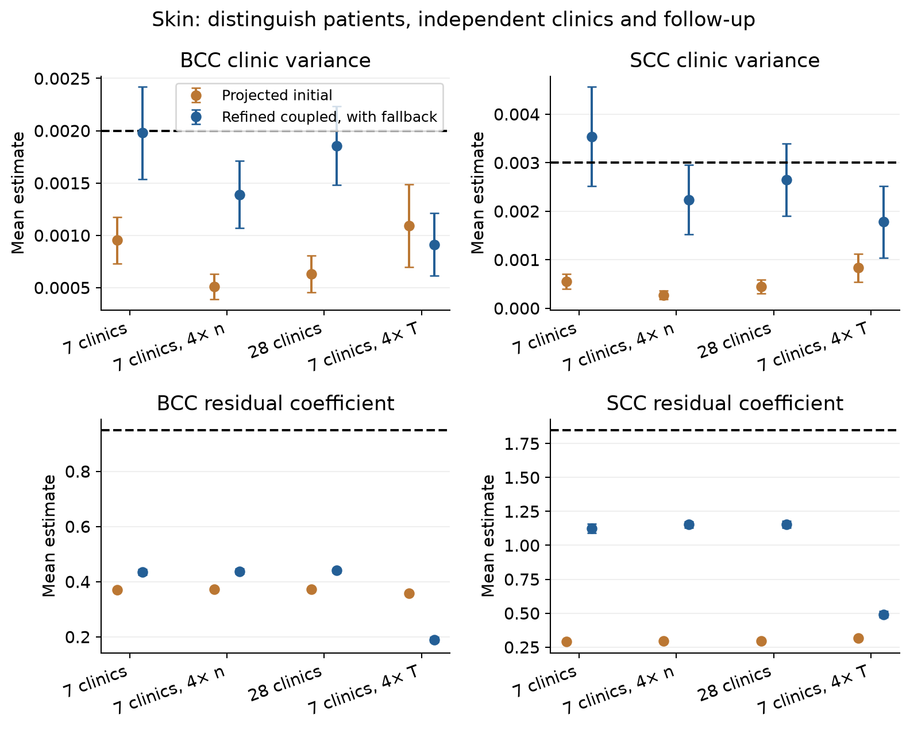
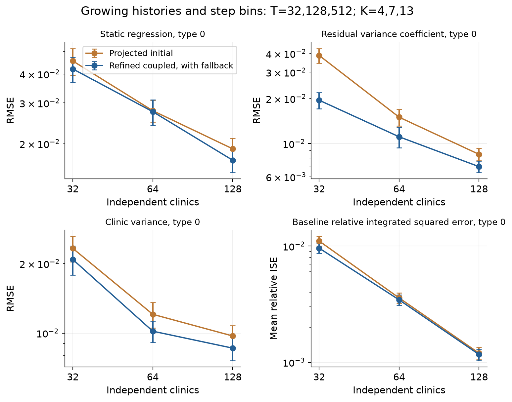
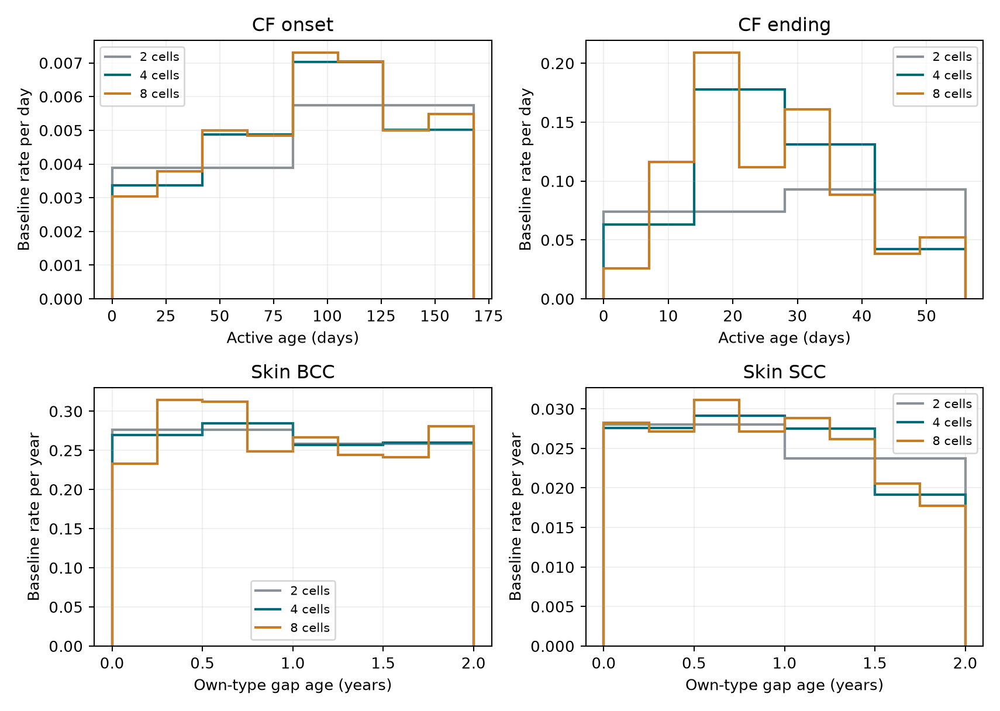

# Linear Prediction and Frailty Inference for Clustered Recurrent Events

**Manuscript 0.12 · 20 September 2026**

[Complete paper (PDF)](paper.pdf)

## Abstract

We develop a few-moment frailty estimator for recurrent events that retains the main modeling features of Sharef Moreno’s thesis: unspecified baseline hazards, correlated event types, nested cluster and subject heterogeneity, unequal cluster sizes, time-dependent covariates and early-event effects. Subject frailty has conditional mean equal to cluster frailty and conditional variance proportional to it. The estimator combines step-function baselines, working best linear unbiased prediction and prediction-error-corrected component equations. A continuous formulation accommodates zero and singular covariance components through a joint constrained estimating equation. We prove existence on a compact working parameter set, and establish a locally unique interior fit, joint asymptotic normality and a cluster sandwich as independent clusters, individual histories and baseline resolution increase. Full proofs cover alternating and nonalternating risks, measured covariates and two right-censoring regimes. We also prove positive definiteness of the symmetric part of the normalized population component derivative at zero clinic variances, allowing correlated event types and unequal cluster sizes with positive-definite residual covariance; a full boundary limit theorem remains open. A 36-scenario study yields 4,195 accepted fits in 4,200 attempts. Increasing-information sequences show decreasing error. In the sparse skin-reference setting, residual-variance means are 54% and 39% below truth and cumulative baseline means are 22% and 23% above truth; changing the frailty law while preserving its specified moments can reverse component bias. Coupling reduces CF ending cumulative-baseline relative RMSE from 2.48 for the initial estimator to 0.129. An additional 800-history diagnostic finds favorable but imperfect interior coverage under joint growth and severe component undercoverage in the sparse skin setting. A separate 700-history diagnostic finds encouraging CF boundary-regression coverage but persistent undercoverage with a normal multiplier in the seven-clinic skin settings; a Student multiplier improves coverage without consistently restoring the nominal level. Analyses of the thesis’s cystic-fibrosis and skin-cancer datasets produce jointly fitted baseline, regression and covariance estimates, with sensitivity to bin count and observation conventions. The method requires no fitted frailty distribution; its remaining statistical limitations concern finite-history calibration and inference at covariance boundaries.

## 1. Scientific objective and contribution

Repeated events provide information about both a subject’s event dynamics and persistent differences between subjects. In clustered studies, part of that heterogeneity may be shared within a clinic. Different event types may also be correlated: for example, an individual’s propensity for exacerbation onset may be associated with episode duration, or a patient’s risks of two skin-cancer types may be related. A useful method must estimate the baseline hazards and covariate effects while preserving these sources of dependence.

Chapter 3 of Sharef Moreno’s thesis (2008) addresses this problem through a nested frailty model and working best linear unbiased predictors (BLUPs), drawing on Ma, Krewski and Burnett’s random-effects construction. We retain its conditional first- and second-moment specification, including the conditional subject variance, signed cross-type covariance, variable cluster sizes and time-dependent predictors. We estimate smooth baseline hazards with increasingly fine constant-height cells. No parametric frailty distribution or additional frailty moments are fitted.

The statistical issue is that observed exposure is itself part of an event history. A Poisson working calculation can yield useful predictors and corrected moment equations, but it does not automatically make those equations exactly mean-zero under a recurrent-event model. Strawderman’s unpublished methods draft (2010) likewise distinguishes best unbiased prediction from linear prediction. Our approach justifies the working equations through growing individual information: the subject predictor approaches the subject frailty, while its nested cluster predictor approaches a best affine predictor with a nonvanishing prediction-error correction. Independent clusters then identify the population baseline scale and covariance components.

The paper makes three connected contributions. First, it defines a joint estimator that remains meaningful when a variance is zero or the residual covariance is singular. Second, it gives a complete interior asymptotic theory, including baseline approximation, local computation and cluster-level inference. Third, it evaluates the estimator in extensive simulations and new analyses of the thesis datasets. The simulation evidence separates computational reliability from statistical bias: accurate solutions are usually obtainable, but few events per subject can still give biased component estimates. The skin-reference means understate the two residual variances by 54% and 39%, even though all 200 fits are numerically accepted. The same setting overstates cumulative baselines by 22–23%. These are generating-law-specific simulation results, not inferred percentage biases of the actual data analyses.

**Relation to prior methods.** The closest methodological antecedent is orthodox BLUP estimation. Ma and Jørgensen (2007) construct nested generalized-linear estimating functions using first and second random-effect moments, with Godambe optimality and consistency in their stated model. Their results do not automatically center our scores when exposure is a stopping-time functional of recurrent events. The distinction is the subject of Appendix A and the long-history argument here. [Ma and Jørgensen](https://doi.org/10.1111/j.1467-9868.2007.00603.x).

There is also a useful connection to penalized quasi-likelihood (PQL). Breslow and Clayton (1993) use approximate integrated quasi-likelihood with Gaussian random effects; Breslow and Lin (1995) and Lin and Breslow (1996) analyze biases and corrections in specified canonical-link mixed models, including small-variance expansions. Working prediction and corrected dispersion updates are shared ideas. Our positive multiplicative frailties, conditional variance hierarchy, endogenous exposure and moment-only specification do not define that same Gaussian PQL model or a unique marginal likelihood. Those papers give relevant bias context, but their correction factors and asymptotic conclusions are not imported as results for our estimator. [Breslow and Clayton](https://doi.org/10.1080/01621459.1993.10594284), [Breslow and Lin](https://doi.org/10.1093/biomet/82.1.81), [Lin and Breslow](https://doi.org/10.1080/01621459.1996.10476971).

Frailty likelihood and recurrent-gap estimation provide complementary approaches. Rondeau, Filleul and Joly (2006) estimate nested gamma-frailty models by penalized likelihood, while Peña, Strawderman and Hollander (2001) study nonparametric recurrent-gap distribution estimation under censoring. Here the target is a joint hazard, covariate and signed covariance estimator with the thesis's conditional moment hierarchy. The constrained formulation uses standard variational-inequality geometry; its elementary existence and block-scaling arguments are supplied in Section 3. [Rondeau et al.](https://doi.org/10.1002/sim.2510), [Peña et al.](https://doi.org/10.1198/016214501753381922), [Facchinei and Pang](https://doi.org/10.1007/b97543).

Section 2 defines the model and notation. Section 3 gives the estimator and the actual fitting procedure. Sections 4–5 state the asymptotic results and the observation-process extensions. Sections 6–7 present simulations and data analyses; Section 8 discusses their implications. All technical proofs are included in this paper’s appendices. A reader interested first in implementation and empirical behavior can read Sections 2–3 and 6–8 before the asymptotic details.

| Symbol | Meaning |
|---|---|
| \(i,j,d\) | Cluster, subject within cluster, and event type \(d=0,1\) |
| \(m,J_i,T\) | Number of independent clusters, cluster size, and nominal follow-up |
| \(U_i^{(d)},U_{ij}^{(d)}\) | Cluster frailty and total subject frailty |
| \(\sigma_d^2,\nu_d^2,\theta\) | Cluster variance, conditional subject-variance coefficient, and conditional cross-type covariance |
| \(a_{ij}^{(d)}(t),Y_{ij}^{(d)}(t)\) | Event-age clock and active-risk indicator |
| \(R_{ij,d}(t),N_{ij}^{(d),\tau}(t)\) | Risk and count restricted to the fitted age window |
| \(\kappa_d,g_d,\zeta_d,\beta_d,\gamma_d\) | Baseline level, centered log shape, static coefficients including level, persistent changing effects, and early contrasts |
| \(A_{ij,d},\widetilde U_{ij,d}\) | Actual integrated exposure and working subject predictor |
| \(K,\Delta\) | Number and width of baseline cells |

The matrix \(R_c\) used below denotes residual covariance; it is distinct from the scalar retained-risk indicator \(R_{ij,d}(t)\). Covariance matrices are always conditional on initial design unless stated otherwise.

## 2. Model and notation

### 2.1 Clusters and the conditional frailty hierarchy

Clusters \(i=1,\ldots,m\) are independent and identically distributed. Cluster \(i\) contains \(J_i\) subjects, \(1\leq J_i\leq J_*\). Types \(d=0,1\) denote episode onset and ending in the alternating base case, and the two recurrent event types in the nonalternating extension. Let \(\mathcal D_i\) contain initial design, including size, bounded static covariates and any known calendar phase offsets. All frailty assumptions below hold conditional on this design.

Cluster frailties \(U_i^{(0)},U_i^{(1)}\) are conditionally independent, with
\(E(U_i^{(d)}\mid\mathcal D_i)=1\) and
\(\operatorname{Var}(U_i^{(d)}\mid\mathcal D_i)=\sigma_d^2\).
Given the cluster pair and design, subject frailty pairs are independent and satisfy

$$\begin{aligned}
E(U_{ij}^{(d)}\mid\mathbf U_i,\mathcal D_i)&=U_i^{(d)},\\
\operatorname{Var}(U_{ij}^{(d)}\mid\mathbf U_i,\mathcal D_i)&=\nu_d^2U_i^{(d)},\\
\operatorname{Cov}(U_{ij}^{(0)},U_{ij}^{(1)}\mid\mathbf U_i,\mathcal D_i)&=\theta.
\end{aligned}\tag{1}$$

The total subject frailty \(U_{ij}^{(d)}\) is the multiplier in the intensity. It is not multiplied by \(U_i^{(d)}\) a second time. The thesis prints an unsubscripted \(u_i\) in its conditional variance line; (1) states the type-specific interpretation used throughout this work.

The components \(\eta=(\sigma_0^2,\sigma_1^2,\nu_0^2,\nu_1^2,\theta)^T\) are constant given design. Thus unequal sizes are allowed, but arbitrary size-dependent conditional components are not. The full model requires \(P(J_i\geq2)>0\) to separate cluster and subject variance. Section 5 treats the independent-subject case without imposing an artificial cluster variance.

Assume an actual compatible positive joint law, with all frailties in a fixed interval \([u_-,u_+]\subset(0,\infty)\). Conditional covariance feasibility requires

$$\theta^2\leq \nu_0^2\nu_1^2U_i^{(0)}U_i^{(1)}
\quad\text{almost surely}.\tag{2}$$

A nonzero constant \(\theta\) cannot be combined with a cluster-frailty product whose support approaches zero. A compatible example is
\(U_{ij}^{(d)}=U_i^{(d)}+\sqrt{\nu_d^2U_i^{(d)}}\,S_{ij,d}\),
with suitably positive cluster support and conditional sign-pair probabilities
\((1+r_i s_0s_1)/4\), where
\(r_i=\theta/\sqrt{\nu_0^2\nu_1^2U_i^{(0)}U_i^{(1)}}\).
Both signs of \(\theta\) are possible. This example establishes compatibility; it is not a fitted distributional assumption.

For a cluster, stack total subject frailties into \(\mathbf U\in\mathbb R^{2J}\). Their design-conditional covariance is

$$\Sigma_{(j,d),(k,e)}=
\begin{cases}
\sigma_d^2+\nu_d^2,&j=k,\ d=e,\\
\sigma_d^2,&j\ne k,\ d=e,\\
\theta,&j=k,\ d\ne e,\\
0,&j\ne k,\ d\ne e .
\end{cases}\tag{3}$$

The interior asymptotic results assume uniformly positive and bounded covariance eigenvalues over allowed sizes, with true components interior to the fitting set. The estimator itself also permits positive-semidefinite boundary values, as defined in Section 3.6.

We sometimes write \(U_{ij,d}\) for \(U_{ij}^{(d)}\), and similarly suppress record/type indices in single-record formulas. A subscript \(0\) on a parameter denotes its true value; the event type is indexed separately by \(d\).

### 2.2 Alternating base case, clocks and retained age window

For the alternating base case, each subject starts a fresh onset-risk gap at calendar time zero. Section 5.5 replaces this risk law by overlapping own-type gap processes. An onset starts ending risk. An ending is followed by a known fixed delay \(\delta>0\), after which onset risk resumes. For the base theorem, everyone is observed through the common actual horizon \(T\). Sections 5.3–5.4 and Appendix G replace this with subject-specific right-censoring endpoints. Conditional on all initial frailties and design, subjects have independent event innovations. Distinct counting-process coordinates have no simultaneous jumps.

Let \(Y_{ij}^{(d)}(t)\) indicate actual type-specific active risk, and \(a_{ij}^{(d)}(t)\) its age since risk entry. During the post-ending delay, neither type is at risk. An onset-gap age begins when that delay finishes. The delay is part of calendar time; it is not subtracted once from the study endpoint or from every observed duration indiscriminately.

Choose a fixed age window \([0,\tau]\), and define

$$R_{ij}^{(d)}(t)=Y_{ij}^{(d)}(t)1\{a_{ij}^{(d)}(t)\leq\tau\},\qquad
N_{ij}^{(d),\tau}(t)=\int_0^t1\{a_{ij}^{(d)}(s)\leq\tau\}\,dN_{ij}^{(d)}(s).
\tag{4}$$

Late events still occur, alter risk and advance episode number. Only their contributions to the fitted score are omitted. Every subject remains included; there is no conditioning on reaching an exposure target or a particular episode before \(T\).

The full true active transition rates, also beyond \(\tau\), lie between constants \(0<\underline\lambda\leq\overline\lambda<\infty\). This is a substantive return-to-risk assumption. It excludes absorbing terminal events and is stronger than smoothness of the fitted baseline alone.

### 2.3 Regression, baseline normalization and episode groups

For the main theorem there is one baseline per type. Write

$$\begin{aligned}
\lambda_{0}^{(d)}(a)&=\exp\{\kappa_d+g_d(a)\},\qquad
\int_0^\tau g_d(a)\,da=0,\\
b_{ij,d}(t;\vartheta)&=
\exp\{x_{ij,d}^T\zeta_d+g_d(a_{ij}^{(d)}(t))
+z_{ij,d}(t)^T\beta_d+w_{ij,d}(t)^T\gamma_d\},\\
\lambda_{ij}^{(d),\tau}(t)&=U_{ij}^{(d)}R_{ij}^{(d)}(t)b_{ij,d}(t;\vartheta_0).
\end{aligned}\tag{5}$$

The bounded static vector \(x\) begins with one; its coefficient \(\kappa\) represents baseline level. There is no additional free baseline intercept. The remaining entries of \(\zeta\) are repeated-group static effects. The centered log baseline \(g_0\) is Lipschitz with constant \(L_0<L\), where \(L\) is the fitting bound.

Persistent changing covariates \(z(t)\) satisfy one of the following concrete constructions, throughout the repeated final group:

- **Gap marks:** a mark in a fixed finite bounded set is drawn independently at each new type-specific gap, independent of frailties and previous history, and held through that gap. Positive mark probabilities and positive-definite mark covariance are required.
- **Calendar profiles:** \(z_{ij,d}(t)=z_d(t+\phi_{ij,d})\), where each fixed bounded profile has common fixed period \(P\), bounded variation on the period circle, and \(\operatorname{Cov}\{z_d(V)\}\succ0\) for uniform phase \(V\). Phase offsets are known at entry. Square waves and smooth sinusoids are examples. No commensurability between \(P\) and \(\delta\) is required.

Values are evaluated predictably, before events. These are the base theorem's two verified constructions; Theorem 6 replaces them by carried-forward measured covariates under a joint process model. There may also be no persistent changing coefficient, in which case that block is omitted.

The bounded predictable vector \(w(t)\), of fixed dimension, is zero after a fixed number \(R_0\) of full episodes. It is a feature of that subject's observed history and initial design, held fixed when evaluating trial parameters. After that finite prefix, the full transition law is exactly the specified marked or periodic law. Canonical thesis-style contrasts are

$$w_{ij,d}(t)=
\begin{pmatrix}
1\{e_{ij,d}(t)=1\}x_{ij,d}\\
\vdots\\
1\{e_{ij,d}(t)=R_0\}x_{ij,d}
\end{pmatrix},
\qquad
\gamma_d=(\gamma_{1,d}^T,\ldots,\gamma_{R_0,d}^T)^T .
\tag{6}$$

The episode-\(e\) static coefficient is \(\zeta_d+\gamma_{e,d}\); later episodes use \(\zeta_d\). Taking \(R_0=2\) yields first/second/third-or-later effects. Grouping the first two indicators gives a first-two-versus-later effect. Bounded continuous baseline FEV and treatment interactions are allowed in \(x\).

Equation (5) must hold in the filtration enlarged by all initial frailties and design, denoted \(\mathcal I_i\), and the evolving observed history. We do not condition at entry on a future observed covariate trajectory. Predictability by itself does not establish the model or the quantitative information bounds. Static information is positive definite, and the early information defined below is positive definite whenever that block is present.

## 3. Estimator and fitting procedure

The final estimator fits hazards, regression and covariance jointly. The concave initial fit supplies a starting point; the nested prediction and corrected equations define the statistical update. A constrained formulation covers covariance boundaries.

### 3.1 A concave initial fit

For equal cells \(I_k\) of width \(\Delta=\tau/K\), put \(g_K(a)=h_k\) on \(I_k\). Fit

$$\sum_{k=1}^K h_k=0,\qquad |h_{k+1}-h_k|\leq L\Delta,\tag{7}$$

with fixed compact coefficient boxes containing truth in their interiors. Centered slope-bounded heights are uniformly bounded. Let \(N=N^\tau(T)\) and

$$A(\vartheta)=\int_0^T R(t)b(t;\vartheta)\,dt,\qquad
\widetilde U(\vartheta)=\frac{N+1}{1+A(\vartheta)}.
\tag{8}$$

Suppress record indices when unambiguous. Maximize

$$\ell_{mT}(\vartheta)=
\sum_{i,j,d}\left\{\int_0^T\log b_{ij,d}(t;\vartheta)\,dN_{ij}^{(d),\tau}(t)
-(N_{ij}^{(d),\tau}(T)+1)\log(1+A_{ij,d}(\vartheta))\right\}.
\tag{9}$$

One derivation profiles the complete-frailty count/exposure criterion after adding the working penalty \(\log u-u\) for each subject/type. Its maximizer in \(u\) is (8). The penalty defines an estimator; it is not a claim that a particular frailty family is true. Equation (9) is a profiled, penalized working criterion. Before profiling, the conditional counting-process criterion contains the count term in \(\log u\) and the exposure term \( -uA\); adding the penalty and eliminating \(u\) changes that criterion. Thus (9) is neither the conditional likelihood with frailties fixed nor the marginal likelihood under the hierarchy (1).

For the vector \(v(t)=\partial_\vartheta\log b(t;\vartheta)\), define
\(A_v=\int vRb\) and \(A_{vv}=\int vv^TRb\). Since the predictor is linear in the fitted coordinates on the log scale, the score and negative Hessian are

$$s=\int v\,dN^\tau-\widetilde U A_v,\qquad
H=(N+1)\left\{\frac{A_{vv}}{1+A}-\frac{A_vA_v^T}{(1+A)^2}\right\}.
\tag{10}$$

The Hessian equals \((N+1)\) times an exposure-weighted feature covariance augmented by an atom at the zero vector with mass \(1/(1+A)\). It is positive semidefinite, proving concavity. In particular, a static record score simplifies to

$$s^S=x(\widetilde U-1).\tag{11}$$

This supplies the population mean-one normalization for absolute baseline level. Long within-subject histories alone identify hazard/frailty products, not the population scale.

Use actual partial-cell exposure and actual covariate integrals. A count-over-predicted-exposure baseline update remains the unconstrained conditional update when predictions and other parameters are held fixed. Under (7), the cell heights must instead be optimized jointly. The asymptotic theorem requires an unscaled initial objective gap \(o_p(1)\). Positive local curvature makes the corresponding statistically scaled parameter error at most a constant times the square root of that gap. Concavity gives a computable gap bound by maximizing the gradient’s linearization over the fitting set. Actual step exposures are integrated exactly in our piecewise-constant covariate implementation.

### 3.2 Initial component estimation with unequal sizes

At the fitted hazard, put \(r_{ij,d}=\widetilde U_{ij,d}-1\). Define

$$\begin{aligned}
V_{i,d}&=J_i^{-1}\sum_j r_{ij,d}^2,\\
B_{i,d}&=1\{J_i\geq2\}\{J_i(J_i-1)\}^{-1}
             \sum_{j\ne k}r_{ij,d}r_{ik,d},\\
C_i&=J_i^{-1}\sum_jr_{ij,0}r_{ij,1},\qquad I_i=1\{J_i\geq2\}.
\end{aligned}\tag{12}$$

Set singleton pair terms to zero without evaluating their zero denominator. Let \(F_i=(V_{i,0},V_{i,1},B_{i,0},B_{i,1},C_i,I_i)^T\) and let bars denote cluster averages. Estimate

$$\widehat\eta=\mathcal G(\bar F)=
\left(\frac{\bar B_0}{\bar I},\frac{\bar B_1}{\bar I},
\bar V_0-\frac{\bar B_0}{\bar I},
\bar V_1-\frac{\bar B_1}{\bar I},\bar C\right)^T.
\tag{13}$$

An observed sample with no multi-subject clusters cannot separate the components and must be flagged. That event vanishes under the full-model assumptions. The hazard fit sums subject contributions; components use the declared cluster averages. These weightings are compatible because the hierarchy holds conditional on size and design.

The moment estimator is unprojected for the interior normal-limit theorem. For fitting, project onto the compact covariance set specified below; in the interior theory the projection is inactive near truth. Such a covariance projection does not manufacture a full conditional frailty law.

### 3.3 The nested working predictor and error correction

The working predictor and error correction below supply the nested quantities used in the coupled estimator. Stack both cluster frailties and all total subject frailties in \(\mathbf W\), and write

$$\Omega=\operatorname{Cov}(\mathbf W\mid\mathcal D),\qquad
C_{WU}=\operatorname{Cov}(\mathbf W,\mathbf U\mid\mathcal D),\qquad
Q_T=\operatorname{diag}(A_a).
\tag{14}$$

For cluster row \(d\), \((C_{WU})_{d,(j,e)}=\sigma_d^2 1\{d=e\}\); its subject rows equal \(\Sigma\). Thus these matrices are determined by (1) and size. For a positive-definite working subject covariance \(S\), put

$$H_T(S)=(Q_T+S^{-1})^{-1},\qquad
\widetilde{\mathbf U}_T(S)=\mathbf1+H_T(S)(\mathbf N_T-Q_T\mathbf1).
\tag{15}$$

This formula remains defined at zero exposure. With \(S=I\) it gives (8). Using candidate or fitted covariance matrices, the nested predictor and working error matrix are

$$\begin{aligned}
\widetilde{\mathbf W}_T
&=\mathbf1+C_{WU}\Sigma^{-1}
 H_T(\Sigma)(\mathbf N_T-Q_T\mathbf1),\\
P_T&=\Omega-C_{WU}\Sigma^{-1}C_{WU}^T
 +C_{WU}\Sigma^{-1}H_T(\Sigma)\Sigma^{-1}C_{WU}^T .
\end{aligned}\tag{16}$$

At finite event-dependent exposure these are working formulas; \(P_T\) is not asserted to equal the actual conditional or unconditional prediction-error matrix. Section 4.5 proves their affine limits. Some affine predictions can be negative. Clipping them gives a different predictor and does not preserve (16)'s correction identities automatically.

The initial fit supplies the pilot; the final estimates solve the coupled equations below.

### 3.4 Coupled hazard and corrected-component equations

Clusters are iid, with bounded variable size \(1\leq J_i\leq J_*\) and \(P(J_i\geq2)>0\). Use subject-major order \((1,0),(1,1),\ldots,(J,0),(J,1)\). The hierarchy implies

$${G_c}=\operatorname{diag}(s_0,s_1),\qquad
{R_c}=\begin{pmatrix}v_0&\theta\\\theta&v_1\end{pmatrix},\qquad
\eta=(s_0,s_1,v_0,v_1,\theta)^T,
\tag{17}$$

where \(s_d=\sigma_d^2\), \(v_d=\nu_d^2\). For the following equivalent matrix representation, take \({G_c}\succ0\), \({R_c}\succ0\), and an actual compatible positive bounded frailty law. The conditional variance is still \(\operatorname{Var}(U_{ij}^{(d)}\mid\mathbf U_i,\mathcal D_i)=v_d U_i^{(d)}\). The notation \({R_c}\) in this section is a residual covariance matrix, not the retained-risk indicator.

Define the centered latent vector

$$b_i=(U_i^{(0)}-1,U_i^{(1)}-1,
 U_{i1}^{(0)}-U_i^{(0)},U_{i1}^{(1)}-U_i^{(1)},\ldots)^T.
\tag{18}$$

Conditional on initial design, its **marginal second-moment** matrix and the observation map are

$$D_J=\operatorname{diag}({G_c},I_J\otimes {R_c}),\qquad
Z_J=(\mathbf1_J\otimes I_2,\ I_{2J}),\qquad
\mathbf U_i-\mathbf1=Z_Jb_i,
\quad \Sigma_J=Z_JD_JZ_J^T=\mathbf1_J\mathbf1_J^T\otimes {G_c}+I_J\otimes {R_c}.
\tag{19}$$

The residual and cluster blocks have zero covariance, but they need not be independent. In particular their uncorrelatedness does not replace the conditional variance model by an independent Gaussian-effects model.

For candidate hazard parameters let \(A_a\) be actual retained exposure and \(N_a\) the retained count, as in (8). Put

$$Q=\operatorname{diag}(A_a),\quad W=\Sigma_J^{-1},\quad
H=(Q+W)^{-1},\quad
\widetilde u=\mathbf1+H(\mathbf N-Q\mathbf1),\quad L=D_JZ_J^TW.
\tag{20}$$

The centered cluster/residual predictor and working correction are

$$\widehat b=L(\widetilde u-\mathbf1),\qquad
P=D_J-D_JZ_J^TWZ_JD_J+D_JZ_J^TWHWZ_JD_J.
\tag{21}$$

This is the matrix correction (16) transformed to cluster/residual coordinates. It has the thesis's corrected-Pearson structure and uses actual integrated exposure.

For a symmetric matrix \(B\) in these coordinates, define the linear extraction map

$$\mathcal E_J(B)=\left(B_{{G_c},00},B_{{G_c},11},
 J^{-1}\sum_jB_{j,00},J^{-1}\sum_jB_{j,11},
 J^{-1}\sum_jB_{j,01}\right)^T.
\tag{22}$$

The blocks indexed by \(j\) refer to the residuals, not total subject frailties. In particular \(\mathcal E_J(D_J)=\eta\). The per-cluster corrected component equation is

$$q_i(\vartheta,\eta)=\mathcal E_{J_i}(\widehat b_i\widehat b_i^T+P_i)-\eta.
\tag{23}$$

Equations (60) and (23) extract the same affine-error targets after changing from cluster/total-subject coordinates to centered cluster/residual coordinates through (21). Equation (60) is a population limiting identity; (23) defines the finite-history estimating equation and is not claimed exactly mean-zero at finite follow-up.

This retains the thesis's averaging within each cluster before averaging across clusters. It is not silently changed to subject weighting when cluster sizes differ.

The hazard equation uses the same conditional score with the nested predictor inserted:

$$S_\vartheta=\sum_{i,a}\left\{\int v_{ia}(t)\,dN_{ia}^{\tau}(t)
-\widetilde u_{ia}\int v_{ia}(t)Y_{ia}^{\tau}(t)b_{ia}(t;\vartheta)\,dt\right\}.
\tag{24}$$

The record label \(a\) denotes a subject/type pair; \(v_{ia}=\partial_\vartheta\log b_{ia}\) is the full hazard feature vector. Here \(Y_{ia}^{\tau}(t)\) denotes the retained at-risk indicator, so the second integral is \(\int vRb\,dt\). All observed covariates, endpoints and risk histories are held fixed when differentiating the equations. The coupled system is \(S_\vartheta=0\), \(m^{-1}\sum_iq_i=0\). Here the centered latent vector \(b_i\) is distinct from the hazard multiplier \(b_{ia}(t)\).

Let the rows of \(X_i\) be the bounded static designs, with type-specific intercepts included. For every candidate hazard, including unknown shapes and changing effects, the exact static identity is

$$\mathbf N-Q\widetilde u=W(\widetilde u-\mathbf1),\qquad
S_{i,\zeta}=X_i^TW(\widetilde u_i-\mathbf1).
\tag{25}$$

It follows by multiplying (20). This identity makes the limiting static equation covariance weighted; using the initial fit's static score (11) at the coupled root would give the wrong estimating equation.

### 3.5 Continuous evaluation at zero or singular covariance

The positive-definite formulas have an equivalent evaluation that also covers zero exposure and singular covariance. In this subsection write \(G=G_c\), \(R=R_c\), \(D_{ij}=\operatorname{diag}(A_{ij,0},A_{ij,1})\) and \(y_{ij}=N_{ij}-A_{ij}\), using two-vectors of counts and exposures. For each subject define

$$B_{ij}=(I+D_{ij}R)^{-1},\qquad
T_{ij}=B_{ij}D_{ij},\qquad b_{ij}=B_{ij}y_{ij}.
\tag{26}$$

For each cluster set

$$t_i=\sum_jT_{ij},\quad s_i=\sum_jb_{ij},\quad
C_i=(I+t_iG)^{-1},\quad a_i=C_is_i,\quad
P_i=GC_i,\quad V_i=C_it_i,\quad \mu_i=Ga_i.
\tag{27}$$

Finally,

$$z_{ij}=b_{ij}-T_{ij}\mu_i,\qquad
\widetilde U_{ij}=\mathbf1+\mu_i+Rz_{ij}.
\tag{28}$$

The normalized cluster and residual covariance matrices are

$$Q_{Gi}=a_i a_i^T-V_i,\qquad
Q_{Rij}=z_{ij}z_{ij}^T-T_{ij}+T_{ij}P_iT_{ij}.
\tag{29}$$

We retain the two diagonal entries of \(Q_{Gi}\) and all three distinct entries of
\(J_i^{-1}\sum_jQ_{Rij}\). The latter division preserves the original equal-cluster component equations with variable cluster sizes. With independent subjects, set \(G=0\), omit its equations, and use \(\widetilde U_j=\mathbf1+Rb_j\) and \(Q_{Rj}=b_jb_j^T-T_j\).

**Proposition A (continuous extension and interior equivalence).** For nonnegative exposures and positive-semidefinite \(G,R\), all inverses in (26)–(27) exist. The predictors and scores are continuous, including at zero variances and singular \(R\). At positive-definite covariance parameters they equal the original predictors and the covariance-normalized component equations in Section 3.4.

*Proof.* Sylvester's determinant identity gives

$$\det(I+DR)=\det(I+D^{1/2}RD^{1/2})>0.
\tag{30}$$

Also \(T=D^{1/2}(I+D^{1/2}RD^{1/2})^{-1}D^{1/2}\) is symmetric positive semidefinite. Applying the same argument to \(t,G\) proves invertibility of \(I+tG\), including singular cases. The matrices \(P,V\) are symmetric positive semidefinite. All formulas are rational functions with nonzero denominators, hence are continuous and admit smooth ambient extensions near each finite feasible point.

In the interior, write \(H_{ij}=(R^{-1}+D_{ij})^{-1}\). Then
\(R^{-1}H_{ij}=B_{ij}\), \(D_{ij}-D_{ij}H_{ij}D_{ij}=T_{ij}\), and
\(P_i=(G^{-1}+t_i)^{-1}\). The original cluster predictor increment is \(\mu_i=P_is_i\), while its residual increment is
\(\epsilon_{ij}=H_{ij}(y_{ij}-D_{ij}\mu_i)=Rz_{ij}\).

The unnormalized corrected matrices are

$$\mathcal Q_{Gi}=\mu_i\mu_i^T+P_i-G,
\qquad
\mathcal Q_{Rij}=\epsilon_{ij}\epsilon_{ij}^T+H_{ij}
 +H_{ij}D_{ij}P_iD_{ij}H_{ij}-R.
\tag{31}$$

The resolvent identities imply

$$G^{-1}\mathcal Q_{Gi}G^{-1}=Q_{Gi},\qquad
R^{-1}\mathcal Q_{Rij}R^{-1}=Q_{Rij}.
\tag{32}$$

For example, \(G^{-1}(P_i-G)G^{-1}=-V_i\) and
\(R^{-1}(H_{ij}-R)R^{-1}=-T_{ij}\). Equation (32) gives precisely division by \(\sigma_d^4\) for the retained cluster diagonal rows and congruence normalization for the residual rows. These transformations are invertible in the interior and common to the summed matrices. Thus the interior root sets are unchanged. The continuous formulas, rather than explicit inverses, define the boundary values. □

In particular, at \(G=R=0\), predictions equal one, but the normalized covariance scores are generally **not zero**:

$$Q_{Gi}=\Big(\sum_jy_{ij}\Big)\Big(\sum_jy_{ij}\Big)^T-\sum_jD_{ij},
\qquad Q_{Rij}=y_{ij}y_{ij}^T-D_{ij}.
\tag{33}$$

These are algebraic identities, not assertions of conditional unbiasedness. At \(G=R=0\), the diagonal residual entry \(y_d^2-A_d\) has the familiar Poisson overdispersion form: squared count residual minus working variance. Because terminal exposure is random and event-dependent, this resemblance alone does not make the normal-cone condition a calibrated dispersion test. The finite-history centering problem is unchanged.

### 3.6 The constrained estimator

Use coordinates, with \(h\) denoting raw log baseline cell heights and regression coefficients,

$$\psi=(h,\sigma_0^2,\sigma_1^2,\nu_0^2,\nu_1^2,\sqrt2\theta),
\tag{34}$$

omitting cluster coordinates for independent subjects. The \(\sqrt2\) factor makes the Euclidean norm of residual covariance coordinates equal to the Frobenius matrix norm. Scale the cross-covariance score by \(\sqrt2\) as well.

Let \(F_m(\psi)\) contain the hazard score averaged over subjects, cluster covariance diagonals averaged over clusters, and the entries of \(m^{-1}\sum_iJ_i^{-1}\sum_jQ_{Rij}\), with the indicated cross-coordinate scaling. Signs are those of the original event-minus-predicted-exposure and corrected-observed-minus-working-covariance equations.

Specify a compact convex working parameter set \(\mathcal C\) **before fitting**. A concrete computational choice is: log cell heights in \([-12,8]\), regression coefficients in \([-4,4]\), adjacent log-cell slope at most six per numerical time unit, \(0\leq\sigma_d^2\leq20\), and \(R\succeq0\) with \(\operatorname{tr}(R)\leq40\). These finite limits are numerical constraints, not population facts; hitting an upper or hazard bound must be reported and investigated by sensitivity analysis. They are not validated tuning defaults. The construction also works with other specified nonempty compact convex sets.

The covariance restrictions in this working set are necessary for the BLUP algebra. They are **not sufficient to construct a positive frailty law satisfying (1)**. The statistical model still assumes a compatible truth. In particular, conditional covariance imposes restrictions involving the cluster-frailty support; the boundary construction does not solve that moment-realizability problem or assert that every candidate in the working set is a possible data-generating law.

Define the solution set by

$$\mathcal S_m=\left\{\psi\in\mathcal C:
 \langle F_m(\psi),v-\psi\rangle\leq0
 \ \text{for every }v\in\mathcal C\right\}.
\tag{35}$$

Equivalently, with Euclidean projection \(\Pi_{\mathcal C}\) and any fixed \(s>0\),

$$\mathcal R_m(\psi)=\psi-\Pi_{\mathcal C}\{\psi+s F_m(\psi)\}=0.
\tag{36}$$

Use \(s=1\) for the definition; other fixed positive values have exactly the same solution set. This is a constrained estimating equation, not a claimed likelihood or posterior fit. Projection is applied to a candidate **update**, with all hazard and covariance equations reevaluated jointly; it is not clipping a final unconstrained estimate.

Select from \(\mathcal S_m\) a point nearest a specified pilot in coordinates (34), breaking remaining ties by successive minimization of the coordinates in their displayed order. The pilot is the initial estimator followed by projection into \(\mathcal C\). Its construction and the parameter units are part of the estimator. This deterministic rule specifies a mathematical target; a numerical optimizer finding one solution does not certify that it found the selected one.

**Proposition B (existence and interior preservation).** For finite observed records and the compact set just described, \(\mathcal S_m\) is nonempty and compact, and the selection rule is well defined. At any interior solution the original estimating equations hold exactly. Conversely, every feasible interior root belongs to \(\mathcal S_m\).

*Proof.* The continuous self-map \(\psi\mapsto\Pi_{\mathcal C}\{\psi+F_m(\psi)\}\) has a fixed point by Brouwer's theorem. Projection characterization gives (35)–(36). The zero set of the continuous residual is closed in a compact set. Distance to the pilot therefore attains its minimum; successive coordinate minimizations over the remaining compact minimizer set terminate in a single point. At an interior point, both signs of every sufficiently small coordinate displacement are feasible, so (35) forces \(F_m=0\). Conversely a zero score satisfies (35). Proposition A gives equivalence with the original interior equations. □

**Interior selection at fixed dimension.** Suppose a consistent pilot and a consistent interior root lie in a fixed neighborhood in which the root is unique and all constraints are inactive. The nearest-pilot constrained solution equals that root with probability tending to one: its distance from the pilot is no larger than the root’s distance, so it enters the neighborhood and must be that unique zero. With growing baseline dimension, this argument requires corresponding control in the selection metric and of the shrinking constraint margins. Theorem 2 proves the local interior root and a locally convergent algorithm; agreement of a global nearest-pilot selection with that root under the growing-cell conditions alone is not established here.

#### Boundary meaning and correlation

At a scalar lower variance boundary, (35) permits \(v=0\) only if its score is nonpositive; at a scalar upper boundary the score must be nonnegative.

For the residual covariance, when the trace bound is inactive, the matrix condition is

$$R\succeq0,\qquad \overline Q_R\preceq0,\qquad
\operatorname{tr}(R\overline Q_R)=0.
\tag{37}$$

This follows by taking the normal cone of the positive-semidefinite cone with the Frobenius inner product. For positive-definite \(R\), it reduces to \(\overline Q_R=0\). At \(R=0\), checking the two diagonal signs is insufficient: a symmetric matrix with diagonals −1 and off-diagonal 2 has a positive eigenvalue. Its covariance score still points in a feasible direction of increasing variation. Correlations therefore require a joint matrix rule. Positive semidefiniteness also forces \(\theta=0\) whenever one residual variance is zero.

There is no uniqueness claim. For example, the scalar score
\(f(v)=-300/(1+100v)+(15-v)/(1+v)^2\) is negative at zero and has positive roots near 0.381918 and 1.865582. On a sufficiently wide interval, zero and both interior roots all satisfy the constrained score rule. This is why a sign check alone cannot choose the fit and why selection is specified explicitly.

### 3.7 Fitting algorithm and numerical accuracy

For observed data, split each risk interval at event transitions, covariate changes, censoring and baseline-cell boundaries. Integrate the fitted step hazard over each resulting interval, retaining its actual length. Events outside the fitted age window update the event history and clocks even though they do not enter the retained score. This constructs the counts, event-feature sums and exposure functions needed by every equation above.

The practical fitting procedure is:

1. Maximize the concave initial criterion and compute its direct component moments. Project those components into the declared working set to obtain the pilot.
2. At every trial parameter, recompute actual exposures, the inverse-free nested predictors, and the normalized hazard and covariance scores. Differentiate through these quantities.
3. Search for a zero of the normal map described below, starting from the projected pilot. For nested models, also search each of the three faces obtained by setting one or both clinic variances to zero. A face solution must satisfy the omitted rows’ full-system normal-cone conditions. If no candidate is accepted, try a full-system zero-covariance start.
4. Check each candidate using the original unscaled equations, feasibility and the full normal cone. Return the accepted candidate closest to the projected pilot in the declared coordinates. If none passes, record a failed search.

Let \(\mathcal C\) be the Cartesian product of the hazard/regression block, two clinic-variance intervals and the residual-covariance block. Write \(\Pi\) for its Euclidean projection. At the pilot, give each block the scale

$$d_b=\{\max(1,\max_{k\in b}\sum_\ell |\partial_\ell F_{m,k}|)\}^{-1},\qquad D=\operatorname{blockdiag}(d_b I_b).\tag{38}$$

Use a single scalar for the entire residual covariance block, including its cross-coordinate, and keep \(D\) fixed throughout all starts. The scaled normal map is

$$H_D(w)=D F_m(\Pi w)+\Pi w-w.\tag{39}$$

**Proposition C (block scaling preserves the estimator).** Positive scalar scaling on each Cartesian constraint block leaves the exact solution set unchanged. If \(x=\Pi w\) and \(v=x+D^{-1}(w-x)\), then \(\Pi v=x\) and \(H_I(v)=D^{-1}H_D(w)\).

*Proof.* Projection gives \(w-x\in N_{\mathcal C}(x)\), where the normal cone consists of vectors having nonpositive inner product with every feasible displacement. The normal cone of a Cartesian product is the product of its block normal cones. Each is a cone, so multiplication or division by its positive block scalar preserves membership. Thus \(v-x\in N_{\mathcal C}(x)\), which gives \(\Pi v=x\). Substitution proves the normal-map identity and equivalence of zero sets. □

The implementation uses a least-squares zero finder with at most 300 evaluations for the full pilot/zero starts and 100 for each face. Its step-change tolerance is \(2\times10^{-12}\); gradient and relative-cost stopping are disabled. A nonzero stationary residual is a failed search. Numerical acceptance requires original normal-map and projected-score maxima below \(2\times10^{-8}\), feasibility error below \(10^{-9}\), and normal-cone support gap below \(2\times10^{-6}\). The initial objective-gap certificate must be below \(10^{-4}\). These are the finite-study numerical settings; the asymptotic accuracy requirements are stated in Section 4.

A finite search certifies an accepted solution, but does not certify the global closest-pilot choice or uniqueness. All empirical results report this implemented procedure. When evaluating operational error in simulation, we separately label a fallback that returns the projected initial estimate after a failed coupled search. The theoretical local Newton result in Section 4 concerns the interior root and is not a global convergence guarantee for this finite constrained search.
## 4. Asymptotic theory

The asymptotic experiment increases both the number of independent clusters and information within each subject. The main distinction is between population quantities learned across clusters and changing features learned repeatedly within subjects. Under the sufficient conditions below:

| Target | Precision scale | Source of information |
|---|---|---|
| Static coefficients and absolute baseline levels | \(\sqrt m\) | Mean-one population frailty normalization |
| Frailty covariance components | \(\sqrt m\) | Independent cluster contributions |
| Effects of finitely many early episodes | \(\sqrt m\) | A bounded early history per subject |
| Persistent changing effects and regular normalized-shape functionals | \(\sqrt{mT}\) | Repeated within-subject information |

Theorem 1 establishes the pilot and its approximation bounds; Theorem 2 establishes the locally selected coupled interior fit. Proposition B separately describes the conditions under which a global constrained selection inherits that local result. Boundary inference is treated conditionally in Appendix L. Proposition L.2 verifies its population component derivative condition for zero clinic variances with positive-definite residual covariance, while the empirical boundary limit conditions remain to be proved.

### 4.1 Conditional occupation and normalized coordinates

Conditional on initial configuration \(s\), let \(\mu_s\) be the repeated-group time occupation measure of retained age and persistent covariate. It is the occupation law of the **true process**, held fixed when varying candidates. Write \(q_0(a,z)=g_0(a)+z^T\beta_0\) and

$$H_s(q)=\int e^q\,d\mu_s,\qquad
d\pi_s=\frac{e^{q_0}}{H_s(q_0)}\,d\mu_s,\qquad
\rho_s=U_s e^{x_s^T\zeta_0}H_s(q_0).
\tag{40}$$

Here \(\pi_s\) is an exposure probability and \(\rho_s\) a retained event rate. Both may depend on the two type frailties. They are initial-measurable limits, not terminal empirical means. The finite early prefix does not change them.

For each type take \(\mathcal H_d=L_0^2(0,\tau)\oplus\mathbb R^{p_d}\), where \(L_0^2\) consists of functions of integral zero. A direction \((f,b)\) represents \(v(a,z)=f(a)+z^Tb\). Use the norm \(\|f\|_2^2+|b|^2\) and the direct sum over types. Define

$$\mathcal B(v,w)=E\sum_{j,d}\rho_{ij,d}
       \operatorname{Cov}_{\pi_{ij,d}}(v_d,w_d),\qquad
I_S=\operatorname{blockdiag}_d E\sum_j x_{ij,d}x_{ij,d}^T .
\tag{41}$$

Appendix B proves uniform coercivity and boundedness of \(\mathcal B\) for the declared covariate models. On equal-cell steps choose a \(K\times(K-1)\) matrix \(Q\) with \(Q^TQ=I\) and \(\mathbf1^TQ=0\), and use cell basis \(Q/\sqrt\Delta\). Its coefficient norm equals the shape's \(L^2\) norm. Let \(I_K\) be the matrix of \(\mathcal B\) on these normalized step spaces. It has eigenvalues bounded above and below independently of \(K\).

The early information is

$$I_E=E\sum_{j,d}\int_0^\infty
 U_{ij,d}R_{ij,d}(t)b_{0,ij,d}(t)w_{ij,d}(t)w_{ij,d}(t)^Tdt,
\tag{42}$$

with type blocks embedded in a common vector. It is finite. Assume it is positive definite if present. For (6), every fixed episode is eventually reached and its probability of ending before age \(\tau\), conditional on entry history, is at least \(1-e^{-\underline\lambda\tau}\). The compensator identity therefore makes each episode block dominate a positive multiple of static design information. This verifies (42) for the canonical contrasts.

### 4.2 Rates and the pilot theorem

Let \(n=mT\) and \(\mathscr L=\log(e+mTK)\). Assume

$$\frac mT\longrightarrow0,\qquad
\frac{\sqrt{mT}}{K^2}\longrightarrow0,\qquad
\frac{K^3\mathscr L}{mT}\longrightarrow0,\qquad
\frac{K\mathscr L}{m}\longrightarrow0 .
\tag{43}$$

For pure polynomial schedules \(T\asymp m^a\), \(K\asymp m^b\), the strict exponent region is

$$1<a<3,\qquad \frac{1+a}{4}<b<\min\left\{1,\frac{1+a}{3}\right\}.
\tag{44}$$

Indeed the four exponents are \(1-a\), \((1+a)/2-2b\), \(3b-1-a\), and \(b-1\); all must be negative, with the last two also dominating the logarithm. Boundary schedules with logarithmic factors require checking (43) directly. For example \(T\asymp m^{3/2}\), \(K\asymp m^{3/4}\) works. These conditions are sufficient, not claimed sharp. They are not a practical bin-count rule; in particular the restriction on the growing-dimensional inverse is conservative.

Let \(M_{ij,d}=N_{ij}^{(d),\tau}-U_{ij,d}\int R_{ij,d}b_{0,ij,d}\). Define cluster vectors

$$h_{i,d}=\sum_jx_{ij,d}(U_{ij,d}-1),\qquad
\xi_i=\sum_{j,d}\int_0^\infty w_{ij,d}(t)\,dM_{ij,d}(t).
\tag{45}$$

Let \(F_i^0\) denote (12) with \(r_{ij,d}=U_{ij,d}-1\),
\(f_0=EF_i^0\), \(G=D\mathcal G(f_0)\), and

$$\mathcal C=-\left.\frac{\partial}{\partial\epsilon}
 \mathcal G\{EF_i^0(\epsilon)\}\right|_{\epsilon=0},
\qquad U_{ij,d}(\epsilon)=e^{-x_{ij,d}^T\epsilon_d}U_{ij,d}.
\tag{46}$$

For a fixed collection of fast functionals, take

$$\ell_r(g,\beta)=b_r^T\beta+\int_0^\tau \omega_r(a)g(a)\,da,
\tag{47}$$

where weights are bounded Lipschitz or piecewise Lipschitz with finitely many fixed breakpoints. Types may be combined by addition. Let \(r_r\in\mathcal H\) solve
\(\mathcal B(r_r,v)=D\ell_r[v]\).

**Theorem 1 (joint inference for the initial fit).** Under Section 2, positive \(I_S,I_E\), (43) and the optimization accuracy in Section 3, the estimator is consistent. Jointly:

**(i)** The static coefficients, early contrasts and unprojected components have root-\(m\) normal limits with covariance equal to the covariance of

$$L_i=
\begin{pmatrix}
 I_S^{-1}h_i\\
 I_E^{-1}\xi_i\\
 G(F_i^0-f_0)-\mathcal C I_S^{-1}h_i
\end{pmatrix}.
\tag{48}$$

Absent early coordinates are simply omitted.

**(ii)** The selected functionals (47) have root-\(mT\) joint normal limit, with covariance
\((V_F)_{rs}=\mathcal B(r_r,r_s)\). Normalized cumulative shapes
\(\int_0^t e^{g_d(a)}da\), for finitely many fixed ages \(t\), also have this scale.

**(iii)** The limiting covariance between (48) and the fast block is zero. The early block has zero covariance with the other slow blocks. For disjoint episode/type contrasts (6), its separate episode/type blocks have zero covariance, although coordinates within a covariate vector need not.

**(iv)** Uniformly for \(0\leq t\leq\tau\), the repeated-group absolute cumulative baseline satisfies

$$\sqrt m\{\widehat\Lambda_d(t)-\Lambda_{0,d}(t)\}
=\Lambda_{0,d}(t)\sqrt m(\widehat\kappa_d-\kappa_{0,d})+o_p(1).
\tag{49}$$

At the root-\(m\) scale in (iv), the repeated-group absolute baseline inherits the uncertainty of its estimated level; normalized shape uncertainty is smaller by the additional history information. That level is estimated using the mean-one frailty normalization and the static regression design. Thus its limiting variance reflects heterogeneity and static estimation, not a negligible-uncertainty assumption about the absolute hazard. Returning to an early-episode reference also adds the early-effect uncertainty described in Section 4.4.

**(v)** The sample adjacent-height constraints are inactive with probability tending to one. The full whole-cluster sandwich in Appendix K is consistent for the stated fixed collections of targets. Wald contrasts require positive limiting variance.

Proofs are in Appendices B–F. The theorem does not assert a simultaneous finite-dimensional Gaussian limit for all growing cell coefficients, pointwise hazard bands, individual-frailty normal intervals, or finite-\(T\) unbiasedness. Leading orthogonality does not imply independence of event types or finite-sample estimates.

### 4.3 Approximation of a smooth baseline by steps

Proposition 1 characterizes the pilot’s population approximation. The coupled fit shares its leading shape contrast and first-order fast limit under (43); its static and component equations are those in Section 3.4.

The sample estimator is not defined by prescribing true cell averages. Its actual long-history target must be analyzed. For one type let \(\mathcal E f=E\sum_j f_{ij}\), and define the repeated-group contrast

$$\mathcal L(q)=\mathcal E\,\rho_s
 \{\log E_{\pi_s}e^{q-q_0}-E_{\pi_s}(q-q_0)\}.
\tag{50}$$

To see the population reduction, divide a record contribution to (9) by \(T\). Up to terms independent of candidates, its limit is \(\rho_s\{E_{\pi_s}q-\log H_s(q)\}\): \(N/T\to\rho_s\), the event integral tends to \(\rho_s E_{\pi_s}(x_s^T\zeta+q)\), and the static level cancels against \((N/T)\log A\). Subtracting its value at truth gives (50). Let \(q_K^*=g_K^*+z^T\beta_K^*\) minimize it over the constrained step model. Put
\(c_{s,K}=E_{\pi_s}e^{q_K^*-q_0}\). The next-order static target solves

$$\mathcal E x_s\left\{\frac{U_s e^{-x_s^T(\zeta_K^*-\zeta_0)}}{c_{s,K}}-1\right\}=0 .
\tag{51}$$

Indeed, the limiting fitted subject input at \(q_K^*\) is \(U_s e^{-x_s^T(\zeta-\zeta_0)}/c_{s,K}\); inserting it into the exact static score (11) gives (51). Early effects contribute only a finite-history term and do not alter the leading contrast (50). These successive population orders are not an assertion about the exact expected-score root at a finite \(T\).

**Proposition 1 (repeated-group population approximation).** With \(\bar g_K\) the unweighted cell averages of \(g_0\),

$$\begin{aligned}
\|g_K^*-\bar g_K\|_2+|\beta_K^*-\beta_0|&=O(K^{-2}),\\
\|g_K^*-\bar g_K\|_\infty&=O(K^{-3/2}),\\
\sup_s|c_{s,K}-1|+|\zeta_K^*-\zeta_0|&=O(K^{-2}),\\
\sup_{t\leq\tau}|\Lambda_K^*(t)-\Lambda_0(t)|+|\eta_K^*-\eta_0|&=O(K^{-2}).
\end{aligned}\tag{52}$$

Population slope constraints are eventually inactive. Here \(\eta_K^*\) uses the limiting subject inputs \(U_s e^{-x_s^T(\zeta_K^*-\zeta_0)}/c_{s,K}\) in (12)–(13).

Appendix C proves the result by cancellation against Lipschitz exposure moment densities and uniform curvature. The piecewise constant hazard itself generally approximates a smooth truth only to first order in uniform or \(L^2\) norm. The second-order claims concern the fitted population displacement from cell averages and the integrated or regression targets in (52). No second-order approximation is asserted for a general early contrast; its \(K^{-1}\) score error is sufficient on the root-\(m\) scale under (43).

### 4.4 Early effects and baseline reference groups

For one record write \(B=\int wRb\), \(B_2=\int ww^TRb\),
\(A_F=\int v_KRb\), \(B_F=\int wv_K^TRb\), with normalized persistent feature vector \(v_K\). Exact differentiation gives

$$\begin{aligned}
s^E&=\int w\,dN^\tau-\widetilde U B,\\
H_{EE}&=\widetilde U\{B_2-BB^T/(1+A)\},\\
H_{SE}&=x\widetilde U B^T/(1+A),\\
H_{EF}&=\widetilde U\{B_F-BA_F^T/(1+A)\}.
\end{aligned}\tag{53}$$

Early exposure is bounded independently of \(T\). Thus the static/early cross block is \(O(T^{-1})\) per record, while the early/persistent cross block is \(O(1)\) in normalized shape coordinates. The latter vanishes after the two statistical scales are applied. This cancellation explains why an early *contrast* can approach oracle information even though the repeated-group absolute level also has root-\(m\) uncertainty.

Write \(\zeta_d=(\kappa_d,\alpha_d^T)^T\) and
\(\gamma_{e,d}=(c_{e,d},a_{e,d}^T)^T\), setting \(c_{e,d}=a_{e,d}=0\) in the repeated group. Then episode-specific static effects and proportional baselines are

$$\alpha_{e,d}=\alpha_d+a_{e,d},\qquad
\lambda_{0,e}^{(d)}(a)=e^{c_{e,d}}e^{\kappa_d+g_d(a)}.
\tag{54}$$

To use the thesis's first-episode baseline convention, report \(\lambda_{0,1}^{(d)}\) and intercept contrasts \(c_{e,d}-c_{1,d}\). The first contrast is zero; the repeated-group contrast is \(-c_{1,d}\). This is a reparameterization of the same proportional-episode model, not an allowance for unrelated episode-specific shapes.

For \(\Lambda_{e,d}=e^{c_{e,d}}\Lambda_d\),

$$\sqrt m(\widehat\Lambda_{e,d}(t)-\Lambda_{e,d}(t))
=\Lambda_{e,d}(t)\sqrt m\{(\widehat\kappa_d-\kappa_d)
+(\widehat c_{e,d}-c_{e,d})\}+o_p(1)
\tag{55}$$

uniformly on the fitted window. The two displayed terms have zero leading covariance in the repeated-group parameterization. First-episode baseline uncertainty therefore includes the early contrast. Total early covariate effects share \(\alpha_d\) and generally remain correlated across episodes even when their contrast blocks are orthogonal.

### 4.5 Prediction and the correction’s statistical target

**Proposition 2 (known-clock working subject prediction).** If each retained exposure is at most \(CT\), and

$$P\{\min_a A_a(T)<cT\mid\mathcal I_i\}\leq C_1e^{-c_1T},
\tag{56}$$

then, for working \(S\) with fixed positive eigenvalue bounds,

$$E\|\widetilde{\mathbf U}_T(S)-\mathbf U\|^2=O(T^{-1}),\qquad
E\|\widetilde{\mathbf U}_T(S)-\mathbf U\|^4=O(T^{-2}).
\tag{57}$$

The deterministic bounds underlying these rates are uniform over data-dependent choices of \(S\) in those eigenvalue bounds. If additionally
\(E(\|\mathbf A_T-T\mathbf a\|^2\mid\mathcal I_i)\leq CT\), with initial-measurable positive bounded \(\mathbf a\), then a fixed design-dependent \(S\) has conditional bias \(O(T^{-1})\).

**Proposition 3 (nested affine limit and correction).** Under the main model, using true clocks/components first,

$$\widetilde{\mathbf W}_T\longrightarrow
\mathbf W^*=\mathbf1+C_{WU}\Sigma^{-1}(\mathbf U-\mathbf1)
\quad\text{in }L^2,\qquad
P_T\longrightarrow P_\infty=\Omega-C_{WU}\Sigma^{-1}C_{WU}^T
\quad\text{in }L^1.
\tag{58}$$

This is the genuine best affine predictor of \(\mathbf W\) from \(\mathbf U\), and

$$E\{(\mathbf W^*-\mathbf1)(\mathbf W^*-\mathbf1)^T+P_\infty
 \mid\mathcal D\}=\Omega.
\tag{59}$$

Using fitted exposures and consistent projected components preserves the corresponding average prediction and correction limits. The fitted **subject** predictor approaches its total subject frailty. The **cluster** predictor generally retains nonzero error with bounded numbers of subjects.

For a cluster-coordinate selector \(e_d\), and a subject-minus-cluster selector \(l_{j,d}\), (59) gives corrected Pearson targets

$$\begin{aligned}
\sigma_d^2&=E\{(W_{i,d}^*-1)^2+e_d^TP_\infty e_d\},\\
\nu_d^2&=E\,J_i^{-1}\sum_j
 \{(l_{j,d}^T\mathbf W^*)^2+l_{j,d}^TP_\infty l_{j,d}\},\\
\theta&=E\,J_i^{-1}\sum_j
 \{(l_{j,0}^T\mathbf W^*)(l_{j,1}^T\mathbf W^*)
       +l_{j,0}^TP_\infty l_{j,1}\}.
\end{aligned}\tag{60}$$

Cross-error terms matter. Neither long follow-up nor shrinkage justifies deleting the cluster correction.

These are population affine-error identities. They do not identify the unrestricted cluster posterior mean, and do not assert \(P_\infty=\operatorname{Var}(\mathbf W\mid\mathbf U)\). The initial component estimator (13) identifies covariance inputs independently. For the coupled correction equations, Appendix J.2 separately proves local component identification; centering a correction at truth alone would not prove it.

For a known clock, component consistency needs only \(m,T\to\infty\). The sharper conditional bias in Proposition 2 gives a known-clock component CLT under \(\sqrt m/T\to0\). The joint growing-baseline theorem uses the stronger sufficient schedule (43). These are different results, not interchangeable rate assertions.

### 4.6 The coupled interior theorem

Choose a centered step basis orthonormal in \(L^2[0,\tau]\), as in Section 4. Write \(\mathcal I_K=I_K\) for its information matrix (with the duration-weighted versions under censoring). Combine its coefficients and \(\beta\) into \(q_F\), of dimension \(p_K=O(K)\). The subscript distinguishes this parameter vector from the corrected residual \(q_i\) in (23). Its Euclidean norm is the square root of the sum of the squared shape \(L^2\) norms and squared coefficient norms. Put

$$b_S=(\zeta^T,\eta^T,\gamma^T)^T,\qquad n=mT,\quad\Delta=\tau/K,\quad\mathscr L=\log(e+mTK).$$

The four sufficient growth conditions are (43).

Here \(b_S\) denotes the finite-dimensional parameter block. The target is a smooth true log hazard estimated with increasingly fine steps, not a true step hazard of fixed dimension.

Use the actual counts and integrated exposures in (20)–(24). The full estimator solves the static, corrected-component, early and fast equations together. Its starting estimator is the concave initial fit (9) and direct component moments (13). Denote the **exact theoretical** initial fast fit by \(\widehat q_I\). For computation an objective gap \(o_p(1)\), already allowed in this manuscript, is sufficient; the distinction is addressed below.

**Assumptions for Theorem 2.** Retain the model in Sections 2–4, strict baseline slope slack, coefficient interiors, static/early information, compatible bounded positive frailties and bounded variable cluster sizes. Require interior \({G_c},{R_c}\) and \(P(J\geq2)>0\), as in Lemma J.1. Use one of its verified repeated-process models: alternating risk or nonalternating own-type clocks, with the declared marks/periodic covariates or the joint measured-covariate process of Theorem 6. Take common observation horizon first. Appendix J.8 transfers the proof to precisely the two censoring regimes in Theorems 3–4. In all cases (43) holds. These assumptions invoke the already proved occupation, moment, curvature and initial-fit results; mere predictability of an arbitrary covariate process is not being substituted for them.

**Theorem 2 (full coupled local fit).** Under these assumptions, with probability tending to one there is a unique coupled root in a neighborhood of the initial fit, with interior baseline constraints. Its slow coordinates are root-\(m\) consistent and its fast coordinates satisfy

$$\|\widehat q_F-\widehat q_I\|=O_p(T^{-1}),\qquad
\sqrt{mT}\,\|\widehat q_F-\widehat q_I\|=o_p(1).
\tag{61}$$

Appendix J proves this theorem, including both censoring transfers and the reduced models. The comparison is in the entire normalized growing coefficient norm. Consequently the initial fit's fast linear representation and fixed-functional central limit theorems hold for the coupled fit. Its joint slow influence functions are (63) below. The sandwich from the full differentiated system consistently estimates joint variances of any fixed collection of regular targets in Theorem 1. The fitted predictor and correction (16) retain their affine consistency conclusions, with the average prediction bounds under external fractions. A profiled Newton solver started from the consistent initial fit converges locally to this root. Neither uniqueness away from this neighborhood nor convergence from arbitrary initial values is asserted. All limits and sandwich claims in this theorem concern this local interior root. They apply to the mathematical selection in Section 3.6 or the finite-search output in Section 3.7 only if that selection agrees with the local root with probability tending to one (and any numerical error is negligible at the stated scales). Such agreement under the growing-cell conditions alone is not proved.

**Interpretation of the feedback.** Under (43), (61) gives
\(\sqrt{mT}\|q_C-q_I\|=O_p(\sqrt{m/T})=o_p(1)\): baseline shape and persistent changing effects agree to first order. The early-effect influence is also unchanged. Static regression, including the absolute baseline levels, and the component influences generally change at the root-\(m\) scale through (62)–(63). Consequently the whole coupled estimator is not first-order identical to the pilot. The scalar example (J.17) shows a possible slow undamped block update, not the convergence rate of every multivariate thesis iteration. At short histories, covariance feedback can make appreciable differences, as Section 6 demonstrates, but the long-history theorem does not quantify that finite-history improvement.

### 4.7 Joint influence functions and inference

At truth let \(V_i=\mathbf U_i-\mathbf1\). Define

$$q_i^0=\mathcal E_{J_i}\{L_0(V_iV_i^T-\Sigma_{J_i,0})L_0^T\},\qquad
\mathcal I_\zeta=E(X_i^T\Sigma_{J_i,0}^{-1}X_i),$$

$$\mathcal A h=E\,\mathcal E_{J_i}\{L_0\dot\Sigma_{J_i}[h]L_0^T\},\qquad
\mathcal C_\zeta h=E\,\mathcal E_{J_i}\!\left[L_0\{\operatorname{diag}(X_ih)\Sigma_{J_i,0}+\Sigma_{J_i,0}\operatorname{diag}(X_ih)\}L_0^T\right].$$

All matrices in these expectations use the true components. The derivative \(\dot\Sigma[h]\) is the linear covariance perturbation induced by a component direction \(h\). Appendix J.2 proves invertibility of \(\mathcal A\) for the declared unequal-size model; it is not an additional unexplained rank assumption. Write \(\mathcal I_E=I_E\) and \(\xi_{i,E}=\xi_i\) from (42), (45). The negative limiting slow profile derivative, in the order \((\zeta,\eta,\gamma)\), is

$$\mathcal B_S=
\begin{pmatrix}
\mathcal I_\zeta&0&0\\
\mathcal C_\zeta&\mathcal A&0\\
0&0&\mathcal I_E
\end{pmatrix}.
\tag{62}$$

The joint slow representation is

$$\begin{aligned}
\varphi_{i,\zeta}&=\mathcal I_\zeta^{-1}X_i^T\Sigma_{J_i,0}^{-1}V_i,\\
\varphi_{i,\eta}&=\mathcal A^{-1}(q_i^0-\mathcal C_\zeta\varphi_{i,\zeta}),\\
\varphi_{i,\gamma}&=\mathcal I_E^{-1}\xi_{i,E},\\
\sqrt m(\widehat b_S-b_{S,0})
 &=m^{-1/2}\sum_i(\varphi_{i,\zeta}^T,
                   \varphi_{i,\eta}^T,\varphi_{i,\gamma}^T)^T+o_p(1).
\end{aligned}\tag{63}$$

These replace the static and component rows of (48) for the coupled estimator. The early influence, leading fast influence and orthogonality statements retain their forms. Absolute baseline formula (49) uses the new covariance-weighted static influence. Reference-group transformations in Section 4.4 then add the corresponding early uncertainty as before. The fast information uses the actual process occupation and, under censoring, its specified duration weighting.

For cluster \(i\), stack the raw equations as
\(\mathfrak F_i=(S_{i,\zeta}^T,q_i^T,S_{i,\gamma}^T,S_{i,F}^T)^T\), with full parameter \(\chi=(b_S^T,q_F^T)^T\). This stack is distinct from the initial component-summary vector \(F_i\) in (12). At the fitted coupled root define

$$D_T=\operatorname{diag}(I_{\dim b_S},T^{-1/2}I_{p_K}),\qquad
\widehat J=-\frac1m\sum_iD_T(\partial_\chi \mathfrak F_i)D_T,\qquad
\widehat M=\frac1m\sum_i(D_T\mathfrak F_i)(D_T\mathfrak F_i)^T.
\tag{64}$$

$$\widehat{\operatorname{Cov}}(\widehat\chi)
 =\frac1mD_T\widehat J^{-1}\widehat M\widehat J^{-T}D_T.
\tag{65}$$

Apply the target derivatives to (65). This is the usual full cluster sandwich expressed in coordinates scaled for numerical conditioning. Its bread generally is nonsymmetric. Differentiate through both the nested predictions and the correction matrices; do not reuse the initial estimator's formula (K.1) unchanged. Appendix J.7 proves consistency for fixed selected targets while the baseline dimension grows, including the required representer and cross-block error control.

### 4.8 Local convergence and statistical accuracy

Let \(G_S(b_S)\) denote the average slow residual evaluated after solving the inner fast equations. The proof suggests the following implementation of the exact feedback equations.

1. Compute the concave initial fit (9) and consistent initial covariance components (13). Retain the centered step basis and actual risk/covariate integrals.
2. For a proposed finite slow block \(b_S\), solve the fast score \(S_F(q_F,b_S)=0\) near the initial fast fit. Recompute nested predictions with the proposed covariance. Newton or the local chord iteration (J.25) can solve this inner problem.
3. Evaluate the remaining static, corrected-component and early residuals at that inner root. Update the finite slow block by Newton, differentiating through the inner solution.
4. Continue to the scaled residual tolerances below, then form the full cluster sandwich (64)–(65).

In step 3 the derivative is the Schur complement, not the derivative obtained by holding the fitted fast block fixed:

$$\partial_{b_S}G_S
 =\partial_{b_S}\overline{\mathfrak F}_S
  -\partial_{q_F}\overline{\mathfrak F}_S
     (\partial_{q_F}S_F)^{-1}\partial_{b_S}S_F,
\qquad \overline{\mathfrak F}_S=m^{-1}\sum_i\mathfrak F_{i,S}.
\tag{66}$$

The inner normalized Jacobian has an inverse bounded in probability and a local Lipschitz constant \(O_p(\sqrt K)\). Its initial error is \(O_p(T^{-1})\); hence the Newton smallness product \(\sqrt K/T\) vanishes. The outer profile Jacobian has a bounded inverse and bounded slow-coordinate Lipschitz constant, by Appendix J.6–J.7. A consistent initial slow estimate therefore lies in its local convergence neighborhood with probability tending to one. Both solves have the usual local quadratic Newton convergence; admissibility safeguards can keep trial values inside the coefficient and positive-definite covariance neighborhoods. This does not guarantee a successful path from arbitrary remote starting values.

If the slow pilot is root-\(m\) consistent, one exact outer Newton step, with the inner profile evaluated to sufficient accuracy, has the same first-order slow distribution as the fully solved root: the remaining slow error is \(O_p(m^{-1})\). Further iterations improve numerical accuracy. Sufficient stopping requirements for the summed residuals are

$$\frac{\|\sum_i\mathfrak F_{i,S}\|}{\sqrt m}=o_p(1),\qquad
\frac{\|S_F\|}{\sqrt{mT}}=o_p(1).
\tag{67}$$

The uniformly invertible scaled Jacobian makes these residual errors negligible in the corresponding parameter scales. The resulting extra fast perturbation also respects slope slack by \(K^3/n\to0\). A fixed unscaled residual convention should not be mistaken for a general first-order accuracy argument; (67) states the relevant requirement directly.

With uniformly long histories, the local root is also a fixed point of the thesis-shaped conditional hazard/component block updates. Subject predictions are uniformly positive on the local neighborhood with high probability, by the bounded-away-from-zero frailty condition and the union bound under \(m/T\to0\). The held-prediction conditional hazard objective is then strictly concave on the full-rank constrained design, its local score root is interior, and (23) fixes the component update. This identifies the desired fixed point. It still does not prove that repeatedly applying the original undamped block map reaches it; the slow scalar example (J.17) explains why that is a separate algorithmic question.

## 5. Observation processes and model extensions

Theorems 3–6 below establish the process and initial-estimator extensions. Their references to (48) and the unchanged sandwich concern that initial estimator. Theorem 2 and Appendix J.8 transfer the same model and censoring assumptions to the coupled fit, with the static/component influences and sandwich from Section 4.6–4.8.

### 5.1 Independent subjects without recoverable cluster identifiers

**Corollary 1 (subject-only model).** Suppose each independent unit is one subject, with total frailty pair of conditional mean one, variances \(\omega_0^2,\omega_1^2\) and covariance \(\theta\). Keep all other event, covariate, support and growth conditions. Use the same hazard fit, omit cluster effects and pair moments, and estimate

$$\widehat\eta_{\rm sub}=(\bar V_0,\bar V_1,\bar C)^T.
\tag{68}$$

The joint theorem holds for \((\omega_0^2,\omega_1^2,\theta)\), with the reduced component map and its static sensitivity. This estimates total subject heterogeneity; it does not separate an unobserved clinic component.

**Proof.** Take \(U_i^{(d)}\equiv1\) and remove the nonestimated cluster coordinates, or formulate the total subject pair directly. The subject covariance remains positive definite and the event/occupation proofs are unchanged. Replace \(F\) by \((V_0,V_1,C)\). Its expectations are exactly the three targets; all product, sensitivity and covariance arguments apply. This is an interior theorem for the reduced parameter vector, not a test of zero cluster variance at the boundary of the full model. □

The public CF data described in the thesis omit institution identifiers. This reduced formulation supplies a total-subject heterogeneity target if patients can be treated as independent units. Missing identifiers alone do not establish that independence or eliminate shared clinic effects. The application’s observation conventions are specified in Section 7.

### 5.2 Finitely many fixed baseline strata

**Corollary 2 (initial fixed strata).** Allow a fixed finite number of initial strata per type, each with positive expected subject count per cluster bounded away from zero. Give each stratum its own centered shape and baseline level, using \(K\) equal cells per shape. Include stratum indicators, without a redundant overall intercept, in the static design. Require full static and early design rank and uniform versions of the main assumptions across strata. Components remain shared and constant conditional on design. Then Theorem 1 and Propositions 1–3 hold with the direct sum over strata and the same rates (43).

**Proof.** The occupation and geometric constants can be minimized over finitely many strata. Each record uses one stratum shape. Product domination gives curvature for that shape and persistent covariates; averaging over the positive stratum frequencies supplies curvature on the full finite direct sum. Static information uses the expanded design. The dimension is a fixed multiple of \(K\), so the score, kernel, union-bound and rate arguments retain their orders. The component hierarchy and weighting are unchanged. Apply the same expansions in these coordinates. □

This covers initial fixed strata with shared component parameters, not strata determined by later events, arbitrary stratum-specific frailty laws, or identification obtained solely by adding enough regressors.

### 5.3 External right censoring with heterogeneous follow-up

Let \(T\) now be the nominal horizon and \(C_{ij,T}\leq T\) the observed subject endpoint, shared by its two event types. In all estimator formulas replace counts, event integrals and exposures by their values stopped at that endpoint:

$$
N_{ij,d}^C=N_{ij}^{(d),\tau}(C_{ij,T}),\qquad
A_{ij,d}^C(\vartheta)=\int_0^{C_{ij,T}}R_{ij,d}(t)b_{ij,d}(t;\vartheta)\,dt.
\tag{69}
$$

Keep all enrolled subjects and original cluster sizes, including zero-event records. The last incomplete gap supplies actual exposure and no unobserved event. A stop during the off-risk delay adds no active exposure. The objective, predictor, moment map, derivatives and sandwich are otherwise unchanged; the observation endpoint is held fixed in differentiation.

**Theorem 3 (external random follow-up fractions).** Assume the model of Theorem 1, except for its common observation endpoint. Let

$$
C_{ij,T}=TV_{ij},\qquad 0<V_{ij}\leq1,\qquad
E\sum_{j=1}^{J_i}V_{ij}^{-1/2}<\infty.
\tag{70}
$$

The joint distribution of initial quantities and fractions is fixed across \(T\), and clusters with their fractions are iid. Conditional on all initial frailties/design, the fraction vector is independent of subsequent event innovations. Fractions can be dependent within a cluster and can depend on initial design or frailty; the original frailty moments remain conditional on \(\mathcal D_i\), not additionally on \(V_i\).

Under (43), the stopped estimator has all conclusions of Theorem 1, replacing fast information by

$$
\mathcal B_V(v,w)=E\sum_{j,d}V_{ij}\rho_{ij,d}
 \operatorname{Cov}_{\pi_{ij,d}}(v_d,w_d).
\tag{71}
$$

Static, early and component influence functions remain (48). Use the Riesz representers for \(\mathcal B_V\) for fast variances. Proposition 1 uses the fraction-weighted leading population contrast, with the same approximation orders. Nested affine prediction and correction remain consistent, but the uniform prediction rates of Proposition 2 are replaced by the average inverse-length bounds in Appendix G. Corollaries 1–2 still apply.

**Proof.** Appendix G.2–G.5 proves the all-length score bounds, information geometry, growing-step expansion, normal limits and fitted sandwich. □

The condition allows arbitrarily small fractions: uniform \(V\) has \(EV^{-1/2}=2\). It also covers scaled exponential dropout censored at \(T\); a fixed calendar-time dropout rate is not scaled exponential dropout. If a common fraction distribution is independent of all initial quantities, \(\mathcal B_V=EV\,\mathcal B\), so uniform fractions double fast asymptotic variances. General design-dependent censoring changes information nonproportionally. Slow variances are unchanged only in the stated leading long-history limit.

If censoring fractions themselves contain extra information about cluster frailty, the prediction target remains the best affine predictor from the subject frailties alone. We do not claim optimality among predictors also using those fractions, or the correction identity conditional on their values.

No censoring weights or censoring-model fit are needed under this theorem. This does not claim that a patient's observed duration is uninformative about frailty; it uses recovery of frailty from increasingly long actual histories while retaining the entire cohort.

An important administrative-censoring subcase has a design-enforced minimum fraction \(V\ge v_*>0\). Its inverse moment is automatic. Allowing fractions arbitrarily close to zero is additional generality, not an assertion about the thesis datasets. A calendar end and staggered enrolment justify the external-fraction formulation only after checking enrolment, withdrawals and independence from future innovations. Likewise, knowing that a finite dataset has a positive smallest observed fraction does not by itself establish a uniform lower bound along an asymptotic sequence.

### 5.4 History-dependent stopping after substantial follow-up

**Theorem 4 (nonanticipating stopping with long histories).** Instead of (70), suppose each \(C_{ij,T}\) is a stopping time for the cluster's observed history and any nonanticipating censoring randomization, with

$$
c_*T\leq C_{ij,T}\leq T,\quad c_*>0,\qquad
E\sum_j\left|E(C_{ij,T}/T\mid\mathcal I_i)-w_{ij}(\mathcal I_i)\right|\longrightarrow0 .
\tag{72}
$$

The event martingales retain their stated intensities in the filtration enlarged by the censoring mechanism and initial frailties. Clusters, including their stopping mechanisms, are iid for each \(T\). All other assumptions and (43) remain.

Then the stopped estimator has the same conclusions, with fast information

$$
\mathcal B_w(v,v')=E\sum_{j,d}w_{ij}(\mathcal I_i)\rho_{ij,d}
 \operatorname{Cov}_{\pi_{ij,d}}(v_d,v_d').
\tag{73}
$$

Again the slow influences are (48), the observed-cluster sandwich is valid, and nested prediction/correction is consistent. No convergence rate for the conditional mean fractions in (72) is required.

**Proof.** Appendix G.6 uses maximal occupation bounds and a finite-\(T\) information operator before passing to its limit. It never treats the stopping time as initially known. □

For example, observe everyone to \(c_*T\), then stop those satisfying a recorded early-event criterion and continue the others to \(T\). This is history-dependent censoring, yet it can meet (72). The required long-history lower bound is substantial. Neither theorem covers arbitrary informative terminal death, a permanent nonvanishing short-history group, prevalent entry or daily coarsening without further modeling.

### 5.5 Nonalternating recurrent types with overlapping risk

The original thesis intensity uses time since the last event of the *same* type. For BCC/SCC-like data, define

$$
a_{ij}^{(d)}(t)=t-S_{ij,N_{ij}^{(d)}(t-)}^{(d)},\qquad
e_{ij,d}(t)=N_{ij}^{(d)}(t-)+1,\qquad S_{ij,0}^{(d)}=0 .
\tag{74}
$$

Both types are continuously at risk before censoring. An event resets only its own age; it neither resets nor disables the other stream. There is no post-event delay. Set \(Y_{ij}^{(d)}=1\), retain the age cap in (4), and use the regression/intensity form (5). Late events still reset their own clocks.

**Theorem 5 (nonalternating own-type gap processes).** Replace the alternating risk law by (74) and continuously overlapping risk. Keep the conditional frailty hierarchy, bounded variable cluster sizes, positive bounded full intensities, centered Lipschitz step-baseline assumptions and information/rate conditions. After the finite early prefix, conditional on initial frailties/design use separate innovations for each subject/type stream. Each persistent covariate construction may be independent own-gap marks or a known periodic bounded-variation profile, with a common fixed period for all periodic profiles. There are no true simultaneous jumps.

For each type, early features are bounded predictable observed-history features supported on its first fixed \(R_d\) own-type gaps. Once both prefixes end, the full process follows the declared repeated law. Require the same positive early information when present. Then Theorem 1, Proposition 1 and the nested prediction/correction conclusions hold with the nonalternating occupation law. No positive minimum interevent time is imposed. Corollaries 1–2 and censoring Theorems 3–4 hold under their respective additional assumptions, with the modified average prediction rates already stated for censoring.

**Proof.** Appendix H derives bounded-intensity count tails, mixing, shrinking-cell occupation bounds, empirical information, localized cell brackets and all-length ratio moments without the alternating model's positive delay. It then transfers the estimator and inference expansions. □

The estimator itself remains (9), with each type's own count and exposure stopped at its subject endpoint. Both exposures can accrue over the same calendar interval. For independent marks the occupation denominator is that type's own mean gap, not a joint alternating cycle. Periodic entrance flux is likewise its own event flux.

This covers a model with dependence through the stated frailties and the allowed covariates. Theorem 6 adds shared measured covariates; recorded ties and study-entry ages remain separate questions.

### 5.6 Measured time-dependent covariates

Let \(v_{ij,r}\) be measurement-availability times and \(Z_{ij,r}\) the resulting bounded covariate vectors. Baseline \(Z_{ij,0}\) is known at entry. Use the predictable carried-forward path

$$r_{ij}(t)=\max\bigl(\{0\}\cup\{r\geq1:v_{ij,r}<t\}\bigr),\qquad
z_{ij}(t)=Z_{ij,r_{ij}(t)},\quad t>0.
\tag{75}$$

The same vector can enter both type intensities, with separate coefficients. The covariate is not reset by an event. A measurement update does not reset gap age. In the selenium example a component is \((L_{ij,r}-L_{ij,0})/L_{ij,0}\); the bounded-covariate assumption is imposed on this transformed path. A fixed positive baseline denominator and bounded supported measurement range are sufficient. We do not silently truncate data to satisfy a theorem.

The estimator remains (8)–(16), with actual exposure split at measurement updates as well as risk changes and age-cell crossings. For example,

$$s_{ij,d,\beta}=\int_0^{C_{ij,T}}z_{ij}(t)\,dN_{ij}^{(d),\tau}(t)
-\widetilde U_{ij,d}\int_0^{C_{ij,T}}z_{ij}(t)R_{ij,d}(t)b_{ij,d}(t;\vartheta)\,dt .
\tag{76}$$

The observed path stays fixed during differentiation. The derivative through \(\widetilde U\) remains included. No measurement-transition or visit-intensity parameters need to be fitted to calculate this estimator.

**Theorem 6 (carried-forward measured covariates).** Retain the frailty, baseline, static/early information and growth conditions of Theorem 1, and either its alternating risk law or Theorem 5's nonalternating risk law. Replace the previous persistent-covariate constructions by the following joint model, conditional on initial frailties/design \(s\). After the finite early prefix, the event state together with the current bounded measurement vector is Markov. Event intensities are (5) in its joint filtration, with the same full-rate bounds. Subjects have conditionally independent joint innovations; within a subject the types can share measurements and are not assumed conditionally independent after fixing only frailty.

Measurements are updated either at scheduled opportunities \(rH+\phi\), with fixed \(H>0\) and known phase, or at random opportunities whose state-dependent intensity lies in a fixed positive bounded interval. The schedule/update law is repeated and time homogeneous at its own observation phase. At each opportunity the update kernel obeys

$$P_s(y,dz')\geq\epsilon\nu(dz'),\qquad \epsilon>0,
\qquad \operatorname{Cov}_{\nu}(Z)\succ0,
\tag{77}$$

uniformly over initial configurations and current states \(y\). All measurement values have common bounded support. The reference measure may be continuous; it need not be the actual transition law. Type-specific feature subvectors are permitted if their reference covariance is uniformly positive. An update may retain the old value, including a missed measurement, provided the whole kernel still satisfies (77). For scheduled opportunities use a common fixed spacing across subjects, with allowed known phase offsets. The joint process has only the declared event and measurement transitions: events do not update the held measurement, and measurements do not reset event ages. Random measurement and event transitions have no common jumps, and distinct event coordinates have no common jumps. Events at deterministic scheduled times have probability zero under the bounded continuous-time intensity model; recorded ties are a separate observation question.

Then Theorem 1's joint inference, Proposition 1's population approximation, and the nested prediction/correction conclusions hold using the joint event/measurement occupation measures. The four sufficient rates (43) are unchanged. Corollaries 1–2 and censoring Theorems 3–4 also hold under their respective conditions. In Theorem 3, external fractions must be independent of all future **joint event/measurement innovations** given initial frailties/design. In Theorem 4, intensity preservation is required in the joint filtration.

**Proof.** Appendix I verifies augmented-state mixing, the weighted age regularity and sample information needed in Appendices C–F, then transfers Appendix G's censoring bounds. □

The kernel and visit rate can depend on current gap ages/risk and the previous measurement, so the theorem does not require independence of measurements from event history or frailty. Such dependence must be represented by the declared state and must preserve the stated intensity and uniform conditions. It does not cover arbitrary hidden history dependence or guarantee the growth rate for a covariate that eventually ceases to vary.

This result models the observed carried-forward value. It does not identify a coefficient for an unobserved current biological concentration, or a causal mediation effect, without additional assumptions.

## 6. Simulation study

### 6.1 Design and generating models

The 36 scenarios contain 4,200 scenario-replications built from 3,800 distinct simulated histories. Replications are independent within each scenario; the bin-count scenarios deliberately reuse histories. Six anchor scenarios have 200 replications each; the other 30 have 100. The design and generating code were fixed before production; calibration used separate seeds and no estimator fits. The numerical refinement was developed on 60 case-fits from six settings, then frozen and checked on 360 further case-fits from all 36 settings before being applied to the rest of this archive. It fixed positive block scales at the pilot and disabled gradient/cost-change stopping; equations and acceptance tests were unchanged. Outcomes from the original solver were already known. Thus the 4,195/4,200 reliability figure includes development data and is not an entirely independent prospective validation. This is not an independent validation sample. All reference fits use four cells per type unless a bin alternative is specified.

**Cystic fibrosis (CF) design.** The reference has 641 independent subjects, empirical baseline treatment/FEV profiles, and observed follow-up lengths treated as an external design. Risks alternate between onset and ending, followed by six days off risk. Time is in 28-day units; retained onset/ending ages are 6/2 units (168/56 days). Treatment/FEV10 coefficients are \((-.35,-.18)\) for onset and \((.05,.08)\) for ending. Reference residual variances are \((.4,.06)\) and \(\theta=-.03\). Other scenarios vary subject count, follow-up, bins, hazard, frailty law, a zero ending variance, near-singular or rank-one negative covariance, measured covariates, early effects and independent censoring fractions uniform on [0.5,1]. The near-rank and rank-one cases use variances \((1.8680300111,.014191105775)\) with correlations \(-.9\) and \(-1\), respectively.

**Skin-cancer design.** The reference has seven clinics with sizes \((275,243,298,79,208,44,70)\), giving 1,217 subjects. It uses empirical treatment/age profiles and external follow-up lengths. Each event type has its own recurrence clock and a two-year retained age window. Coefficients for treatment/age10 are \((.125,-.05)\) for basal cell carcinoma (BCC) and \((.246,.156)\) for squamous cell carcinoma (SCC). Clinic variances are \((.002,.003)\), residual variance coefficients \((.95,1.85)\), and conditional covariance \(.3\). A quarter-sized-clinic case has 305 subjects. Comparisons distinguish 4,868 subjects in seven clinics from 4,868 subjects in 28 independent clinics. Clinic-variance alternatives set both components to zero or raise them to \((.04,.0225)\). Further scenarios vary follow-up, bins, frailty law, clinic variance, continuous measured covariates, censoring, and a ten-covariate empirical baseline design. Adaptive censoring stops observation at the first type-0 event after half the external horizon; that stopping event is retained if within the age window.

These are continuous-time design analogues, not complete reproductions of the clinical recording mechanisms. Profiles and follow-up are external to the newly drawn frailties. This does not establish that censoring or measured covariates in the actual studies are ignorable. Entry is fresh, event times are not day-rounded, and CF endpoint ascertainment is not copied by forcing every onset to have an observed ending.

**Informative and growing-history designs.** The informative reference has 75 clinics of random sizes 2–4, follow-up 20, age cap 3, clinic variances \((.04,.0225)\), residual coefficients \((.10,.14)\), and covariance \(.025\). It includes a binary static covariate with coefficients \((.25,-.20)\), a measured binary covariate with coefficients \((.35,-.30)\), and first-two-own-events effects \((.25,-.20)\). A joint growth sequence uses

$$m=(32,64,128),\qquad T=(32,128,512),\qquad K=(4,7,13).\tag{78}$$

This distinguishes a convergence-oriented sequence with growing independent information, histories and bins from fixed-history or fixed-bin stress tests. CF follow-up comparisons keep \(K=4\); they do not by themselves test the growing-bin theorem. Likewise, increasing patients within seven clinics is not an increasing-independent-cluster asymptotic sequence.

Calibration targets CF onset count \(356/641\) and skin retained counts \((2002/1217,633/1217)\) per subject. CF ending rate is held fixed; the actual ending count \(350/641\) is a comparison, not an enforced match. Calibrated baseline levels are approximately \((.0964541,2)\) for CF, \((.241670,.0975014)\) for skin, and \((.213267,.0212360)\) for the rich skin design. Informative levels are \((.8,1.1)\). Variants share their family reference rates rather than being individually recalibrated.

The reference smooth hazard on each retained interval is \(r_d[1+.32\sin\{4.2a/c_d+\phi_d\}]\), where \(c_d\) is the age cap and \((\phi_0,\phi_1)=(0,.7)\); the hazard is held constant beyond the cap. Flat alternatives use constant rate \(r_d\); the monotone CF alternative uses \(r_d\exp[c_d^*\{\min(a/c_d,1)-1/2\}]\), with \((c_0^*,c_1^*)=(.66,-.54)\). All are fitted with steps. Events outside retained windows still reset their clocks. Measured covariates are carried forward between scheduled visits two time units apart. Each subject has two possible values: independent uniform draws on \([-1,1]\) in the continuous-mark scenarios, or \(-1,+1\) in the informative scenarios. At each visit, with probability 0.4 a value is redrawn uniformly from that pair; otherwise the current value is retained. Visit phases are uniform between 0.01 and 2 time units. Independent censoring multiplies each external horizon by an independent uniform fraction on \([0.5,1]\). Early effects concern the first two own-type events, including events outside the estimation window. The added measured and early-effect coefficients in the application families are \((.25,-.20)\). Fitting receives the observed covariate/risk histories, not generating parameters.

Cluster frailties are independent mean-one two-point variables. Conditional subject frailties use positive finite-support bivariate laws with exactly (1). The alternative and mixture laws change higher moments while retaining the declared conditional first two moments. In the CF zero-ending-variance case, the sampler’s degenerate-coordinate construction also changes the onset marginal support from \((.5,1.8)\) to \((.1,1+.4/.9)\), preserving its mean and variance. That case is a valid zero-variance stress test, but it does not isolate the ending variance while holding the entire onset law fixed. This tests sensitivity to those laws; it is not a test of robustness to every positive frailty distribution. The generator uses thinning with analytic rate bounds and exact compensator accumulation. Validation checks cover exposure integration, a Poisson special case, martingale sums, analytic score derivatives against the original complex-step implementation, and identical histories for paired bin comparisons.

For clarity, the finite-support generator can be specified directly. Given cluster means \(u_d\), choose positive lower and upper subject values \(l_d<h_d\) with mean \(u_d\) and variance \(v_d=\nu_d^2u_d\). Put \(p_d=(u_d-l_d)/(h_d-l_d)\). The probability of taking both upper values is \(p_0p_1+\theta/\{(h_0-l_0)(h_1-l_1)\}\); the other three probabilities follow from these two marginal probabilities. All probabilities are checked nonnegative. Skin default and alternative laws set \(l_d=cu_d\) with \(c=.1\) and \(c=.7\), respectively, and \(h_d=u_d+v_d/(u_d-l_d)\). The mixture uses either construction with probability one half. Informative designs use \(l_d=u_d-\sqrt{v_d}\), \(h_d=u_d+\sqrt{v_d}\). CF uses \(l=(1-a,1-\sqrt{\nu_0^2\nu_1^2}/a)\), \(h=(1+\nu_0^2/a,1+a\sqrt{\nu_1^2/\nu_0^2})\), with \(a=.5\) by default and \(a=.35\) for its alternative law. Degenerate coordinates equal their means.

### 6.2 Outcomes and denominators

For a scalar parameter \(q\), bias is the mean of \(\widehat q-q\); RMSE is the square root of the mean squared error. Baseline cumulative error at the cap is relative: \(\widehat\Lambda_d(c_d)/\Lambda_d(c_d)-1\). The relative integrated squared hazard error is

$$\operatorname{RISE}_d=\frac{\int_0^{c_d}\{\widehat\lambda_{0d}(a)-\lambda_{0d}(a)\}^2\,da}{\int_0^{c_d}\lambda_{0d}(a)^2\,da}.\tag{79}$$

The comparator is the actual smooth generating hazard, not an assumed cell-average population root. Prediction error is the mean squared difference between the working subject predictor and realized frailty. Negative working predictions are also counted; they are not silently clipped.

Monte Carlo standard errors (MCSEs) use the empirical standard deviation across independent replications divided by the square root of their count. RMSE MCSEs use the delta method. Paired squared-error differences use the same histories and their within-history difference; negative values favor the first named procedure. Bin comparisons reuse identical simulated histories. Acceptance intervals are 95% Wilson Monte Carlo intervals. None of these intervals is a confidence interval for a parameter in one clinical dataset. The broad suite evaluates point estimation and computation. Section 6.8 adds an interior interval diagnostic, and Section 6.8.1 examines three unvalidated regression-interval approximations on selected boundaries.

Every numerical failure remains in the acceptance denominator. Error summaries for the coupled method use accepted histories, with paired initial estimates on those same histories. Full-denominator operational summaries use the fallback. Initial-certification failures, if any, remain visible and reduce the error-summary denominator. Broad screening with 100/200 replications cannot resolve rare-failure probabilities precisely; isolated favorable differences should not be interpreted as a universal ranking.

### 6.3 Numerical reliability and event information

Across all 4,200 attempted fits, 4,199 initial fits were certified and 4,195 coupled candidates accepted. There were four coupled-search failures and one initial-certification failure. All accepted candidates were independently checked against the original unscaled scores and full normal cone. The maximum projected residual was \(9.61\times10^{-11}\), maximum support gap \(2.24\times10^{-9}\), and maximum score discrepancy \(2.14\times10^{-14}\).

**Table 1. All scenarios.** Events are mean retained counts per subject (type 0/type 1). “Interior candidate” counts histories with any accepted interior candidate; “singular” counts selected residual matrices with minimum eigenvalue below \(10^{-7}\), encompassing rank one or rank zero. The additional selected-interior audit is in Table 1b. Monte Carlo (MC) intervals are Wilson intervals for acceptance.

**CF scenarios**

| Scenario | Runs | Events | Accepted | 95% MC interval | Interior candidate | Singular |
|---|---|---|---|---|---|---|
| CF reference | 200 | 0.56/0.51 | 200/200 | 98.1–100.0% | 100 | 100/200 |
| 160 subjects | 100 | 0.56/0.51 | 100/100 | 96.3–100.0% | 25 | 71/100 |
| 2,564 subjects | 100 | 0.55/0.50 | 100/100 | 96.3–100.0% | 68 | 32/100 |
| Follow-up ×4 | 100 | 1.38/1.81 | 100/100 | 96.3–100.0% | 96 | 4/100 |
| Follow-up ×16 | 100 | 4.53/6.99 | 99/100 | 94.6–99.8% | 99 | 0/99 |
| 2 bins | 100 | 0.56/0.51 | 100/100 | 96.3–100.0% | 58 | 42/100 |
| 8 bins | 100 | 0.56/0.51 | 100/100 | 96.3–100.0% | 34 | 60/100 |
| Flat hazard | 100 | 0.48/0.42 | 100/100 | 96.3–100.0% | 48 | 52/100 |
| Monotone hazard | 100 | 0.46/0.41 | 100/100 | 96.3–100.0% | 50 | 50/100 |
| Zero ending variance | 100 | 0.55/0.51 | 100/100 | 96.3–100.0% | 37 | 63/100 |
| Correlation −0.9 | 100 | 0.50/0.45 | 100/100 | 96.3–100.0% | 10 | 90/100 |
| Rank-one covariance | 200 | 0.50/0.45 | 200/200 | 98.1–100.0% | 9 | 191/200 |
| Alternative law | 100 | 0.56/0.50 | 100/100 | 96.3–100.0% | 51 | 49/100 |
| Independent censoring | 100 | 0.43/0.38 | 100/100 | 96.3–100.0% | 49 | 51/100 |
| Measured covariate | 100 | 0.55/0.50 | 100/100 | 96.3–100.0% | 45 | 55/100 |
| First-two-events effects | 100 | 0.68/0.59 | 100/100 | 96.3–100.0% | 44 | 56/100 |

**Skin scenarios**

| Scenario | Runs | Events | Accepted | 95% MC interval | Interior candidate | Singular |
|---|---|---|---|---|---|---|
| Skin reference | 200 | 1.61/0.52 | 200/200 | 98.1–100.0% | 31 | 0/200 |
| Quarter-sized clinics | 100 | 1.63/0.53 | 100/100 | 96.3–100.0% | 9 | 1/100 |
| Fourfold clinic sizes | 100 | 1.62/0.53 | 100/100 | 96.3–100.0% | 44 | 0/100 |
| 28 independent clinics | 100 | 1.62/0.53 | 100/100 | 96.3–100.0% | 34 | 0/100 |
| Follow-up ×4 | 100 | 5.58/1.62 | 99/100 | 94.6–99.8% | 21 | 0/99 |
| 2 bins | 100 | 1.61/0.52 | 100/100 | 96.3–100.0% | 10 | 0/100 |
| 8 bins | 100 | 1.61/0.52 | 100/100 | 96.3–100.0% | 11 | 0/100 |
| Zero clinic variances | 200 | 1.61/0.52 | 200/200 | 98.1–100.0% | 17 | 0/200 |
| Moderate clinic variances | 100 | 1.61/0.53 | 99/100 | 94.6–99.8% | 61 | 0/99 |
| Flat hazard | 100 | 1.48/0.53 | 100/100 | 96.3–100.0% | 14 | 0/100 |
| Alternative law | 100 | 1.44/0.48 | 100/100 | 96.3–100.0% | 9 | 0/100 |
| Mixture law | 100 | 1.53/0.51 | 100/100 | 96.3–100.0% | 16 | 0/100 |
| Measured covariate | 100 | 1.64/0.54 | 100/100 | 96.3–100.0% | 13 | 0/100 |
| Ten baseline covariates | 100 | 1.64/0.53 | 98/100 | 93.0–99.4% | 12 | 0/98 |
| Independent censoring | 100 | 1.29/0.43 | 100/100 | 96.3–100.0% | 20 | 0/100 |
| Event-triggered stopping | 100 | 1.08/0.46 | 100/100 | 96.3–100.0% | 14 | 0/100 |

**Informative and growing-history scenarios**

| Scenario | Runs | Events | Accepted | 95% MC interval | Interior candidate | Singular |
|---|---|---|---|---|---|---|
| Informative reference | 200 | 19.22/26.72 | 200/200 | 98.1–100.0% | 188 | 0/200 |
| Growth: 32 clinics | 100 | 30.00/42.88 | 100/100 | 96.3–100.0% | 77 | 0/100 |
| Growth: 64 clinics | 100 | 116.35/172.15 | 100/100 | 96.3–100.0% | 95 | 0/100 |
| Growth: 128 clinics | 200 | 465.58/690.99 | 200/200 | 98.1–100.0% | 199 | 0/200 |

No selected fit hit an upper covariance cap or had a negative subject predictor. Hazard constraints were active in 40 accepted fits: 21 in the 160-subject CF scenario, 17 with eight CF cells, and two with zero ending variance. The four failed coupled searches were CF follow-up ×16 (replicate 50), skin follow-up ×4 (18), moderate clinic variance (97) and rich skin design (40). The rich design’s replicate 70 failed initial certification. All failures remain in denominators; a failed search does not prove nonexistence of a constrained solution.

The scaled search accepted 4,195 fits compared with 3,533 from the unscaled search on the same histories, recovering 663 failures and losing one prior success. On 3,532 common successes, estimates agree within \(2.20\times10^{-10}\) in every coordinate. This numerical comparison supports improved reliability without changing the estimating equations. It is not a new bias correction.

### 6.3.1 Candidate selection and active constraints

An audit of all accepted searches found 1,393 histories with more than one accepted search. The largest pairwise coordinate difference between their candidates was \(1.93\times10^{-12}\), using coordinates (34). Thus no history had distinct accepted candidates at any of the checked absolute tolerances \(10^{-8},10^{-6},10^{-4}\). Every selected fit was closest to its pilot among the stored accepted candidates. There were two exact ties in the recorded floating-point pilot distances, both between numerically identical solutions; the code retained the first search in its declared order. The mathematical coordinate tie rule was not needed to choose between distinguishable solutions. This empirical agreement does not establish global uniqueness: CF normally has only one full-system search, and the other starts also explore a limited part of the parameter space.

**Table 1b. Selected interiors and repeated searches.** “Multiple searches” counts repeated accepted searches even when they found the same point. “Interior” here requires every constraint inactive, retained clinic variances and both residual eigenvalues above \(10^{-7}\). No selected boundary fit had another accepted interior candidate.

| Scenario | Accepted | Selected interior | Multiple searches | Distinct candidates |
|---|---|---|---|---|
| CF reference | 200 | 100 | 0 | 0 |
| Growth: \(m=128\) | 200 | 199 | 1 | 0 |
| Growth: \(m=32\) | 100 | 77 | 23 | 0 |
| Growth: \(m=64\) | 100 | 95 | 5 | 0 |
| Skin reference | 200 | 31 | 157 | 0 |

Across all scenarios, 1,718 of 4,195 accepted fits were interior by this numerical definition. The growth counts are 77/100, 95/100 and 199/200. Neither an interior fit nor agreement among searched candidates certifies that a fit is the asymptotic local root of Theorem 2.

All 40 selected active hazard constraints occurred in CF: 21 at 160 subjects, 17 with eight cells and two at zero ending variance. Table 1c compares errors within each of those scenarios. Constraint activity is an outcome of the same data used to compute the error, so these comparisons do not estimate the effect of imposing the constraint. The two-fit stratum is especially unstable. No selected upper covariance cap was active.

**Table 1c. Error by selected hazard-constraint activity.** Each entry is RMSE among accepted fits in that stratum.

| Scenario | Constraint | Fits | Onset treatment | Ending cumulative baseline |
|---|---|---|---|---|
| CF: 160 subjects | inactive | 79 | 0.228 | 0.489 |
| CF: 160 subjects | active | 21 | 0.246 | 0.242 |
| CF: eight cells | inactive | 83 | 0.111 | 0.130 |
| CF: eight cells | active | 17 | 0.123 | 0.115 |
| CF: zero ending variance | inactive | 98 | 0.108 | 0.189 |
| CF: zero ending variance | active | 2 | 0.115 | 0.032 |

The [complete candidate audit](../results/manuscript_v09/candidate_summary.csv) and [stratified errors](../results/manuscript_v09/active_hazard_errors.csv) include all scenarios and parameters.

### 6.4 Estimation error and finite-history bias

The following tables compare projected initial estimates (I) with coupled estimates using fallback on failed searches (F). Bias and RMSE use all certified-initial histories in that scenario. Parentheses after bias give its MCSE. The last column is paired MSE(F) − MSE(I), followed by its MCSE. Smaller MSE is better; component magnitudes differ, so comparisons are within rows. Complete numerical tables are supplied with the reproducibility files.

**Table 2. CF reference (200 histories).**

| Parameter | Truth | F bias (MCSE) | I RMSE | F RMSE | Paired MSE diff. (MCSE) |
|---|---|---|---|---|---|
| Treatment \(\beta_{0,\mathrm{trt}}\) | -0.35 | -0.0104 (0.00829) | 0.128 | 0.117 | -0.00271 (0.000455) |
| Treatment \(\beta_{1,\mathrm{trt}}\) | 0.05 | -0.00515 (0.0086) | 0.164 | 0.121 | -0.012 (0.00187) |
| \(\nu_0^2\) | 0.4 | -0.0548 (0.0093) | 0.114 | 0.142 | 0.00723 (0.0017) |
| \(\nu_1^2\) | 0.06 | -0.021 (0.00356) | 0.0514 | 0.0544 | 0.000317 (0.000311) |
| \(\theta\) | -0.03 | 0.0291 (0.00444) | 0.017 | 0.069 | 0.00448 (0.000558) |
| \(\widehat\Lambda_0/\Lambda_0\) | 1 | -0.00371 (0.00649) | 0.139 | 0.0916 | -0.0109 (0.00156) |
| \(\widehat\Lambda_1/\Lambda_1\) | 1 | -0.036 (0.00875) | 2.48 | 0.129 | -6.12 (0.329) |

**Table 3. Skin reference (200 histories).**

| Parameter | Truth | F bias (MCSE) | I RMSE | F RMSE | Paired MSE diff. (MCSE) |
|---|---|---|---|---|---|
| Treatment \(\beta_{0,\mathrm{trt}}\) | 0.125 | 0.00511 (0.00395) | 0.0581 | 0.0559 | -0.000252 (4.84e-05) |
| Treatment \(\beta_{1,\mathrm{trt}}\) | 0.246 | 0.0101 (0.00718) | 0.101 | 0.102 | 6.99e-05 (6.4e-05) |
| \(\sigma_0^2\) | 0.002 | -2.16e-05 (0.000224) | 0.00192 | 0.00316 | 6.31e-06 (1.47e-06) |
| \(\sigma_1^2\) | 0.003 | 0.000541 (0.00052) | 0.00268 | 0.00736 | 4.7e-05 (1.32e-05) |
| \(\nu_0^2\) | 0.95 | -0.515 (0.00559) | 0.581 | 0.521 | -0.0664 (0.00421) |
| \(\nu_1^2\) | 1.85 | -0.726 (0.0181) | 1.56 | 0.769 | -1.85 (0.0198) |
| \(\theta\) | 0.3 | -0.119 (0.00597) | 0.269 | 0.146 | -0.0511 (0.000988) |
| \(\widehat\Lambda_0/\Lambda_0\) | 1 | 0.222 (0.00437) | 0.152 | 0.23 | 0.0298 (0.000957) |
| \(\widehat\Lambda_1/\Lambda_1\) | 1 | 0.231 (0.00757) | 0.267 | 0.255 | -0.00625 (0.00107) |

**Rank-one covariance (200 histories).**

| Parameter | Truth | F bias (MCSE) | I RMSE | F RMSE | Paired MSE diff. (MCSE) |
|---|---|---|---|---|---|
| \(\nu_0^2\) | 1.87 | -0.332 (0.0233) | 1.5 | 0.467 | -2.05 (0.015) |
| \(\nu_1^2\) | 0.0142 | -0.000807 (0.000806) | 0.0744 | 0.0114 | -0.00541 (9.54e-05) |
| \(\theta\) | -0.163 | 0.0384 (0.00342) | 0.134 | 0.0617 | -0.014 (0.000342) |

**Joint growth: 128 clinics (200 histories).**

| Parameter | Truth | F bias (MCSE) | I RMSE | F RMSE | Paired MSE diff. (MCSE) |
|---|---|---|---|---|---|
| Static effect, type 0 | 0.25 | 0.000653 (0.0012) | 0.019 | 0.017 | -7.33e-05 (1.74e-05) |
| Static effect, type 1 | -0.2 | -0.00131 (0.00152) | 0.0214 | 0.0215 | 5.19e-06 (1.35e-05) |
| \(\sigma_0^2\) | 0.04 | -0.00115 (0.000605) | 0.00971 | 0.00861 | -2.03e-05 (4.77e-06) |
| \(\sigma_1^2\) | 0.0225 | -0.000243 (0.000644) | 0.0106 | 0.00909 | -2.99e-05 (7.25e-06) |
| \(\nu_0^2\) | 0.1 | 0.000826 (0.000494) | 0.00848 | 0.00702 | -2.27e-05 (4.59e-06) |
| \(\nu_1^2\) | 0.14 | 6.25e-05 (0.000672) | 0.0105 | 0.00949 | -1.96e-05 (6.68e-06) |
| \(\theta\) | 0.025 | -0.000122 (0.000568) | 0.00916 | 0.00802 | -1.96e-05 (4.96e-06) |

**Table 4. Component bias among accepted coupled fits.**

These are coupled estimates only, without fallback. The common truths are \(\nu_0^2=.95\), \(\nu_1^2=1.85\), and \(\theta=.3\). Parentheses give MCSE. Because acceptance depends on each history, these conditional summaries do not describe the error on unaccepted histories; the operational comparisons above retain that limitation explicitly.

| Scenario | Accepted | \(\nu_0^2\) bias | \(\nu_1^2\) bias | \(\theta\) bias |
|---|---|---|---|---|
| Skin reference | 200 | -0.515 (0.00559) | -0.726 (0.0181) | -0.119 (0.00597) |
| Follow-up ×4 | 99 | -0.762 (0.00453) | -1.36 (0.0114) | -0.202 (0.00341) |
| Flat hazard | 100 | -0.546 (0.00795) | -0.79 (0.0241) | -0.124 (0.00709) |
| Alternative law | 100 | 0.266 (0.0182) | 0.82 (0.0527) | 0.153 (0.0168) |
| Mixture law | 100 | -0.1 (0.0122) | 0.0799 (0.0417) | 0.0234 (0.0122) |

The skin reference estimates \(\nu_0^2,\nu_1^2,\theta\) average 0.435, 1.124 and 0.181 against truths 0.95, 1.85 and 0.30. Fourfold patients give means 0.437, 1.152 and 0.184; 28 independent clinics give 0.440, 1.154 and 0.186. Thus increasing sample size at these sparse histories does not remove the component displacement. Flat hazards also retain substantial bias, while an alternative law with the same specified moments changes its sign. The scalar analysis in Appendix A explains why higher features of the frailty law can matter at finite follow-up even though the long-history correction uses only second moments.

The operational procedure improves several regression and baseline targets relative to the pilot, but does not dominate it. For example, CF \(\theta\) RMSE increases from 0.017 to 0.069, and skin type-0 cumulative-baseline error increases. A substantial improvement is the CF ending cumulative baseline: relative bias changes from +2.332 for the pilot to −0.036 after coupling, and relative RMSE decreases from 2.477 to 0.129. This improves one important target while leaving other targets more difficult. Numerical recovery itself also has mixed effects: relative to the unscaled solver with the same fallback, skin-reference prediction MSE increases from 0.9069 to 0.9193 (paired-change MCSE 0.00164), although residual-component errors decrease.

*Figure 1.* Operational estimates use all certified-initial histories. Error bars on mean estimates are 1.96 Monte Carlo standard errors; dashed lines mark truth. Increasing patients, independent clinics and individual history length are different changes in information.

### 6.5 Growing histories and cells

For the joint sequence \(m=32,64,128\), \(T=32,128,512\), \(K=4,7,13\), type-0 static-effect RMSE decreases from 0.0421 to 0.0275 to 0.0170, type-0 residual-variance RMSE from 0.0195 to 0.0111 to 0.00702, and mean baseline RISE from 0.00961 to 0.00345 to 0.00117. All fits are accepted in these three scenarios. The sequence follows \(T=m^2/32\) and approximately \(K\propto m^{7/8}\), within the strict exponent region of Section 4. The actual finite undersmoothing ratios \(\sqrt{mT}/K^2\) are 2.00, 1.85 and 1.51, so they are not yet small despite tending to zero under the declared asymptotic schedule. The point-estimation results illustrate convergence rather than estimate a limiting rate; the separate interval diagnostic is in Section 6.8.

*Figure 2.* Error of the projected initial and operational coupled procedures as clusters, follow-up and cell counts increase together.

### 6.6 Bin sensitivity

**Table 5. Paired bin comparisons.**

Each difference below compares identical generated histories. Outcomes use the operational fallback on histories where both initial fits are certified. A negative risk difference favors the first bin count. Baseline entries compare mean relative integrated squared hazard error; component entries compare MSE. Increasing bins at fixed event information need not improve either criterion.

| Family | Bins | Outcome | Pairs | Risk difference | MCSE |
|---|---|---|---|---|---|
| CF | K2 - K4 | \(\nu_0^2\) | 100 | 8.76e-05 | 0.000944 |
| CF | K2 - K4 | \(\nu_1^2\) | 100 | -0.000388 | 0.000322 |
| CF | K2 - K4 | Baseline RISE, type 0 | 100 | 0.00444 | 0.00105 |
| CF | K2 - K4 | Baseline RISE, type 1 | 100 | -0.0104 | 0.00383 |
| CF | K8 - K4 | \(\nu_0^2\) | 100 | 0.000395 | 0.000496 |
| CF | K8 - K4 | \(\nu_1^2\) | 100 | 0.000263 | 0.000212 |
| CF | K8 - K4 | Baseline RISE, type 0 | 100 | 0.0111 | 0.00117 |
| CF | K8 - K4 | Baseline RISE, type 1 | 100 | 0.0297 | 0.00349 |
| SKIN | K2 - K4 | \(\nu_0^2\) | 100 | -0.00219 | 0.000796 |
| SKIN | K2 - K4 | \(\nu_1^2\) | 100 | -0.0281 | 0.00233 |
| SKIN | K2 - K4 | Baseline RISE, type 0 | 100 | 0.00902 | 0.000252 |
| SKIN | K2 - K4 | Baseline RISE, type 1 | 100 | 0.00267 | 0.000421 |
| SKIN | K8 - K4 | \(\nu_0^2\) | 100 | -0.000284 | 0.000317 |
| SKIN | K8 - K4 | \(\nu_1^2\) | 100 | 0.00448 | 0.00123 |
| SKIN | K8 - K4 | Baseline RISE, type 0 | 100 | 0.000218 | 0.000254 |
| SKIN | K8 - K4 | Baseline RISE, type 1 | 100 | 0.00725 | 0.000697 |

### 6.7 Covariates and censoring

**Table 6. Changing effects and observation regimes.**

These operational comparisons retain failed coupled searches through fallback. The measured/early-effect rows directly assess the corresponding fitted coefficient. Other rows assess treatment coefficients. Bias is signed; parentheses give MCSE. Differences across these scenarios do not isolate a universal censoring or higher-moment effect: achieved event burden also changes.

| Scenario | Coefficient | F bias (MCSE) | I RMSE | F RMSE |
|---|---|---|---|---|
| CF: Measured covariate | Measured effect, type 0 | -0.000645 (0.011) | 0.116 | 0.109 |
| CF: Measured covariate | Measured effect, type 1 | -0.00397 (0.01) | 0.155 | 0.0996 |
| CF: First-two-events effects | Early effect, type 0 | -0.0629 (0.0212) | 0.431 | 0.22 |
| CF: First-two-events effects | Early effect, type 1 | -0.00631 (0.0243) | 0.431 | 0.242 |
| Skin: Measured covariate | Measured effect, type 0 | 0.00619 (0.00462) | 0.0497 | 0.0464 |
| Skin: Measured covariate | Measured effect, type 1 | 0.00231 (0.00817) | 0.0808 | 0.0813 |
| Skin: Ten baseline covariates | Treatment \(\beta_{0,\mathrm{trt}}\) | 0.00494 (0.00655) | 0.0676 | 0.0651 |
| Skin: Ten baseline covariates | Treatment \(\beta_{1,\mathrm{trt}}\) | 0.00117 (0.011) | 0.108 | 0.109 |
| CF: Alternative law | Treatment \(\beta_{0,\mathrm{trt}}\) | 0.0114 (0.0122) | 0.128 | 0.122 |
| CF: Alternative law | Treatment \(\beta_{1,\mathrm{trt}}\) | 0.00242 (0.0128) | 0.174 | 0.127 |
| Skin: Alternative law | Treatment \(\beta_{0,\mathrm{trt}}\) | -0.00597 (0.00776) | 0.0777 | 0.0774 |
| Skin: Alternative law | Treatment \(\beta_{1,\mathrm{trt}}\) | -0.0133 (0.0121) | 0.123 | 0.121 |
| Skin: Mixture law | Treatment \(\beta_{0,\mathrm{trt}}\) | -0.0154 (0.00843) | 0.0861 | 0.0853 |
| Skin: Mixture law | Treatment \(\beta_{1,\mathrm{trt}}\) | -0.00216 (0.0108) | 0.11 | 0.107 |
| CF: Independent censoring | Treatment \(\beta_{0,\mathrm{trt}}\) | 0.0137 (0.0126) | 0.134 | 0.126 |
| CF: Independent censoring | Treatment \(\beta_{1,\mathrm{trt}}\) | 0.0271 (0.0145) | 0.196 | 0.147 |
| Skin: Independent censoring | Treatment \(\beta_{0,\mathrm{trt}}\) | -0.00355 (0.00703) | 0.0719 | 0.07 |
| Skin: Independent censoring | Treatment \(\beta_{1,\mathrm{trt}}\) | 0.00767 (0.0102) | 0.102 | 0.101 |
| Skin: Event-triggered stopping | Treatment \(\beta_{0,\mathrm{trt}}\) | 0.00779 (0.00779) | 0.0788 | 0.0779 |
| Skin: Event-triggered stopping | Treatment \(\beta_{1,\mathrm{trt}}\) | 0.0183 (0.00993) | 0.101 | 0.1 |

The rich skin design includes ten baseline covariates. Its treatment biases are small (0.00494 and 0.00117), but the “neither prior cancer” coefficients have biases −0.115 and −0.216, with RMSE 0.381 and 0.680. Sparse subgroups can therefore remain difficult even when the overall numerical search succeeds.

### 6.8 Interval-coverage diagnostic

We additionally evaluated the nominal 95% whole-cluster sandwich intervals on the 800 archived histories in the two reference and three growth settings. This diagnostic was specified after the point-estimation results were known. It reconstructs the same histories and differentiates the score at each archived estimate; no estimates were refitted. The pilot calculation uses (10) and Appendix K. The coupled calculation differentiates the entire inverse-free score system, including covariance feedback. Analytic derivatives agree with the original complex-step calculation on a checked eligible fit in each setting, with maximum relative discrepancy below \(3\times10^{-15}\).

For the coupled calculation we require the **selected** fit to satisfy the interior definition in Table 1b. We do not substitute an unselected interior candidate or freeze a selected covariance face. Pilot intervals require certified initial optimization and inactive hazard constraints. Both calculations require finite positive marginal variances and a bread condition number below \(10^{12}\); no otherwise eligible fit was excluded by these checks. If \(f_i\) is the vector of whole-cluster score rows in the normalization used by the derivative \(\widehat J=\partial\{m^{-1}\sum_i f_i\}\), we use

$$\widehat V=\frac{1}{m^2}\sum_{i=1}^m
\widehat J^{-1}(f_i-\bar f)(f_i-\bar f)^T\widehat J^{-T}.$$

We form normal intervals with multiplier 1.95996. Cumulative-baseline intervals use the delta method at the retained cap and are assessed against the smooth generating cumulative hazard. All standard errors use independent clusters, including the seven-clinic skin reference; no small-cluster adjustment is assumed to repair its approximation.

**Table 6b. Coverage among eligible fits.** I denotes the initial estimator; C the selected coupled estimator. Counts give eligible/total histories. Regression columns are treatment in the reference cases and the static covariate in the growth cases. These are selection-conditional empirical proportions, not guaranteed conditional coverage or full-procedure coverage. MCSE is \(\{\widehat p(1-\widehat p)/n_{\mathrm{eligible}}\}^{1/2}\), available with the exact numerators in the linked summary.

| Scenario / estimator | Eligible | Regression 0 | Regression 1 | \(\Lambda_0\) | \(\Lambda_1\) |
|---|---|---|---|---|---|
| CF reference I | 200/200 | 96.5% | 95.0% | 88.5% | 0.5% |
| CF reference C | 100/200 | 95.0% | 95.0% | 95.0% | 92.0% |
| Skin reference I | 200/200 | 89.5% | 86.5% | 22.5% | 19.5% |
| Skin reference C | 31/200 | 90.3% | 96.8% | 9.7% | 25.8% |
| Growth: \(m=32\) I | 100/100 | 95.0% | 92.0% | 94.0% | 98.0% |
| Growth: \(m=32\) C | 77/100 | 94.8% | 89.6% | 93.5% | 98.7% |
| Growth: \(m=64\) I | 100/100 | 95.0% | 91.0% | 92.0% | 93.0% |
| Growth: \(m=64\) C | 95/100 | 91.6% | 90.5% | 91.6% | 93.7% |
| Growth: \(m=128\) I | 200/200 | 96.0% | 92.5% | 94.5% | 90.5% |
| Growth: \(m=128\) C | 199/200 | 94.5% | 93.0% | 94.5% | 91.0% |

**Table 6c. Coupled component coverage among the same eligible fits.**

| Scenario | Eligible | \(\nu_0^2\) | \(\nu_1^2\) | \(\theta\) |
|---|---|---|---|---|
| CF reference | 100/200 | 94.0% | 100.0% | 96.0% |
| Skin reference | 31/200 | 3.2% | 16.1% | 58.1% |
| Growth: \(m=32\) | 77/100 | 94.8% | 96.1% | 92.2% |
| Growth: \(m=64\) | 95/100 | 90.5% | 97.9% | 90.5% |
| Growth: \(m=128\) | 199/200 | 94.5% | 93.5% | 94.0% |

The sparse skin reference illustrates a failure that an interior computation alone cannot fix: only 1/31 eligible intervals covers \(\nu_0^2\), and only 3/31 covers the type-0 cumulative baseline. Pilot treatment coverage over all 200 skin histories is 89.5% and 86.5%, so small mean regression bias does not establish calibrated inference either. In the CF reference, coupled regression coverage is 95/100 for each type on its eligible half of the sample. Pilot ending-baseline coverage is only 1/200: its mean cumulative-baseline estimate is 3.332 times truth, corresponding to relative bias +2.332 in Table 2. Such displacement can overwhelm an otherwise reasonable sampling-SE estimate; low coverage alone does not diagnose a derivative or sandwich implementation error.

Growth results are more favorable but not uniformly nominal. At \(m=128\), coupled coverage is 188/199 for \(\nu_0^2\), 181/199 for the type-1 cumulative baseline and 183/199 for the type-0 clinic variance. For \(\nu_0^2\), median SE is 0.00680 and empirical SD is 0.00699; the type-1 cumulative-baseline values are 0.02370 and 0.02561. For the type-1 cumulative baseline and type-0 clinic variance, empirical SD divided by median SE is respectively 1.081 and 1.033; the latter uses SD 0.00855 and median SE 0.00828. Their signed mean errors are respectively 0.033 and −0.130 empirical SDs. These summaries do not isolate variance as the sole cause of undercoverage or rule out effects of bias, tails, selection or Monte Carlo variation. The finite rate ratios in Section 6.5 remain relevant, but are not a demonstrated causal explanation of these proportions. These results neither validate intervals on the excluded covariance boundaries nor prove that coverage has reached its asymptotic limit.

The [coverage summary](../results/manuscript_v09/coverage_summary.csv) gives every checked coefficient and component, exact denominators, MCSEs, empirical SDs and median SEs. The [diagnostic protocol](../docs/reproducibility.md) and [per-history interval records](../results/manuscript_v09/coverage_records.jsonl.gz) make the calculation reproducible.

### 6.8.1 Regression intervals at selected boundaries

The interior calculation leaves open whether a simple regression interval can still be useful at a covariance boundary. We examined this directly on the 200 CF-reference and 200 skin-reference histories, adding the existing 200 CF rank-one-truth and 100 rich-skin histories to assess two important differences from the simpler reference models. These are 700 archived histories, without refitting or new generation. All 600 fits in the first three cases were accepted; the rich-skin case retains its one failed initial certification and one failed coupled search, leaving 98 accepted fits. Boundary-selected counts are respectively 100, 169, 191 and 86; the remaining accepted fits are interior.

Three normal-interval calculations use the same coupled point estimate and whole-cluster score rows. **A (ambient)** applies the full inverse-free sandwich without allowing for the constraints. **F (fixed face/range)** holds zero clinic components, active linear hazard constraints and the null space of a singular residual covariance fixed, while still estimating the free covariance parameters. **R (fixed rank)** also holds the selected rank fixed but allows the rank-one residual eigenvector to rotate; its derivative includes the curvature of that rank-one parameterization. Appendix L.2 gives the precise formulas. For a positive-definite residual covariance, F and R coincide. For a rank-one matrix, deleting a single raw covariance coordinate would not implement either construction.

All three calculations ignore selection uncertainty and are evaluated as diagnostics, not as consequences of Theorem 2 or Appendix L. All 698 accepted fits produced finite regression SEs with the declared bread condition limit. Table 6d includes every boundary-selected fit in each displayed denominator. Interior, boundary and pooled-accepted summaries, all regression coefficients, MCSEs, mean/median SEs and empirical SDs are in the [complete coverage file](../results/manuscript_v010/coverage_summary.csv). Interior results for the two reference cases reproduce Section 6.8 to numerical precision. Neither boundary-conditional nor pooled-accepted coverage is coverage of a procedure that supplies intervals after every attempted fit.

**Table 6d. Nominal 95% normal-reference regression coverage on boundary-selected fits.** Entries are covered/valid intervals. Type 0/1 means onset/ending for CF and BCC/SCC for skin. FEV and age are per ten units. A, F and R are defined above; the Monte Carlo SE of each proportion is \(\{\widehat p(1-\widehat p)/n\}^{1/2}\).

| Scenario | Coefficient | A | F | R |
|---|---|---|---|---|
| CF reference | Treatment 0 | 96/100 | 96/100 | 96/100 |
| CF reference | Treatment 1 | 93/100 | 93/100 | 93/100 |
| CF reference | FEV 0 | 91/100 | 91/100 | 91/100 |
| CF reference | FEV 1 | 95/100 | 94/100 | 95/100 |
| Skin reference | Treatment 0 | 151/169 | 150/169 | 150/169 |
| Skin reference | Treatment 1 | 143/169 | 143/169 | 143/169 |
| Skin reference | Age 0 | 145/169 | 144/169 | 144/169 |
| Skin reference | Age 1 | 141/169 | 140/169 | 140/169 |
| CF rank-one truth | Treatment 0 | 182/191 | 182/191 | 182/191 |
| CF rank-one truth | Treatment 1 | 183/191 | 183/191 | 183/191 |
| CF rank-one truth | FEV 0 | 184/191 | 184/191 | 184/191 |
| CF rank-one truth | FEV 1 | 180/191 | 180/191 | 180/191 |
| Skin rich design | Treatment 0 | 76/86 | 76/86 | 76/86 |
| Skin rich design | Treatment 1 | 72/86 | 72/86 | 72/86 |
| Skin rich design | Age 0 | 71/86 | 71/86 | 71/86 |
| Skin rich design | Age 1 | 66/86 | 66/86 | 66/86 |

The CF results are encouraging within these generating models: fixed-face treatment coverage is 96% and 93% at the interior reference truth and 95.3% and 95.8% at the rank-one truth, conditional on the fit being on the boundary. CF onset FEV coverage is 91% in the reference case, so the results are not uniformly nominal. The skin reference is less favorable: fixed-face treatment coverage is 88.8% and 84.6%, and age coverage is 85.2% and 82.8%. The rich-skin case has treatment coverage of 88.4% and 83.7% and SCC age coverage of 76.7%. Alternative handling of the covariance boundary has little effect on these proportions.

Among the coefficients displayed in Table 6d, A, F and R differ by at most one covered interval within a scenario. This statement is not universal across coefficients: the full archive includes a five-interval difference for the type-0 male effect in the rich-skin case. The skin undercoverage is not simply evidence of a poor face choice. In its reference boundary stratum, treatment empirical SDs are 0.0556 and 0.1046, versus fixed-face median SEs 0.0507 and 0.0841; signed biases are 0.0050 and 0.0133. Seven-clinic sampling, history-dependent bias and selection can all affect the interval distribution. The present comparison does not isolate their contributions. Favorable CF calibration under two bounded generating laws does not transfer automatically to unknown clinical frailty laws, other observation conventions or measured-covariate models.

### 6.8.2 Sensitivity to a small-cluster reference multiplier

The normal reference may be inaccurate when the sandwich is estimated from few independent clusters. We therefore recalculated the intervals with \(t_{m-1,0.975}\), keeping every point estimate, SE, accepted fit and stratum unchanged. This is a retrospective sensitivity calculation on the same 700 histories, not a new simulation or a calibrated small-cluster procedure. The reference is \(t_6\) for the seven-clinic skin cases and \(t_{640}\) for the 641 independent CF subjects. Their multipliers are respectively 2.446912 and 1.963678, compared with 1.959964 for the normal reference. The skin half-width increases by 24.8%; its estimated SE does not change.

**Table 6e. Fixed-face/range boundary coverage under two reference multipliers.** Same denominators and F construction as Table 6d. Columns give normal and Student covered/valid intervals, plus Student coverage as a percentage; df is the reference degrees of freedom. This comparison changes only interval width.

| Scenario | Effect / type | df | Normal | Student | Student % |
|---|---|---|---|---|---|
| CF reference | Treatment 0 | 640 | 96/100 | 96/100 | 96.0% |
| CF reference | Treatment 1 | 640 | 93/100 | 93/100 | 93.0% |
| CF reference | FEV per 10 0 | 640 | 91/100 | 91/100 | 91.0% |
| CF reference | FEV per 10 1 | 640 | 94/100 | 94/100 | 94.0% |
| CF rank-one truth | Treatment 0 | 640 | 182/191 | 182/191 | 95.3% |
| CF rank-one truth | Treatment 1 | 640 | 183/191 | 183/191 | 95.8% |
| CF rank-one truth | FEV per 10 0 | 640 | 184/191 | 184/191 | 96.3% |
| CF rank-one truth | FEV per 10 1 | 640 | 180/191 | 180/191 | 94.2% |
| Skin reference | Treatment 0 | 6 | 150/169 | 161/169 | 95.3% |
| Skin reference | Treatment 1 | 6 | 143/169 | 152/169 | 89.9% |
| Skin reference | Age per 10 0 | 6 | 144/169 | 155/169 | 91.7% |
| Skin reference | Age per 10 1 | 6 | 140/169 | 148/169 | 87.6% |
| Skin rich design | Treatment 0 | 6 | 76/86 | 80/86 | 93.0% |
| Skin rich design | Treatment 1 | 6 | 72/86 | 77/86 | 89.5% |
| Skin rich design | Age per 10 0 | 6 | 71/86 | 78/86 | 90.7% |
| Skin rich design | Age per 10 1 | 6 | 66/86 | 70/86 | 81.4% |

The wider intervals improve skin-reference treatment coverage from 88.8% and 84.6% to 95.3% and 89.9%. Age coverage becomes 91.7% and 87.6%. In the rich design, treatment coverage is 93.0% and 89.5%, and age coverage is 90.7% and 81.4%. The displayed CF fixed-face counts do not change. Thus the simple multiplier helps, but does not resolve the skin calibration problem. All three sandwich constructions and every regression coefficient, including interior and pooled-accepted strata, appear in the [complete multiplier comparison](../results/manuscript_v011/reference_coverage.csv), with Monte Carlo SEs and paired coverage gains. The [protocol](../docs/reproducibility.md) and [reproduction instructions](../docs/reproducibility.md) document the unchanged inputs and exclusions.

The reference treatment biases are about 0.09 and 0.13 empirical SDs. Together with empirical SDs exceeding median SEs and similar undercoverage of the pilot, this makes few-cluster uncertainty estimation a plausible contributor. These comparisons do not identify how much of the shortfall comes from bias, variance estimation, tail shape or selection. Increasing a multiplier raises coverage mechanically; the improvement does not establish a Student law or exclude boundary effects.

Small-cluster corrections require more than a choice of multiplier. Bell and McCaffrey (2002) develop residual-based bias-reduced linearization and a Satterthwaite reference for linear regression; MacKinnon and Webb (2017) show that unequal cluster sizes can impair cluster-robust inference and examine wild-bootstrap remedies and their limitations. Their findings motivate further work, but do not supply an off-the-shelf correction for this nonlinear, jointly constrained estimator. Such a correction would require an appropriate working covariance and leverage/linearization calculation, followed by its own coverage evaluation. We have not implemented CR2 or inferred that it would eliminate the remaining shortfall. [Bell and McCaffrey](https://www150.statcan.gc.ca/n1/pub/12-001-x/2002002/article/9058-eng.pdf), [MacKinnon and Webb](https://doi.org/10.1002/jae.2508).

### 6.9 Reproducibility

The [scenario manifest](../results/simulations/thesis_boundary_v01/manifest.json), [generator provenance](../docs/reproducibility.md), [frozen fitter](../src/frailtyblup/_engine/solver.py), [complete parameter summaries](../results/simulations/thesis_boundary_v02/estimates.csv), [paired risk comparisons](../results/simulations/thesis_boundary_v02/paired_risks.csv) and [paired bin comparisons](../results/simulations/thesis_boundary_v02/paired_bins.csv) provide the archived study specification and aggregate results. The public package supplies the estimator and independent synthetic examples; reconstructing the application-informed study requires the original design data, as explained in the [reproducibility guide](../docs/reproducibility.md). Each scenario has 100 or 200 independent replicates; bin scenarios reuse the same histories. The 4,200 case-fits must therefore not be treated as 4,200 independent datasets in a pooled statistical calculation.

## 7. Analyses of the thesis datasets

These analyses fit the constrained working-BLUP estimator to the archived cystic-fibrosis and skin-cancer data described in Chapter 3 of the thesis. Every estimate reported here was computed with the present estimator. The same frozen algorithm as in Section 3 was used for all sixteen prespecified models and sensitivity analyses; all sixteen passed the independent original-equation checks.

### 7.1 Cohorts and observation conventions

The cohort flow is CF: 645 archived patients minus four prevalent-entry patients = 641; skin: 1,250 within the thesis blood-draw restriction minus 33 whose draw was after entry = 1,217.

| Analysis cohort | Independent-unit working structure | Subjects | Observed events, types 0 / 1 | Events within retained age windows |
|---|---|---:|---:|---:|
| CF | Independent subjects; institution identifiers unavailable | 641 | 357 / 354 | 356 / 350 |
| Skin cancer | Seven clinics, with 275, 243, 298, 79, 208, 44 and 70 subjects | 1,217 | 2,703 / 1,024 | 2,002 / 633 |

**CF.** We exclude the four patients already in an episode at entry, retaining the 641 who start outside an episode. This defines a fresh-entry working cohort; it does not prove that selection on initial state leaves every population frailty assumption unchanged. The archived endpoints have integer-day resolution. Four completed post-therapy gaps have length exactly seven days. Among 317 post-therapy onset-risk records, changing the difference from six to seven days reduces positive active exposure in 307 records, including 116 completed gaps; total active exposure decreases by 307 days, or 306 days within the onset age cap. Thus the convention affects exposure more broadly than the four zero-duration events. Subtracting seven literally would give those four events zero active duration. Giving them a half-day exposure floor would introduce a further recording model; it is not algebraically the same estimator under a seven-day delay, and that additional sensitivity is not included here. We use a six-day difference as an explicit inclusive-day approximation, and examine 6.5 days as a sensitivity. Censored intervals ending within the off-risk period contribute no new onset exposure; no positive exposure floor is imposed. The six-day choice is an analysis convention, not a newly verified biological delay. All subsequent transitions, including events outside the retained estimation window, update the risk state and episode clock.

The fixed retained windows are 168 days for onset and 56 days for ending. The main grid has four equal cells per type, with two- and eight-cell checks. Fixed type-specific windows only change the constants in the typewise bounds; both windows remain positive and fixed. Numerical time is measured in 28-day units. The basic model includes treatment and FEV centered over the 641 subjects, with the latter reported per ten units. The history model adds an indicator for at least two previous onsets, excluding the current episode. A secondary model allows separate treatment and FEV coefficients for episode 1, episode 2 and later episodes. Institution identifiers are not recovered from patient numbers, so no clinic variance is fitted to CF.

**Skin cancer.** We use the interval event histories, whose SCC count agrees between the tumor-only and time-dependent files; the baseline summary's SCC count does not. Of the 1,250 subjects meeting the thesis's blood-draw-within-four-days restriction, 33 had their baseline draw after entry. Excluding those 33 avoids using that measurement before it was recorded, leaving 1,217 subjects. Each type has its own age since entry or its own previous event, and the two risk processes overlap. The outcome is a recorded diagnosis date of the indicated type, not a separately counted lesion when several lesions share a type/date in the cleaned archive.

There are 137 dates with both BCC and SCC in this cohort. For the continuous-time working analysis, BCC is placed half a day before SCC on those dates; reversing this order is a sensitivity analysis. This explicitly approximates day-level coarsening and does not establish a theorem for genuine common jumps. Selenium uses the archived interval's left-end value; a right-end measurement is not used backward over the interval. Six intervals with nonpositive recorded current selenium use the last positive value. The interpretation assumes recorded update times represent availability; laboratory reporting delays were not recoverable from these files.

The baseline model includes treatment, baseline selenium per 20 units, indicators for neither prior type, SCC only or both types (reference: BCC only), prior AK count above two, centered age per ten years, sex, drinking above two days per week, and sun damage above five. The measured model replaces treatment with proportional current-selenium change from baseline. Its coefficient is reported per 50% increase over baseline and is an adjusted association, not an identified causal mediation effect.

The primary retained age window is two years for each type, with two, four and eight equal cells; the primary grid has four. A four-year window is a sensitivity. An event beyond the retained age window still resets its type's clock. Observed withdrawal/death endpoints are used, including 312 deaths. Intensity-preserving censoring, the initial gap convention and the measured-process assumptions are working assumptions for these analyses, rather than properties established by the archived counts. The long-history theorem is not a finite-sample guarantee for either dataset.

### 7.2 Regression and heterogeneity

Table 7 reports log intensity ratios from the primary four-cell fits. Exponentiating a coefficient gives the corresponding multiplicative intensity association at equal frailty and the stated other covariates.

| Table 7. Effect | Type 0: onset / BCC | Type 1: ending / SCC |
|---|---|---|
| CF: treatment | -0.3420 | +0.0536 |
| CF: FEV, per ten units | -0.2093 | +0.0877 |
| Skin baseline model: treatment | +0.1254 | +0.2461 |
| Skin baseline model: baseline selenium, per 20 units | +0.0679 | -0.0956 |
| Skin measured model: selenium change, per 50% | +0.0243 | +0.1139 |
| Skin measured model: baseline selenium, per 20 units | +0.0754 | -0.0578 |

The CF treatment coefficient corresponds to an onset intensity ratio of 0.710 and an ending intensity ratio of 1.055. Higher FEV is associated with fewer onsets and faster endings. Skin treatment associations are positive in both types. Measured selenium is an adjusted time-dependent association; replacing treatment by that measurement does not identify a causal mediation effect.

| Table 8. Working heterogeneity fit | \(\sigma_0^2\) | \(\sigma_1^2\) | \(\nu_0^2\) | \(\nu_1^2\) | \(\theta\) |
|---|---|---|---|---|---|
| CF basic | omitted | omitted | 1.868 | 0.014 | -0.163 |
| Skin baseline | 0 | 0.0026 | 0.953 | 1.878 | 0.306 |
| Skin measured | 0 | 0 | 0.962 | 1.804 | 0.296 |

Table 8 reports working heterogeneity parameters whose finite-history calibration is unresolved; the displayed precision is descriptive. In the skin-reference simulations, residual-variance means were 54% and 39% below truth. Changing the generating law with the same specified moments reversed the sign of their bias. The skin-reference residual parameters were chosen near the application fits as design inputs; their numerical similarity is deliberate, not independent validation. The CF rank-one scenario uses the application-scale covariance, whereas the CF reference uses a different interior covariance. Neither choice identifies the actual frailty law or yields an estimated bias for Table 8. The CF residual covariance is rank one with a negative fitted correlation. The skin baseline fit has zero BCC clinic variance; the measured fit has both clinic variances at zero. These are jointly constrained fits, with the hazard and regression refitted along with the covariance. They are not clipped unconstrained estimates. In view of the simulation results, a singular fitted covariance does not establish perfect population correlation, and a zero clinic estimate does not establish absence of clinic heterogeneity. The simulation audit found zero clinic components in 169/200 reference fits with true clinic variances 0.002/0.003, and 38/99 accepted moderate-clinic fits with truths 0.04/0.0225. These frequencies demonstrate that a positive population variance can produce a fitted zero; they do not invert to a confidence set for the observed data. Boundary-valid uncertainty for the coupled fits is not supplied by the interior sandwich theorem. We report coupled point estimates and sensitivities, distinct initial-estimator SE diagnostics in Section 7.5, and directly calculated but unvalidated coupled SE diagnostics in Section 7.6. Appendix L explains why fixing the selected face or applying an ordinary bootstrap does not automatically solve this inferential problem.

**Table 8b. Fitted log baseline levels.** For the four-cell grid, \(\widehat\kappa_d\) is the arithmetic mean of the four fitted log cell heights; the centered shape then has zero integral as in (5). Rates use the numerical time unit in this table. To express the CF log levels per day, subtract \(\log 28\), giving −5.318 and −2.421. These levels describe the zero-coded reference covariates at frailty one.

| Model | Rate time unit | \(\widehat\kappa_0\) | \(\widehat\kappa_1\) |
|---|---|---|---|
| CF basic | 28 days | -1.985 | 0.912 |
| Skin baseline | year | -1.318 | -3.669 |
| Skin measured | year | -1.270 | -3.629 |

The skin-reference simulations have about 22–23% upward mean error in cumulative baseline at the cap. This quantifies a limitation of the estimator under that generating law; it is not a percentage bias estimate for these patients, for the log levels in Table 8b, or for every point of the baseline curves. No simulation-based bias factor is applied to the clinical estimates.

*Figure 3.* Fitted step baselines at zero coded covariates and frailty one. CF rates are per day and skin rates per year. The two-, four- and eight-cell curves use identical cohorts and observation windows. These are coupled constrained estimates.

### 7.3 Grid, model and observation sensitivity

| Table 9. Coefficient | Two cells | Four cells | Eight cells |
|---|---|---|---|
| CF treatment, type 0 | -0.3357 | -0.3420 | -0.3463 |
| CF treatment, type 1 | +0.0441 | +0.0536 | +0.0372 |
| Skin treatment, type 0 | +0.1246 | +0.1254 | +0.1278 |
| Skin treatment, type 1 | +0.2460 | +0.2461 | +0.2453 |
| Measured selenium per 50%, type 0 | +0.0261 | +0.0243 | +0.0206 |
| Measured selenium per 50%, type 1 | +0.1135 | +0.1139 | +0.1152 |

Changing the CF off-risk difference from six to 6.5 days changes treatment coefficients from −0.3420 to −0.3441 for onset and from 0.0536 to 0.0535 for ending. Reversing the same-day BCC/SCC order changes each skin treatment coefficient by less than 0.0002 and each measured-selenium coefficient per 50% by less than 0.0004. These particular ordering sensitivities are small.

Extending the skin retained window from two to four years has a larger effect: treatment coefficients change from 0.1254/0.2461 to 0.1204/0.2166, and measured-selenium coefficients per 50% change from 0.0243/0.1139 to 0.0366/0.0658. SCC residual variance changes from 1.8781 to 2.2849 in the baseline model and from 1.8041 to 2.2271 in the measured model. This window sensitivity is material and exceeds the grid sensitivity within a fixed window.

| Table 10. CF secondary model | Onset | Ending |
|---|---|---|
| History model: treatment | -0.3218 | +0.0668 |
| History model: at least two previous onsets | +0.2905 | +0.5110 |
| Episode model: treatment, episode 1 | -0.5584 | +0.0946 |
| Episode model: treatment, episode 2 | +0.0867 | -0.1197 |
| Episode model: treatment, episode 3 or later | +0.1274 | +0.0788 |

The episode-specific model concentrates the negative treatment association in the first onset; the later coefficients differ appreciably. These estimates illustrate the estimator’s ability to accommodate event-order interactions, rather than establish well-determined differences between episodes in this sparse cohort. The “two or more previous events” term becomes constant after a finite prefix and can be reparameterized as a repeated-group effect plus early contrasts.

### 7.4 Numerical checks and interpretation
All sixteen fits satisfy the original unscaled equations: the largest projected residual is 2.2e-13, the largest normal-cone gap is 1.2e-12, and independently evaluated scores agree to 1.4e-16. No upper covariance cap is active. The CF eight-cell fit has an active hazard constraint; the other fifteen fits do not. All selected subject predictions are positive. Numerical certificates establish solutions to the stated equations, not statistical calibration or global uniqueness.

The analyses demonstrate that the method can jointly fit the thesis’s main features: alternating onset/ending risk, nonalternating correlated types, unequal clinic sizes, measured covariates and early-event interactions. Their inferential interpretation still depends on entry and recording conventions, censoring assumptions, seven independent skin clinics, and the finite-history component bias quantified in Section 6. The [complete coefficient estimates](../results/data_analysis/thesis_boundary_v02/estimates.csv), [analysis manifest](../results/data_analysis/thesis_boundary_v02/manifest.json) and [prespecified refit protocol](../docs/reproducibility.md) accompany these tables.

### 7.5 Initial-estimator uncertainty as a separate diagnostic

For transparency, Table 10b supplies the available whole-cluster standard errors for the initial criterion (9), using Appendix K. These initial fits are part of the present estimation procedure, not historical thesis estimates. They estimate the same scientific coefficients under the long-history assumptions but are different estimators from the coupled coefficients in Table 7. Their standard errors cannot be attached to Table 7 or taken as a correction for finite-history bias. In particular, the skin standard errors rely on only seven independent clinics; the reference simulation's pilot treatment coverage of 89.5% and 86.5% shows that even these regression intervals need not be calibrated.

**Table 10b. Initial coefficients (working cluster SE).** Skin SEs use seven independent clinics; CF SEs use 641 independent subjects. Units match Table 7. No clinical significance tests or coupled confidence intervals are inferred from these entries.

| Initial-estimator effect | Type 0 | Type 1 |
|---|---|---|
| CF basic: treatment | -0.320 (0.151) | +0.064 (0.105) |
| CF basic: FEV per ten units | -0.194 (0.036) | +0.087 (0.025) |
| Skin baseline: treatment | +0.121 (0.050) | +0.213 (0.130) |
| Skin baseline: baseline selenium per 20 units | +0.072 (0.021) | -0.081 (0.052) |
| Skin measured: selenium change per 50% | +0.023 (0.023) | +0.128 (0.026) |
| Skin measured: baseline selenium per 20 units | +0.079 (0.020) | -0.041 (0.047) |

### 7.6 Coupled regression uncertainty and derivative diagnostics

Table 10c supplies the three directly computed coupled regression SEs examined in Section 6.8.1. They use the actual fits, including covariance feedback in every retained free direction, and independent subjects for CF or seven whole clinics for skin. These are **unvalidated uncertainty diagnostics**, not standard errors justified by the interior theorem at these boundary fits. We give them to show the numerical scale and sensitivity of the available approximations. We do not use them to declare clinical significance or label an interval as having established 95% coverage. The measured-selenium model in particular has not been calibrated by these static-regression simulation cases.

**Table 10c. Coupled coefficients and candidate SEs.** Coefficients use the units of Table 7, including a 50% selenium change. A, F and R have the meanings in Section 6.8.1. An SE is independent of the chosen reference multiplier. A candidate two-sided interval has half-width \(c\times\mathrm{SE}\): \(c=1.959964\) for a normal reference, 2.446912 for the skin \(t_6\) sensitivity calculation, or 1.963678 for CF \(t_{640}\). The skin Student interval is 24.8% wider than its normal counterpart. Neither choice is established as a 95% clinical confidence interval here.

| Model | Effect / type | Estimate | SE A | SE F | SE R |
|---|---|---|---|---|---|
| CF basic | Treatment 0 | -0.342 | 0.1691 | 0.1683 | 0.1689 |
| CF basic | Treatment 1 | +0.054 | 0.1022 | 0.1036 | 0.1040 |
| CF basic | FEV per 10 0 | -0.209 | 0.0377 | 0.0380 | 0.0378 |
| CF basic | FEV per 10 1 | +0.088 | 0.0261 | 0.0279 | 0.0260 |
| Skin baseline | Treatment 0 | +0.125 | 0.0522 | 0.0499 | 0.0499 |
| Skin baseline | Treatment 1 | +0.246 | 0.1307 | 0.1323 | 0.1323 |
| Skin measured | Selenium per 50% 0 | +0.024 | 0.0210 | 0.0209 | 0.0209 |
| Skin measured | Selenium per 50% 1 | +0.114 | 0.0254 | 0.0222 | 0.0222 |

For example, the CF onset-treatment coefficient −0.342 has candidate SEs 0.1683–0.1691, versus the distinct initial estimator's SE 0.1505. The skin SCC treatment SE is approximately 0.131–0.132. Similarity of alternative SE calculations is not a calibration argument: their skin simulation coverages are similarly below nominal. For SCC selenium change per 50%, the SE changes from 0.02545 ambient to 0.02221 with the zero clinic components held fixed; this difference illustrates a choice that should not be hidden in a single reported interval.

We also evaluated the actual full score derivative \(J=\partial F_m/\partial\psi\) at every clinical fit, in exactly the Frobenius covariance coordinates and subject/cluster score normalization of Section 3.6. Table 10d gives the minimum eigenvalue of \(-(J+J^T)/2\). All sixteen values are negative. Therefore the positive symmetric-part condition sufficient for Appendix L is not supported at these fitted points; the check supplies no justification for invoking that theorem in the applications. This is a statement about the specified sufficient condition and finite-data normalization, not evidence that the estimator is inconsistent, that the equations lack a locally unique solution, or that every possible boundary limit theorem must fail. Changing equation scales changes this symmetric-part check, even when the constrained solution set is unchanged. Appendix L.3 proves a weaker conditional result for a triangular derivative, then shows why the interior component lemma does not automatically establish its boundary assumptions. Appendix L.4 directly establishes the normalized population component condition at zero clinic variances when residual covariance is positive definite. This population result does not contradict the finite-history full-Jacobian checks in Table 10d or establish clinical interval calibration. Both the hazard and component scores here are averages: the hazard score is averaged over subjects, and the component scores use the cluster normalization of Section 3.6.

**Table 10d. Symmetric-part check at all clinical fits.** Unscaled score and coordinates of Section 3.6; the solver's block scales and normal-map derivative are not used.

| Fit | \(\lambda_{\min}\{-(J+J^T)/2\}\) |
|---|---|
| CF basic K2 | -0.049591 |
| CF basic K4 | -0.047491 |
| CF basic K8 | -0.040569 |
| CF history K4 | -0.058323 |
| CF episode K4 | -0.047281 |
| CF basic K4 delay 6.5 | -0.047527 |
| Skin baseline K2 | -5.766326 |
| Skin baseline K4 | -5.563552 |
| Skin baseline K8 | -5.433129 |
| Skin baseline K4 opposite ties | -5.560020 |
| Skin baseline K4 four-year window | -37.521266 |
| Skin measured K2 | -6.624280 |
| Skin measured K4 | -6.349715 |
| Skin measured K8 | -6.183466 |
| Skin measured K4 opposite ties | -6.346029 |
| Skin measured K4 four-year window | -30.132457 |

To quantify local regression sensitivity to covariance, partition the score into hazard/regression coordinates \(h\) and covariance coordinates \(\eta\), retaining the \(\sqrt2\theta\) coordinate. If \(T_h\) is an orthonormal basis for the active hazard face, differentiating its projected hazard equation gives

$$C_{h\eta}=-T_h(T_h^T J_{hh}T_h)^{-1}T_h^T J_{h\eta}.$$

The selected coefficient rows describe changes per unit perturbation of the declared covariance coordinates, within this local algebraic calculation. Their norms depend on parameter units and are not standardized measures of statistical dependence. At the basic CF fit, the treatment row norms are 0.0231 for onset and 0.2368 for ending; the FEV row norms are 0.0148 and 0.2107. The corresponding skin treatment norms are 0.4810 and 0.0973. In the measured skin model, the selenium rows per 50% have norms 0.0395 and 0.2095. The [full sensitivity and SE file](../results/manuscript_v010/clinical_regression.csv) reports individual coordinate derivatives and every regression coefficient in all sixteen models. The [Jacobian summary](../results/manuscript_v010/clinical_jacobians.csv) also supplies maximum symmetric-part eigenvalues. Score variation, finite-history centering and boundary selection matter in addition to these derivative couplings; the norm alone cannot certify a confidence interval. The larger CF ending sensitivities lie in the ending residual-variance and cross-type covariance directions. The skin BCC treatment derivative is dominated by \(\sigma_0^2\) (0.48085); the SCC treatment derivatives include \(\sigma_1^2\) (0.08506) and \(\sigma_0^2\) (−0.03748). For selenium change per 50%, BCC has comparable derivatives in \(\sigma_0^2\) (−0.02866) and \(\nu_0^2\) (−0.02700), while SCC is dominated by \(\sigma_1^2\) (−0.20899). These are derivatives per unit component change, not induced sampling errors; estimating such errors would also require the appropriate joint component uncertainty.

## 8. Discussion

The proposed estimator preserves the thesis’s central modeling choices within one joint fitting procedure. It uses actual risk exposure, permits separate or overlapping event-type clocks, retains the conditional variance hierarchy and signed cross-type dependence, and accommodates unequal cluster sizes and predictable measured covariates. The asymptotic analysis explains why step baselines can estimate smooth hazard truth and why absolute baseline levels remain estimable despite frailty: population mean-one normalization identifies their scale, while repeated histories identify shape and changing effects more precisely.

The prediction-error correction is essential even with long follow-up. Bounded numbers of subjects per cluster leave uncertainty about cluster frailty after the subject frailties become well observed. The limiting correction restores the appropriate second moments of the best affine predictor. It does not require a posterior frailty law or a Gaussian fourth-moment identity.

The simulations also identify the principal statistical limitation. At event-dependent finite histories, working prediction and correction need not center the estimating equations at the true frailty moments. More independent patients can concentrate estimates around a displaced target when individual information stays sparse. The scalar calculation in Appendix A exhibits the mechanism directly: even with the correct working variance, the leading remaining score bias can depend on the third frailty moment. The observed sensitivity to different positive laws with the same prescribed moments is consistent with that calculation. Baseline refinement and more accurate numerical solution do not by themselves remove this source of bias.

The clinical analyses are therefore useful as fitted models and sensitivity studies, with particular caution in interpreting their variance components. The principal regression estimates are fairly stable to the tested cell counts and day-ordering conventions; changing the skin age window has a larger effect. The covariance boundaries are part of the estimator’s joint constrained definition. They are not evidence that a population correlation is exactly one in magnitude or that a clinic effect is absent.

Two extensions remain important. The first is a finite-history calibration method that preserves the few-moment motivation without relying on poorly estimated additional moments. The second is verified boundary inference for the growing-baseline estimator. Appendix L gives a conditional fixed-dimensional cone limit, but its centering, identification and derivative conditions have not been established for the clinical boundary fits. Ordinary interior Wald intervals are consequently not reported for those coupled fits. The added interior coverage diagnostic is favorable under joint growth but shows that sparse-history component intervals can fail even when every fitted constraint is inactive. Available pilot SEs describe a separate estimator. Directly computed coupled SE diagnostics are now supplied, but their interpretation remains limited: the boundary coverage comparison is encouraging for CF under the tested laws and inadequate in the seven-clinic skin settings. A Student reference improves the skin diagnostic without consistently restoring nominal coverage. None of the sixteen clinical Jacobians supports the positive symmetric-part sufficient condition used in Appendix L. The weaker triangular result in Appendix L.3 explains an alternative. Appendix L.4 now verifies its population component monotonicity and static orthogonality when clinic variances are zero and residual covariance is positive definite, including unequal cluster sizes and cross-type correlation. Boundary score convergence, selection consistency and growing-baseline profiling still require proof; singular residual covariance remains outside that result. These questions are distinct from the interior long-history theorem and the finite-data existence result proved here.

## References

1. **Sharef Moreno, E. S. (2008).** *Nonparametric Frailty Models for Clustered Survival Data*. Cornell University dissertation, Chapter 3.
2. **Ma, R., Krewski, D. and Burnett, R. T. (2000).** *Random Effects Cox Models: A Poisson Modelling Approach*. Technical report TRS338, February 1, 2000. [Technical report](http://lrsp.carleton.ca/trs/pdffiles/TRS338.pdf). Related journal publication: *Biometrika* **90** (2003), 157–169, [doi:10.1093/biomet/90.1.157](https://doi.org/10.1093/biomet/90.1.157).
3. **Strawderman, R. L. (2010).** Unpublished recurrent-event methods draft, July 13, 2010.
4. **Andersen, P. K. and Gill, R. D. (1981).** *Cox’s Regression Model for Counting Processes: A Large Sample Study*. CWI preprint SW 73/81. [Preprint](https://ir.cwi.nl/pub/8042/8042D.pdf).
5. **Ogata, Y. (1981).** On Lewis’ simulation method for point processes. *IEEE Transactions on Information Theory* **27**, 23–31. [doi:10.1109/TIT.1981.1056305](https://doi.org/10.1109/TIT.1981.1056305).

6. **Ma, R. and Jørgensen, B. (2007).** Nested generalized linear mixed models: an orthodox best linear unbiased predictor approach. *JRSS B* **69**, 625–641. [doi:10.1111/j.1467-9868.2007.00603.x](https://doi.org/10.1111/j.1467-9868.2007.00603.x).
7. **Breslow, N. E. and Clayton, D. G. (1993).** Approximate inference in generalized linear mixed models. *JASA* **88**, 9–25. [doi:10.1080/01621459.1993.10594284](https://doi.org/10.1080/01621459.1993.10594284).
8. **Breslow, N. E. and Lin, X. (1995).** Bias correction in generalised linear mixed models with a single component of dispersion. *Biometrika* **82**, 81–91. [doi:10.1093/biomet/82.1.81](https://doi.org/10.1093/biomet/82.1.81).
9. **Lin, X. and Breslow, N. E. (1996).** Bias correction in generalized linear mixed models with multiple components of dispersion. *JASA* **91**, 1007–1016. [doi:10.1080/01621459.1996.10476971](https://doi.org/10.1080/01621459.1996.10476971).
10. **Rondeau, V., Filleul, L. and Joly, P. (2006).** Nested frailty models using maximum penalized likelihood estimation. *Statistics in Medicine* **25**, 4036–4052. [doi:10.1002/sim.2510](https://doi.org/10.1002/sim.2510).
11. **Peña, E. A., Strawderman, R. L. and Hollander, M. (2001).** Nonparametric estimation with recurrent event data. *JASA* **96**, 1299–1315. [doi:10.1198/016214501753381922](https://doi.org/10.1198/016214501753381922).
12. **Facchinei, F. and Pang, J.-S. (2003).** *Finite-Dimensional Variational Inequalities and Complementarity Problems*, Volume I. Springer. [doi:10.1007/b97543](https://doi.org/10.1007/b97543).
13. **Andrews, D. W. K. (1999).** Estimation when a parameter is on a boundary. *Econometrica* **67**, 1341–1383. [doi:10.1111/1468-0262.00082](https://doi.org/10.1111/1468-0262.00082).
14. **Andrews, D. W. K. (2000).** Inconsistency of the bootstrap when a parameter is on the boundary of the parameter space. *Econometrica* **68**, 399–405. [doi:10.1111/1468-0262.00114](https://doi.org/10.1111/1468-0262.00114).

15. **Bell, R. M. and McCaffrey, D. F. (2002).** Bias reduction in standard errors for linear regression with multi-stage samples. *Survey Methodology* **28**, 169–181. [Article](https://www150.statcan.gc.ca/n1/pub/12-001-x/2002002/article/9058-eng.pdf).
16. **MacKinnon, J. G. and Webb, M. D. (2017).** Wild bootstrap inference for wildly different cluster sizes. *Journal of Applied Econometrics* **32**, 233–254. [doi:10.1002/jae.2508](https://doi.org/10.1002/jae.2508).

The thesis supplies the scientific model and motivating applications. The Ma technical report supplies the working random-effects construction; Strawderman’s draft motivates the distinction between linear prediction and exact score calibration. The recurrent-process, increasing-baseline and boundary-construction arguments used in this paper are proved below.
## Appendix A. Calibration, prediction error and nested correction

### A.1 Why terminal exposure cannot be treated as fixed Poisson exposure

For a true intensity \(URb_0\), a complete-frailty score with observed feature \(v\) has expectation zero. Substitution of a terminal predictor gives the exact identity

$$E\left\{\int v\,dN^\tau-\widetilde U\int vRb_0\,dt\right\}
=E\left\{(U-\widetilde U)\int vRb_0\,dt\right\}.
\tag{A.1}$$

The predictor need not be predictable; the right side is simply the difference from the true martingale score. Marginal mean calibration \(E\widetilde U=EU\) is not enough. A true posterior mean given the full observed record has the required orthogonality, but an auxiliary affine formula does not acquire it by inserting a random realized exposure.

For a scalar mean-one frailty with true variance \(v\), let \(v_w>0\) denote the working variance. The auxiliary predictor and scale score are

$$\widetilde U_{v_w}=\frac{1+v_wN}{1+v_wA},\qquad
S_{v_w}=N-A\widetilde U_{v_w}=\frac{N-A}{1+v_wA}.
\tag{A.2}$$

In a single-event constant-hazard example, let \(H=\alpha C\), \(A=\alpha\min(T_1,C)\) and \(N=1\{T_1\leq C\}\). If \(L_G(a)=E_G e^{-aU}\),

$$ES_{v_w}=\int_0^H\frac{1-a}{1+v_wa}[-L_G'(a)]\,da
-\frac{H}{1+v_wH}L_G(H).
\tag{A.3}$$

With \(\mu_2=EU^2=1+v\), \(\mu_3=EU^3\), and a finite fourth moment, direct Taylor expansion gives

$$ES_{v_w}=\frac{v_w-v}{2}H^2+
 \frac{\mu_3+(2v_w-1)\mu_2-4v_w(1+v_w)}6H^3+O(H^4).
\tag{80}$$

For completeness, the integrand in (A.3) is
\(1-(1+v_w+\mu_2)a+
\{v_w+v_w^2+\mu_2(1+v_w)+\mu_3/2\}a^2+O(a^3)\).
The boundary term subtracted there is
\(H-(1+v_w)H^2+\{\mu_2/2+v_w+v_w^2\}H^3+O(H^4)\).
Subtracting after integration proves (80). Setting \(v_w=1\) yields the quadratic term in (G.9). Matching \(v_w=v\) removes that term; writing \(S_v=S_{v_w}|_{v_w=v}\),

$$ES_v=\frac{EU^3-(1+v)(1+2v)}6H^3+O(H^4).
\tag{A.4}$$

The positive two-point law \(U=1\pm\sqrt v\), \(0<v<1\), has leading bias \(-v^2H^3/3\). This persists when a visited-cell approximation to exposure converges to \(A\). It is a distribution/calibration discrepancy, not a baseline discretization error.

For comparison, a mean-one gamma frailty with shape/rate \(1/v\) has posterior mean (A.2) under the event-likelihood kernel \(u^Ne^{-uA}\), even for endogenous exposure, provided the observation mechanism supplies no other frailty-dependent likelihood factor. Its posterior variance is

$$\frac{v\widetilde U_v}{1+vA},
\tag{A.5}$$

not the auxiliary error term \(v/(1+vA)\). Thus the corresponding posterior variance correction is exactly centered under that gamma model, while a general moment-only interpretation is not. Indeed, in this scalar gamma benchmark let \(q_v=(\widetilde U_v-1)^2+v/(1+vA)-v\). The law of total variance with the *true* posterior variance (A.5) gives the exact diagnostic identity

$$E q_v=v\,E\left\{\frac{1-\widetilde U_v}{1+vA}\right\}.
\tag{81}$$

For a fixed external exposure the denominator is constant and the right side vanishes. For endogenous exposure the mean-one posterior property does not by itself make this weighted expectation zero. Thus posterior-mean exactness of the scalar hazard score does not automatically center the auxiliary component correction. This is an actual discrepancy: for \(v=1/2\), writing \(c_H=1+H/2\), integrating the right side of (81) gives \(1/(6c_H^3)-1/(8c_H^4)-1/24\). At \(H=1\) this equals \(-11/648\), whereas the gamma posterior-mean hazard score is exactly centered.

This benchmark does not supply a signed two-type nested-gamma extension or validate the fully iterated original procedure. The expansion is for the expected single-event score as \(H\downarrow0\), not directly for a fitted root or for the general recurrent component system. Matching variances cancels the quadratic score coefficient, not every finite-history bias. In particular, the gamma posterior-mean scale benchmark does not make the auxiliary covariance correction exact: (A.5) and the following comparison show why. A correction for the complete coupled system must examine its expected component equations separately.

### A.2 Proof of Proposition 2

The exact working-prediction error is

$$\widetilde{\mathbf U}_T(S)-\mathbf U
=H_T(S)\{\mathbf M_T+S^{-1}(\mathbf1-\mathbf U)\}.
\tag{A.6}$$

Uniform bounded intensities and frailties give conditional martingale moments
\(E(\|\mathbf M_T\|^{2k}\mid\mathcal I_i)\leq C(T^k+1)\) for \(k=1,2,4\).
On the good event in (56), \(\|H_T\|\leq C/T\); everywhere,
\(\|H_T\|\leq\|S\|\). Apply these deterministic bounds to (A.6). On the complement, Cauchy–Schwarz and the fourth or eighth martingale moment multiply an exponentially small probability. This proves (57), uniformly over admissible \(S\), including data-dependent choices.

For conditional bias with fixed design-dependent \(S\), let
\(H_T^0=(T\operatorname{diag}\mathbf a+S^{-1})^{-1}\).
It is initial measurable and \(E(H_T^0\mathbf M_T\mid\mathcal I_i)=0\). The resolvent identity gives

$$H_T-H_T^0=H_T\operatorname{diag}(T\mathbf a-\mathbf A_T)H_T^0.
\tag{A.7}$$

On the good event its product with \(\mathbf M_T\) has expected norm bounded by
\(CT^{-2}\{E\|\mathbf A_T-T\mathbf a\|^2 E\|\mathbf M_T\|^2\}^{1/2}=O(T^{-1})\).
The complement is exponentially negligible. The shrinkage term in (A.6) also has mean norm \(O(T^{-1})\), proving the bias claim.

For known clocks, differences between the quadratic component contributions and their latent counterparts have mean \(O(T^{-1})\) and second moment \(O(T^{-1})\). Independent clusters imply

$$\sqrt m(\bar F_T-\bar F^0)=O(\sqrt m/T)+O_p(T^{-1/2}).
\tag{A.8}$$

This proves the stated known-clock component CLT when \(\sqrt m/T\to0\); mere consistency uses the coarser absolute-error \(O_p(T^{-1/2})\) and needs no relative rate.

### A.3 Proof of Proposition 3 and fitted-clock transfer

Equation (16) equals
\(\mathbf1+C_{WU}\Sigma^{-1}(\widetilde{\mathbf U}_T(\Sigma)-\mathbf1)\).
Equation (57) gives its \(L^2\) limit. The same exposure bounds give \(E\|H_T(\Sigma)\|=O(T^{-1})\), proving the error-matrix limit. Linear projection has covariance
\(C_{WU}\Sigma^{-1}C_{WU}^T\) and residual covariance \(P_\infty\), giving (59). Applying the specified selectors gives (60), since
\(E(U_{ij}^{(d)}-U_i^{(d)})^2=\nu_d^2\) and the analogous cross moment equals \(\theta\).

For estimated clocks, the error identity becomes

$$\widehat{\mathbf U}_T(S)-\mathbf U
=(\widehat Q_T+S^{-1})^{-1}
\{\mathbf M_T+S^{-1}(\mathbf1-\mathbf U)
 +(Q_T-\widehat Q_T)\mathbf U\}.
\tag{A.9}$$

The joint fitting rates proved below imply uniform log-multiplier error \(o_p(1)\) over records and the retained window. Consequently
\(\max_a|\widehat A_a-A_a|/(1+A_a)=o_p(1)\), and fitted positive bounded weights preserve the exposure lower bound. On the simultaneous geometry event, averaging squared bounds from (A.9) gives \(O_p(T^{-1})+o_p(1)\). Continuous covariance functions on the admissible compact set and component consistency then give the asserted average nested prediction and correction limits. Cross-fitting is not needed for this argument because the fitted log-multiplier error is uniform and the martingale bound is evaluated at truth.

## Appendix B. Quantitative occupation and sample information

This appendix verifies the process inputs rather than assuming a generic ergodic theorem. Constants are uniform over supported initial configurations. Removing a finite early prefix is justified in B.5.

### B.1 Independent gap marks

Conditional on initial frailties/design, repeated-group onset/ending cycles are iid. Their durations are at least \(\delta\) and have uniform exponential tails by the transition-rate lower bound. For mark \(z\), type-\(d\) gap survival on the fitted window is

$$S_{s,d}(a\mid z)=
\exp\left\{-U_{s,d}e^{x_s^T\zeta_{0,d}+z^T\beta_{0,d}}
 \int_0^a e^{g_{0,d}(r)}dr\right\}.
\tag{B.1}$$

Let \(\mathcal T_s=E_s(T_0+T_1)+\delta\). The renewal reward law yields

$$\mu_{s,d}(da,\{z\})=\frac{p_zS_{s,d}(a\mid z)}{\mathcal T_s}\,da.
\tag{B.2}$$

All cycle means and their inverses are uniformly bounded. On \([0,\tau]\), survival, true exposure weights and positive mark masses are bounded above and away from zero. The exposure age density \(p_s(a)\) and covariate moment densities \(v_s(a),V_s(a)\), defined by

$$\pi_s(da,\mathcal Z)=p_s(a)da,\quad
\int z\,\pi_s(da,dz)=v_s(a)da,\quad
\int zz^T\pi_s(da,dz)=V_s(a)da,
\tag{B.3}$$

are bounded Lipschitz. Product domination by uniform age and the mark law gives
\(c\|v\|_{\mathcal H}^2\leq\mathcal B(v,v)\leq C\|v\|_{\mathcal H}^2\).

### B.2 Periodic profiles: mixing and age densities

Conditional on initial quantities, the state consists of active type and gap age, or remaining delay. Sample it every \(B\) calendar units, where \(B\) is a sufficiently large fixed integer multiple of \(P\). This gives a homogeneous Markov kernel \(Q_s\). Force a bounded sequence of transitions to reach onset risk, wait to a designated window, force an onset at time \(B-a\) for \(a\in[\epsilon,2\epsilon]\), then suppress ending to the block endpoint. Positive bounded full rates give, uniformly in initial state and configuration,

$$Q_s(y,\cdot)\geq\varepsilon_0\nu(\cdot),
\tag{B.4}$$

where \(\nu\) is uniform ending-risk age on the indicated interval. Thus total variation contracts geometrically and there is a unique invariant skeleton law. Advancing that law by one period gives another invariant law for the \(B\)-skeleton, hence the same law by uniqueness. Its flow defines the periodic stationary law.

Let \(j_{s,d}(v)\) be stationary entry flux into active type-\(d\) risk at phase \(v\). It is the onset rate for \(d=1\), and the ending rate shifted by \(\delta\) for \(d=0\). It is uniformly bounded above and away from zero: the upper bound follows from bounded intensity, and a fixed forced-transition pattern leaves a uniformly positive chance of being in either active state at any phase. No continuity of \(j\) is needed.

Including the subject phase offset in \(z_s\), set

$$S_s(a;v)=\exp\left\{-\int_0^a
 U_s e^{x_s^T\zeta_0+g_0(r)+z_s(v+r)^T\beta_0}\,dr\right\}.
\tag{B.5}$$

Entries followed by survival give stationary age density
\(j_s(t-a)S_s(a;t-a)\) at time \(t\). Averaging over a period gives

$$\mu_s(da,dz)=\frac1P\int_0^Pj_s(v)S_s(a;v)
 \delta_{z_s(v+a)}(dz)\,dv\,da.
\tag{B.6}$$

The true weighted age moments, for \(F(z)=1,z,zz^T\), are

$$W_{s,F}(a)=\frac{e^{x_s^T\zeta_0+g_0(a)}}P
 \int_0^Pj_s(v)S_s(a;v)e^{z_s(v+a)^T\beta_0}F\{z_s(v+a)\}\,dv.
\tag{B.7}$$

Normalize by \(\int_0^\tau W_{s,1}\) to obtain (B.3). Periodic bounded variation gives

$$\int_0^P|z_s(v+h)-z_s(v)|\,dv
\leq \operatorname{TV}_P(z_d)|h|.
\tag{B.8}$$

For fixed entry phase, \(|S_s(a;v)-S_s(b;v)|\leq\overline\lambda|a-b|\). The map \(z\mapsto e^{z^T\beta_0}F(z)\) is Lipschitz on the bounded range. Apply these two bounds in (B.7), with bounded \(j\) and Lipschitz \(g_0\), to prove bounded Lipschitz age moment densities. Calendar jumps do not force jumps in these phase-averaged densities.

Let \(\nu_d\) be the distribution of \(z_d(V)\) under uniform phase. Positive bounded weights in (B.6) imply both upper domination and

$$\pi_s(da,dz)\geq c\,da\,\nu_d(dz).
\tag{B.9}$$

Minimizing integrated squared deviations over constants under this product measure, using \(\int f=0\) and positive \(\operatorname{Cov}_{\nu_d}(z)\), proves uniform coercivity of (41). A density in \(z\) is not required.

### B.3 Reward moments with shrinking cell scales

**Lemma B.1 (reward bounds with dimension-independent constants).** Work conditionally on initial configuration \(s\). In the marked model assume iid cycles with length at least \(\delta>0\), uniformly exponentially bounded lengths, and full/partial-cycle reward norm at most \(Cb\). In the block model assume a fixed block length, a Markov skeleton satisfying (B.4) with common minorization constant, and full/partial-block reward norm at most \(Cb\). Then (B.10)–(B.12) hold with constants depending on these fixed bounds but not the reward dimension, \(K\), \(T\) or \(s\). More generally each fixed even \(p\) satisfies \(E_s\|R_T-Ta_s\|^p\le C_pb^p(1+T)^{p/2}\). The moment conclusions and scalar exponential conclusion also hold when full and partial block rewards have the uniform conditional factorial moment bound \(E(\|Y_r\|^k\mid S_r)\le k!(Cb)^k\), as used in H.2 and I.2.

*Proof details in addition to the decomposition below.* Minorization implies
\(\|Q_s^k(h-\varpi_sh)\|_\infty\le 2(1-\varepsilon_0)^k\|h\|_\infty\);
hence the Poisson-series solution has norm at most \(2Cb/\varepsilon_0\). The differences in (B.12) have conditional mean zero, second moment at most \(C b^2\), and each fixed even moment at most \(C_pb^p\). The Hilbert-space martingale moment inequality bounds their \(p\)-th summed moment by \(C_pb^p(1+q)^{p/2}\). Its constant depends on \(p\), not on Hilbert dimension. In the scalar case the conditional factorial bound, after centering, gives
\(E(e^{t\xi_{r+1}}\mid\mathcal F_r)\le
\exp\{C t^2b^2/(1-C|t|b)\}\) for \(|t|b\) sufficiently small.
Iteration and exponential Markov inequality give the \(\sqrt{qu}+u\) tail; bounded endpoint terms supply the extra one. For iid cycles use centered increments \(Y-a_sD\) and stop at the first cycle crossing \(T\), whose index is deterministically at most \(T/\delta+1\). These increments have the same factorial bounds because \(a_s=O(b)\) and \(D\) has uniform exponential moments. The crossing-cycle and partial-cycle errors have the tail and moments established below, so have the same bounds after adjustment of constants. This proves the lemma and identifies the probabilistic input behind every higher-moment use. □

Suppose a scalar or Hilbert-valued reward over one complete cycle, or over any full/partial calendar block in the periodic construction, has norm at most \(Cb\). Its accumulated reward \(R_T\) and stationary rate \(a_s\) obey

$$E_s\|R_T-Ta_s\|^2\leq Cb^2(T+1),\qquad
E_s\|R_T-Ta_s\|^4\leq Cb^4(T+1)^2,
\tag{B.10}$$

and, for scalar rewards,

$$P_s\{|R_T-Ta_s|>Cb(\sqrt{Tu}+u+1)\}\leq C'e^{-cu},\quad u\geq1.
\tag{B.11}$$

For iid cycles, subtract rate times duration from each reward. The centered increments have moments and exponential tails on scale \(b\), and the number through the first cycle crossing \(T\) is at most \(T/\delta+1\). Martingale second/fourth-moment bounds and the stopped exponential supermartingale prove the bounds for the completed sum. The crossing duration has a uniform exponentially decreasing tail up to a polynomial factor: starts are separated by \(\delta\), and summing fresh-duration tail bounds over possible start intervals gives \(C(1+t)e^{-ct}\). Its remainder has the required bounded moments and tail.

For periodic blocks, let \(Y_r\) be the block reward and \(h(y)=E_s(Y_r\mid S_r=y)\). With invariant law \(\varpi_s\), the Poisson series
\(v=\sum_{k\geq0}Q_s^k(h-\varpi_sh)\) converges uniformly by (B.4), with \(\|v\|_\infty\leq Cb\). Over complete blocks,

$$\sum_{r<q}(Y_r-\varpi_sh)=v(S_0)-v(S_q)+\sum_{r<q}\xi_{r+1},
\quad
\xi_{r+1}=Y_r-h(S_r)+v(S_{r+1})-Q_sv(S_r).
\tag{B.12}$$

The differences are bounded by \(Cb\). Hilbert martingale second/fourth-moment inequalities and scalar bounded-increment exponential inequalities give (B.10)–(B.11), including endpoint and partial-block terms. Total variation bounds integrals of bounded vector functions by their norm, so constants do not grow with dimension.

Positive delay bounds the number of gap traversals in a fixed calendar block. A type traverses a cell once per gap. With \(F_K=e^{\bar g_K-g_0}-1\), \(\|F_K\|_\infty\leq C\Delta\), the relevant scales are:

| Reward | \(b\) |
|---|---|
| Single-cell exposure, also multiplied by bounded \(z\) or \(zz^T\) | \(\Delta\) |
| Single-cell exposure multiplied by \(F_K\) | \(\Delta^2\) |
| Whole-window exposure difference multiplied by \(F_K\) | \(\Delta\) |
| Full normalized cell-exposure vector plus finitely many covariate moments | \(1\) |
| That full vector multiplied by \(F_K\) | \(\Delta\) |

For the vector statements, block/cycle age exposure is a bounded density on a fixed interval. Orthogonal projection onto the normalized step basis has no greater \(L^2\) norm. This avoids a spurious \(\sqrt K\) factor in occupation noise. Event-count martingale noise, by contrast, has total normalized coefficient variance of order \(KT\).

### B.4 Simultaneous empirical geometry

With probability at least \(1-Cm e^{-cT}-Ce^{-cm}\), every record has retained counts and exposure between \(cT\) and \(CT\); candidate normalized exposure age density is bounded above; cell masses lie between \(c\Delta\) and \(C\Delta\); and exposure covariance is uniformly coercive on centered age functions plus persistent covariates, over a fixed bounded candidate box. These properties hold for all age partitions simultaneously.

For marks, a positive fraction of completed cycles contain a gap of each specified mark surviving through age \(\tau\). Their success probabilities are uniformly positive, and an exponential duration bound puts a fixed multiple of \(T\) cycles before \(T\). Those gaps give age occupation at every fitted age. Short gaps give retained-count lower bounds.

For periodic profiles, choose \(p_d+1\) continuity phases whose augmented values \((1,z_d^T)\) span the full space. Such phases exist because bounded-variation profiles are continuous almost everywhere and their uniform-phase covariance is positive definite. Choose neighborhoods in which augmented vectors remain close enough to preserve a positive Gram eigenvalue. Cover \([0,\tau]\) by finitely many small age intervals. For each age interval and reference phase, force entry in a suitable calendar phase window followed by survival through \(\tau\), completed within a sufficiently large fixed block. The initial-state preparation and delay take only bounded time. Conditional on any preceding history, each pattern has probability at least \(p_*>0\).

For its block indicators \(I_r\), the martingale bounded-difference inequality gives
\(P\{\sum_{r<q}I_r<p_*q/2\}\leq Ce^{-cq}\). A finite union ensures \(cT\) traversals in each reference neighborhood at every age. Their quadratic forms dominate \(cT(u^2+|b|^2)\) for any scalar \(u\) and vector \(b\), by stability of the augmented Gram matrix. Divide by the fixed possible pattern overcounting multiplicity. Set \(u=f(a)-c_0\), integrate over age and minimize over \(c_0\); centering gives
\(\inf_{c_0}\int(f-c_0)^2=\|f\|_2^2\).
Bounded positive candidate weights preserve the covariance lower bound. This uses neighborhoods of continuous profile values, not nonexistent empirical atoms at exact reference values.

The upper age bound and count upper bound follow from the positive delay. Separate short-gap patterns give retained events. Bounded iid cluster design contributions give the static design lower bound with failure \(Ce^{-cm}\). Taking a union over at most \(2J_*m\) records proves the stated geometry.

### B.5 Finite early episodes

Let \(\tau_{R_0}\) be the completion time of the first \(R_0\) episodes and following delay. Conditional gap survival bounds give \(P(\tau_{R_0}>t\mid\mathcal I_i)\leq Ce^{-ct}\), without requiring early gap independence. Each early type has at most \(R_0\) retained traversals, so its rewards have exactly the same shrinking-cell bounds in B.3. Centering the prefix by stationary rate times its duration adds bounded moments and an exponential tail on scale \(b\).

After the prefix, use fresh marked cycles, including a boundary cycle in the transient if its mark has already been observed. For periodic profiles, advance to the next fixed calendar block and apply B.3 conditional on the state there. The limits (40) are unchanged. On \(\{\tau_{R_0}<T/4\}\), the remaining history supplies the geometry patterns; its complement has exponential probability. Thus all preceding occupation, concentration and geometric bounds remain valid.

## Appendix C. Proof of second-order population approximation

Write \(e_K=\bar g_K-g_0\). Then \(\int_{I_k}e_K=0\) and \(\|e_K\|_\infty\leq L_0\Delta\). For any uniformly bounded Lipschitz weight \(w\),

$$\left|\int_{I_k}w(a)\{e^{e_K(a)}-1\}\,da\right|\leq C\Delta^3.
\tag{C.1}$$

Subtract the cell average of \(w\) in its product with \(e_K\). The two variations and cell length give \(O(\Delta^3)\); the exponential remainder has integral \(O(\Delta^3)\) too.

Apply (C.1) to \(p_s\) and coordinates of \(v_s\) in (B.3). Set
\(d_{sk}=\int_{I_k}p_s(e^{e_K}-1)\), \(d_s=\sum_kd_{sk}\), and \(P_{sk}=\pi_s(I_k,\mathcal Z)\). The cell probability change under the tilt at \(\bar q_K=\bar g_K+z^T\beta_0\) is

$$\pi_{s,\bar q_K}(I_k)-P_{sk}
=\frac{d_{sk}-P_{sk}d_s}{1+d_s}=O(\Delta^3).
\tag{C.2}$$

The mean-\(z\) change is \(O(\Delta^2)\). For a step direction \(f_K=\sum_kf_k1_{I_k}\),

$$|D\mathcal L(\bar q_K)[f_K+z^Tb]|
\leq C\Delta^2(\|f_K\|_2+|b|),
\tag{C.3}$$

because \(\sum_k|f_k|\Delta^3\leq\sqrt\tau\,\Delta^2\|f_K\|_2\).
This is a bound in the normalized function-space dual norm.

The tilted law \(d\pi_{s,q}=e^{q-q_0}d\pi_s/E_{\pi_s}e^{q-q_0}\) has uniformly bounded positive density ratios on the compact predictor class. Its Hessian is

$$D^2\mathcal L(q)[v,v]=\mathcal E\rho_s\operatorname{Var}_{\pi_{s,q}}v
\geq c\|v\|_{\mathcal H}^2.
\tag{C.4}$$

The last inequality follows by minimizing squared deviations over constants and using B.1 or B.2. Thus the minimizer exists and is unique. Compare its criterion to the feasible cell-average candidate and apply Taylor's integral formula:
\(0\geq-C\Delta^2\|q_K^*-\bar q_K\|+
c\|q_K^*-\bar q_K\|^2/2\).
This gives the first line of (52). The step inverse inequality
\(\|f_K\|_\infty\leq\Delta^{-1/2}\|f_K\|_2\) gives the second. Adjacent cell means have slack \((L-L_0)\Delta\), while their fitted perturbation is \(O(\Delta^{3/2})\); constraints are eventually inactive without having assumed that fact.

At cell averages the exposure ratio error is \(O(\Delta^2)\). Moving to \(q_K^*\) changes it by at most
\(C(\|g_K^*-\bar g_K\|_2+|\beta_K^*-\beta_0|)\), using bounded age density. This proves the ratio bound uniformly in \(s\). Equation (51) is the gradient equation of the convex function
\(\mathcal E[x_s^T\epsilon+U_s e^{-x_s^T\epsilon}/c_{s,K}]\).
Its gradient at zero is \(O(\Delta^2)\) by conditional mean one, and its Hessian is uniformly positive by static design rank. Hence its minimizer has displacement \(O(\Delta^2)\) and is eventually interior.

For the cumulative baseline, complete-cell exponential integrals have error \(O(\Delta^3)\) by (C.1) with weight \(e^{g_0}\). At any endpoint \(t\), the one partial cell contributes \(O(\Delta^2)\). Moving from cell averages to \(g_K^*\) adds \(O(\|g_K^*-\bar g_K\|_1)=O(\Delta^2)\); the level shift has the same order. This proves the uniform cumulative bound. Limiting subject inputs then differ uniformly from \(U_s\) by \(O(\Delta^2)\). Bounded products, cluster sizes and the positive pair denominator prove the component-target bound. This completes Proposition 1.

## Appendix D. Growing-dimensional score and Hessian control

All expansions are at true static/early/changing coefficients and true log-shape cell averages, denoted \(\bar\vartheta_K\). Write \(q_K\) for normalized persistent coordinates. With \(\mu_{s,K}=E_{\pi_s}v_K\), define

$$Z_{iTK}=\sum_{j,d}\int_0^T(v_K-\mu_{s,K})\,dM_s .
\tag{D.1}$$

The centering is initial measurable. Terminal empirical exposure means are not used as predictable integrands.

### D.1 Exact score decomposition and error sizes

For one record let \(A,\bar v\) use the candidate cell-average clock, and \(A_0\) the true clock. The exact persistent score is

$$s^F=
\int(v_K-\mu_{s,K})\,dM
-(\bar v-\mu_{s,K})M(T)
+U\{\int v_KRb_0\,dt-\bar v A_0\}
+\bar v(\widetilde U-1).
\tag{D.2}$$

Here \(\bar v=A^{-1}\int v_KRb\) on positive exposure, with zero used when exposure is zero. The low-exposure event is exponentially negligible; coefficients/features have at most polynomial growth in \(K,T\).

The empirical candidate mean has conditional \(L^4\) norm error \(O(T^{-1/2})\) around its occupation limit by (B.10), the exposure lower bound and ratio expansion. Its limiting difference from \(\mu_{s,K}\) is \(O(\Delta^2)\) by (C.2)–(C.3). Mean vectors are uniformly bounded in normalized coordinates. Thus the terminal product and final term in (D.2) have \(L^2\) norm at most \(C(1+\sqrt T\Delta^2)\).

For its drift put \(D_A=\int Rb_0F_Kdt\) and \(D_v=\int v_KRb_0F_Kdt\). The bracketed expression equals \(-D_v+\bar vD_A\). Its occupation rate is \(O(\Delta^2)\) by cancellation, and its fluctuation has \(L^2\) norm \(O(\sqrt T\Delta)\) by the vector reward scale in B.3. Hence its \(L^2\) norm is at most \(C(T\Delta^2+\sqrt T\Delta)\). Bounded cluster size and summing expected remainder norms yield

$$\begin{aligned}
m^{-1/2}\sum_i s_i^S
 &=m^{-1/2}\sum_i h_i+o_p(1),\\
n^{-1/2}\sum_i s_i^F
 &=n^{-1/2}\sum_i Z_{iTK}+R_{mTK},\\
\|R_{mTK}\|
 &=O_p\{\sqrt{m/T}+\sqrt n/K^2+\sqrt m/K\}=o_p(1).
\end{aligned}\tag{D.3}$$

The static assertion uses the predictor error from the same ratio argument. The last term vanishes because
\(m/K^2=(\sqrt{mT}/K^2)\sqrt{m/T}\to0\).
The leading fast vector has norm \(O_p(\sqrt K)\) by isometry and
\(\operatorname{tr}I_K=O(K)\).

For early coordinates, the infinite-horizon score \(\xi_i\) is bounded: there are at most \(R_0\) retained events and at most \(R_0\tau\) retained risk time per type. It has conditional mean zero and covariance \(I_E\) by martingale isometry. With \(B_0=\int wRb_0\) and \(\bar B=\int wR\bar b_K\), the exact identity is

$$s^E=\int_0^T w\,dM+(U-\widetilde U_K)B_0
                  -\widetilde U_K(\bar B-B_0).
\tag{D.4}$$

Bounded early exposure gives \(\|\bar B-B_0\|\leq C\Delta\). Its per-cluster \(L^2\) remainder is \(O(T^{-1/2}+K^{-1})\). Finite- versus infinite-horizon early scores differ only on an exponentially rare unfinished prefix. Therefore

$$m^{-1/2}\sum_i s_i^E
=m^{-1/2}\sum_i\xi_i+
O_p\{\sqrt{m/T}+\sqrt m/K\}+o_p(1).
\tag{D.5}$$

No age smoothness of the early covariates was used.

### D.2 Expansion-point bread

**Lemma D.1 (operator control from cell-density errors).** Let \(\Delta=\tau/K\), with fixed \(\tau>0\), and let the number \(p\) of persistent noncell coordinates be fixed. Suppose, on an event, a symmetric raw-cell Hessian error has diagonal part bounded by \(C\Delta\epsilon\), kernel entries bounded by \(C\Delta^2\epsilon\), cell/covariate entries bounded by \(C\Delta\epsilon\), and covariate-block entries bounded by \(C\epsilon\). Then its matrix in normalized centered step coordinates and the covariate coordinates has operator norm at most \(C'\epsilon\), with \(C'\) independent of \(K\).

*Proof.* Before centering, divide cell coordinates by \(\sqrt\Delta\). The cell diagonal is bounded by \(C\epsilon\), and the normalized kernel has every entry bounded by \(C\Delta\epsilon\). Its maximum absolute row and column sums are at most \(CK\Delta\epsilon=C\tau\epsilon\), so the Schur bound gives operator norm at most that constant. The cell/covariate block has entries at most \(C\sqrt\Delta\epsilon\) and Frobenius norm at most \(C\sqrt{Kp\Delta}\epsilon\). The fixed covariate block has norm at most \(Cp\epsilon\). Summing these block bounds proves the assertion. Restriction to the centered cell subspace is an orthogonal compression and cannot increase the operator norm. A naive row sum over the *whole* mixed cell/covariate matrix would be wasteful; the finite cross block is bounded by its Frobenius norm instead. □

At \(\bar\vartheta_K\), scalar concentration in (B.11), the count martingale bound, and a union over records/cells give conditional moment errors
\(O_p(\sqrt{\mathscr L/T}+\mathscr L/T)\).
The normalized cell Hessian is a diagonal cell-mass block minus a kernel formed from products of cell masses. Dividing a raw cell entry by \(\Delta\), its diagonal error is bounded by the maximum density error. Kernel entry errors have order \(\Delta\) times that error, whose row sums remain bounded. Age/covariate rows have normalized size \(\sqrt\Delta\) times the corresponding error. Thus these entry bounds control operator norm without an extra \(K\).

Averaging the bounded conditional-limit entries over iid clusters, with a union over at most \(CK^2\) entries, gives \(O_p(\sqrt{\mathscr L/m})\). The cell-average tilt differs uniformly from truth by \(O(K^{-1})\). Consequently

$$\|H_{FF}/n-I_K\|_{\rm op}
=O_p\{\sqrt{\mathscr L/m}+\sqrt{\mathscr L/T}+K^{-1}\}.
\tag{D.6}$$

Also \(H_{SS}/m\to_p I_S\), \(H_{EE}/m\to_p I_E\),
\(H_{SF}/m=O_p(1)\), \(H_{EF}/m=O_p(1)\), and
\(H_{SE}/m=O_p(T^{-1})\).
For the early block, replace the predictor and step weights by their true values in (53); bounded early Gram matrices satisfy an ordinary cluster law of large numbers, and the rank correction is \(O(T^{-1})\). For static information the limit per record is \(Uxx^T\), whose expectation is \(xx^T\) conditional on initial design.

### D.3 Localization and the maximum-cell argument

Temporarily maximize on a fixed enlarged bounded height box with centering but without slope restrictions. On the geometry event, the augmented covariance formula (10) gives positive curvature with static/early coordinates scaled by \(\sqrt m\) and persistent coordinates by \(\sqrt n\). Early curvature follows from (42), uniform positive candidate weights and its vanishing rank correction. Scaled off-diagonal blocks are \(O(T^{-1/2})\), or \(O(T^{-1})\) for static/early.

Concavity and the score norm first give
\(|\widehat\zeta-\zeta_0|+|\widehat\gamma-\gamma_0|=O_p(\sqrt{K/m})\)
and \(\|\widehat q_K-\bar q_K\|=O_p(\sqrt{K/n})\).
The crude shape inverse bound gives sup error \(O_p(K/\sqrt n)=o_p(1)\); the enlarged boxes are inactive. Refine the static and early equations. Their root-\(m\) fast contribution is \(O_p(\sqrt{K/T})=o_p(1)\), and their mutual contribution is smaller. The two slow errors improve to \(O_p(m^{-1/2})\).

To prove slope inactivity, write the raw cell Hessian divided by \(n\), integrated along the fitted segment, as

$$\operatorname{diag}(D_k)-\mathcal K,\qquad
c\Delta\leq D_k\leq C\Delta,\qquad
|\mathcal K_{k\ell}|\leq C\Delta^2 .
\tag{D.7}$$

Changing-coefficient cross rows have order \(\Delta\); static and early cross rows have order \(\Delta/T\). The sum of raw cell scores is the static intercept score, so the centering multiplier at the interior fit is zero. If \(a_k\) is the expansion-point raw cell score divided by \(n\), the mean-value equation gives

$$\begin{aligned}
\|\widehat g_K-\bar g_K\|_\infty\leq C\{&
 \max_k |a_k|/\Delta+\|\widehat g_K-\bar g_K\|_2
 +|\widehat\beta-\beta_0|\\
&+(|\widehat\zeta-\zeta_0|+|\widehat\gamma-\gamma_0|)/T\}.
\end{aligned}\tag{D.8}$$

For example the kernel term is at most
\(C\Delta^2\sum_\ell|f_\ell|\leq C\Delta\|f\|_2\), and dividing by \(D_k\) removes \(\Delta\).

**Lemma D.2 (raw-cell conversion and maximum error).** On the geometry event of B.4, suppose the score decomposition (D.3), the raw Hessian bounds (D.7), and the preliminary \(L^2\)/coefficient rates in D.3 hold. Put \(n=mT\). If a normalized centered fast-score remainder has norm \(r\) after division by \(\sqrt n\), its contribution to the maximum raw cell score divided by \(n\Delta\) is at most \(C\sqrt{K/n}\,r\). Consequently the maximum-height argument gives (D.9), with constants depending only on the stated fixed model, support and information bounds.

*Proof.* Let \(a\in\mathbb R^K\) be a raw cell-score vector and \(P_K=I-K^{-1}\mathbf1\mathbf1^T\). In uncentered normalized coordinates its score is \(a/\sqrt\Delta\); an orthonormal basis of the centered subspace preserves the norm of \(P_Ka/\sqrt\Delta\). Hence
$$\max_k\frac{|(P_Ka)_k|}{n\Delta}
 \le \frac{1}{\sqrt{n\Delta}}
       \left\|\frac{P_Ka}{\sqrt{n\Delta}}\right\|.$$
The constant cell direction is the intercept score; its contribution is controlled by the slow equation and is \(O_p((\sqrt m\,T)^{-1})\). For the centered martingale score, the raw integrand is a cell indicator minus its occupation probability, so its jumps are bounded and its bracket is \(Cn\Delta\) on the same geometry/count event. A scalar exponential martingale bound followed by a union over \(K\) cells gives
\(O_p(\sqrt{K\mathscr L/n}+K\mathscr L/n)\).
Apply the conversion inequality to the three remainder terms of (D.3):
$$\sqrt{K/n}\left(\sqrt{m/T}+\sqrt n/K^2+\sqrt m/K\right)
 =\sqrt K/T+K^{-3/2}+(KT)^{-1/2}.$$
In the raw mean-value equation, the kernel term divided by its diagonal is bounded by
\(C\Delta\sum_\ell |f_\ell|\le C\sqrt\tau\|f\|_2\).
The changing-coefficient term and the \(L^2\) shape term have order \(O_p(\sqrt{K/n})\), absorbed by the martingale maximum; the slow term is \(O_p((\sqrt m\,T)^{-1})\). This proves (D.9). The nonalternating and measured cases use the localized bracket of H.4, with the same conversion. No inverse bound in raw maximum norm is being assumed. □

Raw-cell martingale jumps are bounded, and total bracket is at most \(Cn\Delta\): deterministic upper age occupation follows from positive delay. The exponential martingale inequality and a union over cells give
\(O_p\{\sqrt{K\mathscr L/n}+K\mathscr L/n\}\) for their normalized maxima. Converting the remainder in (D.3) from normalized coefficient norm to raw score per cell width costs \(C\sqrt K/\sqrt n\). The result, including changing-coefficient error, is

$$s_{mTK}:=\|\widehat g_K-\bar g_K\|_\infty+|\widehat\beta-\beta_0|
=O_p\left\{\sqrt{K\mathscr L/n}+\frac{K\mathscr L}{n}
+\frac{\sqrt K}{T}+K^{-3/2}+\frac1{\sqrt{KT}}\right\}.
\tag{D.9}$$

The new early term \(O_p((\sqrt m T)^{-1})\) is absorbed. Conditions (43) imply \(K s_{mTK}\to_p0\); for example
\(K^{3/2}/T=\sqrt{K^3/(mT)}\sqrt{m/T}\to0\).
True cell-average slopes have slack \((L-L_0)\Delta\). Hence the unconstrained-box maximizer is eventually strictly slope-feasible and equals the original constrained maximizer. Inactivity is established, not assumed.

### D.4 Linear representations

Taylor-expand the interior scores. Equation (D.6) times the leading fast norm \(O_p(\sqrt K)\) tends to zero because
\(K\mathscr L/m\to0\), \(K\mathscr L/T\to0\) and \(K^{-1/2}\to0\).
Along the fitted segment, normalized fast-Hessian variation is bounded by

$$C s_{mTK}+C(|\widehat\zeta-\zeta_0|
                       +|\widehat\gamma-\gamma_0|)/T.
\tag{D.10}$$

Static scaling cancels from normalized exposure probabilities except for the augmented zero atom; changing an early coefficient affects only bounded early occupation. Shape and persistent coefficients change weights uniformly by \(O(s_{mTK})\). Multiplying (D.10) by the normalized fast error gives a vanishing Taylor remainder. Slow-to-fast contributions are \(O_p(T^{-1/2})\); fast-to-slow contributions are \(O_p(\sqrt{K/T})\). Thus

$$\begin{aligned}
\sqrt m(\widehat\zeta-\zeta_0)&=I_S^{-1}m^{-1/2}\sum_i h_i+o_p(1),\\
\sqrt m(\widehat\gamma-\gamma_0)&=I_E^{-1}m^{-1/2}\sum_i \xi_i+o_p(1),\\
\sqrt n(\widehat q_K-\bar q_K)&=I_K^{-1}n^{-1/2}\sum_i Z_{iTK}+o_p(1).
\end{aligned}\tag{D.11}$$

The last remainder is in normalized growing coefficient norm. An objective gap \(o_p(1)\) changes fitted coordinates by \(o_p(1)\) in the same statistical scaling, by positive curvature. Its maximum-height perturbation is also below slope slack since \(K^3/n\to0\). This completes the estimator part of Theorem 1.

## Appendix E. Scientific functionals and component limits

### E.1 Bounded representers and the fast central limit theorem

Coercivity of \(\mathcal B\) gives a unique Riesz representer for each bounded functional derivative in (47), with uniformly bounded norm. Let \(r_{r,K}\) be its step-space counterpart. Coercivity and approximation of \(L^2\) functions by equal-cell steps give \(r_{r,K}\to r_r\) in \(\mathcal H\), without requiring nested partitions.

The age normal equation also bounds these representers uniformly as functions. For one type, if \(r=(f,b)\), write
\(D(a)=E\sum_j\rho_s p_s(a)\geq c\) and
\(C(a)=E\sum_j\rho_s\{v_s(a)-p_s(a)E_{\pi_s}z\}\).
Testing against centered age functions gives

$$D(a)f(a)=\omega(a)-\bar\omega
 +E\sum_j\rho_s p_s(a)E_{\pi_s}f-C(a)^Tb,
\qquad \bar\omega=\tau^{-1}\int_0^\tau\omega(a)da.
\tag{E.1}$$

The constant is determined by integrating the normal equation: both its covariance terms integrate to zero. The already bounded \(L^2\) norm and finite coefficient vector bound the right side uniformly. The step equation uses cell averages of these quantities and has the same bound. Thus \(r_{r,K}(a,z)\) is uniformly bounded.

Apply the selected functional to (D.11). Its leading cluster summand is
\(T^{-1/2}\sum_{j,d}\int(r_{r,K}-E_{\pi_s}r_{r,K})dM_s\).
Uniform bounded integrands and bounded intensities give a uniform fourth moment. Isometry, the occupation bounds and representer convergence give covariance
\(\mathcal B(r_r,r_s)\). The independent-cluster triangular-array CLT applies.

The deterministic centering difference \(\ell_r(\bar g_K,\beta_0)-\ell_r(g_0,\beta_0)\) is \(O(\Delta^2)\). Smooth-weight cells use cancellation; the finitely many cells crossing weight breakpoints each contribute at most \(O(\Delta^2)\). It vanishes on the fast scale by (43).

For normalized cumulative shape, first expand about \(\bar g_K\).
The quadratic stochastic remainder is \(O_p(K/n)\), negligible after multiplication by \(\sqrt n\). Replacing its derivative \(e^{\bar g_K}1\{a\leq t\}\) by \(e^{g_0}1\{a\leq t\}\) contributes at most \(C\sqrt n\,\Delta\|\widehat g_K-\bar g_K\|_2=O_p(K^{-1/2})\). The deterministic cell-average exponential bias is \(O(\Delta^2)\). This proves the nonlinear-functional assertion.

### E.2 Slow parameters, components and orthogonality

Equations (D.9), (43) and the first-order uniform approximation to truth imply

$$\sqrt m\{\|\widehat g_K-g_0\|_\infty
                +|\widehat\beta-\beta_0|\}\to_p0.
\tag{E.2}$$

For example the first term in (D.9) gives \(\sqrt{K\mathscr L/T}\to0\), and the deterministic approximation gives \(\sqrt m/K\to0\). The remaining terms vanish using \(K<m<T\) eventually, \(m/T\to0\), and \(K\mathscr L/m\to0\).

Known-clock prediction products can be replaced by the latent products in (12) with aggregate root-\(m\) error \(O_p(\sqrt{m/T})=o_p(1)\). Equation (E.2) removes fitted persistent shape/changing effects on that scale. Equation (K.3) removes early fitted effects. Static perturbations remain: the limiting input is \(e^{-x^T\epsilon}U\), and smooth differentiation gives exactly the final block of (48), including the unequal-size ratio map. Bounded latent quantities give its cluster CLT.

The bounded early score \(\xi_i\) has \(E(\xi_i\mid\mathcal I_i)=0\) and covariance \(I_E\). Therefore it is orthogonal to the initial latent/static component influences. Its cross-bracket with a bounded-representer fast integral is confined to early retained risk and has norm at most \(C/\sqrt T\) after fast normalization. Distinct canonical episode/type early blocks have disjoint integrands and zero cross-variation. This proves the joint orthogonality assertions by the joint cluster CLT. Frailty covariance is still present in the slow block; zero leading fast cross-type covariance follows from no simultaneous jumps, not from independent frailties.

Finally (E.2) shows that normalized shape uncertainty is negligible on the root-\(m\) scale. Taylor expansion in the estimated level gives (49), uniformly in \(t\); adding an early intercept gives (55). This proves the remaining normal-limit statements.

### E.3 Fixed-dimensional and known-clock special cases

If a fixed finite hazard model is exactly correct, its relevant constraints are strictly inactive at truth and the same occupation/information conditions hold, the argument specializes with \(K\) fixed and no step approximation error. Then \(m/T\to0\) suffices for the same static/early and persistent scales. This is a separate exact-model statement; fixing finitely many cells does not make an arbitrary smooth hazard exactly specified.

For a known clock and fixed first-pass working covariance, (A.8) supplies the sharper component condition \(\sqrt m/T\to0\). In the constant-baseline, no-covariate case, each type's original identity-working score has a unique positive root, when risk time and at least one event are present:

$$\sum_{i,j}\left\{\frac{N_{ij,d}+1}{1+\widehat\alpha_d L_{ij,d}}-1\right\}=0,
\qquad L_{ij,d}=\int_0^T Y_{ij}^{(d)}(t)dt.
\tag{E.3}$$

It is monotone in \(\widehat\alpha_d\), and its limit is
\(EJ(\alpha_{0,d}/\alpha_d-1)\). The conditional bias result gives root-\(m\) log-baseline influence
\(\sum_j(U_{ij,d}-1)/EJ\) under \(\sqrt m/T\to0\). Differentiating the component inputs by baseline rescaling gives rows \(2\sigma_d^2,2\nu_d^2\), and \(\theta\) for each type's scale in the cross-component. This gives a sharper constant-baseline special case. It does not weaken (43) for the general growing-baseline problem.

## Appendix F. Consistency of the fitted whole-cluster sandwich

We provide the replacement argument because a fixed-dimensional sandwich theorem cannot simply be invoked when \(K\) increases. In normalized persistent coordinates, (D.6) and (D.9) imply that the fitted bread's deviation from \(I_K\), multiplied by \(\sqrt K\), is \(o_p(1)\). For a fixed functional, the estimated representer therefore differs from the step-space population representer by \(o_p(K^{-1/2})\). The empirical mean squared norm of fast cluster scores divided by \(T\) is \(O_p(K)\). Cauchy–Schwarz shows that replacing the representer changes the scalar influence by \(o_p(1)\) in average squared norm.

For nonlinear cumulative-shape functionals, their derivative also changes at the fit. Its normalized norm error is at most
\(C(K^{-1}+\sqrt{K/n})\); multiplying by \(\sqrt K\) gives \(o_p(1)\) under (43). The same replacement argument applies.

At the expansion point, the per-cluster squared persistent-score remainder divided by \(T\) is bounded in expectation by

$$C\{T^{-1}+T/K^4+K^{-2}\}\longrightarrow0 .
\tag{F.1}$$

This follows from the individual bounds preceding (D.3). Changing from the expansion point to the fit changes a selected normalized fast influence by a bounded multiple of \(\sqrt T\|\widehat q_K-\bar q_K\|\), plus negligible slow contributions. Its average square is \(O_p(K/m)=o_p(1)\).

For early coordinates, the average squared score difference from \(\xi_i\) is \(O_p(T^{-1}+K^{-2})+o_p(1)\), by (D.4) and the exponential prefix tail. Fitting the parameters changes the score by a bounded multiple of
\(|\widehat\gamma-\gamma_0|+\|\widehat g_K-g_0\|_\infty+
|\widehat\beta-\beta_0|+|\widehat\zeta-\zeta_0|/T=o_p(1)\).
Early bread converges to \(I_E\). In block inversion, the coupling to normalized fast scores is \(O(T^{-1/2})\), so their mean squared vector size \(O_p(K)\) yields only \(O_p(K/T)=o_p(1)\) leakage. Static coupling is \(O(T^{-1})\).

For slow static and component coordinates, latent replacement, (E.2) and (K.3) reduce the fitted influences to (48). The fast nuisance contribution again has vanishing average square \(O_p(K/T)\). Fitted component-map derivatives converge, since their dimensions are fixed and the pair denominator tends to a positive constant. The derivative \(\widehat D\) preserves the nonnegligible static sensitivity in (46).

The remaining true scalar fast influences have uniform fourth moments; early and latent influences are bounded. Independent-cluster laws of large numbers give covariance consistency, including cross terms. The joint CLT then proves studentization for positive-variance contrasts. This completes Theorem 1.

## Appendix G. Right censoring and unequal observed histories

### G.1 Observation convention and the two regimes

Use the stopped data (69). The cohort and original cluster sizes are fixed at enrollment, not redefined by who is still observed. The last partial gap supplies its actual exposure. At a history-based stopping event, that event is included if it is observed. In counting-process notation \(1\{t\leq C\}\) is the left-continuous adapted stopping indicator; the stopped martingale is \(M(t\wedge C)\). An unrelated censoring time tied with an event needs an explicit observation convention; the continuously distributed external examples have no such ties.

For Theorem 3, fractions are external to future event innovations conditional on \(\mathcal I_i\), and the endpoint becomes a fixed duration \(c=TV\) after this conditioning. This preserves the conditional process law used in Appendix B. It does **not** assert mean-one frailties conditional on \(V\); the original hierarchy remains conditional on \(\mathcal D_i\).

For Theorem 4, \(C\) is a stopping time and cannot be inserted into initial information. Its proof instead uses uniform-in-time bounds and optional stopping in the enlarged filtration where the stated event intensities hold.

### G.2 Bounds valid for every deterministic observed length

All constants below are uniform over initial configurations, \(c\geq0\), step dimensions and the fixed coefficient boxes. Write \(A(c)\) for a true or uniformly bounded candidate exposure. The count and occupation-density upper bounds from positive delay give

$$N^\tau(c)\leq C_0(1+c),\qquad
\sup_a\frac{dA(c)}{da}\leq C_0(1+c).
\tag{G.1}$$

For \(c\geq c_0\), Appendix B's single-record geometry gives
\(P\{A(c)<a_0c\mid\mathcal I_i\}\leq C_1e^{-a_1c}\).
On that event's complement \((1+c)/(1+A)\) is bounded; on the event itself it is at most \(1+c\). Enlarging the constant to include \(c<c_0\) proves, for every fixed finite \(p\),

$$
E\left[\left\{\frac{1+c}{1+A(c)}\right\}^p
 \,\middle|\,\mathcal I_i\right]\leq C_p .
\tag{G.2}
$$

Candidate clocks are uniformly comparable to truth, so this bound also holds uniformly over the fitting box. It bounds all fixed moments of \(\widetilde U=(N+1)/(1+A)\), and of the norm of \(A_v/(1+A)\), since \(A_v\) is the projection of a density bounded by \(C(1+c)\). These bounds have no dimension factor.

At true finite coefficients and cell-average log shape, the occupation cancellation and reward bounds give

$$
\|\widetilde U_K(c)-U\|_{L^2(\mathcal I_i)}
\leq C\{(1+c)^{-1/2}+\Delta^2+\Delta(1+c)^{-1/2}\}.
\tag{G.3}
$$

Here the norm denotes conditional \(L^2\); the analogous fixed higher-moment bounds used below follow in the same way. For known clocks delete the \(\Delta\) terms. On large-exposure events, divide the martingale and clock-difference bounds by \(1+c\); use (G.2), the corresponding higher moments, and the exponentially small complement. For bounded \(c\), all terms are uniformly bounded and the right side includes a positive constant. This proves (G.3) over the full range.

For a known clock, squared and fourth prediction errors therefore have bounds \(C/(1+c)\) and \(C/(1+c)^2\). At a random fraction endpoint, their averages are bounded by the expectations of those quantities with \(c=TV\). In particular the \(T^{-1}\) rate in Proposition 2 is not uniform over fractions near zero.

### G.3 An exact score decomposition that is safe for short records

The terminal empirical mean \(A_v/A\) can be large for a very short exposure concentrated in one cell. Replace it in the *proof*, not in the estimator, by the augmented mean

$$
a_K=\frac{A_v}{1+A},\qquad
D_A=\int_0^c Rb_0(e^{\bar g_K-g_0}-1)\,dt,\qquad
D_v=\int_0^c v_KRb_0(e^{\bar g_K-g_0}-1)\,dt .
\tag{G.4}
$$

Let \(\mu_K=E_{\pi_s}v_K\), which remains initial measurable. Since
\(N=UA_0+M(c)\), \(A=A_0+D_A\) and \(A_v=A_{0,v}+D_v\), the exact fast score is

$$
s^F(c)=Z_K(c)-(a_K-\mu_K)M(c)
       -U(D_v-a_KD_A)+a_K(U-1),\qquad
Z_K(c)=\int_0^c(v_K-\mu_K)\,dM.
\tag{G.5}
$$

This identity remains defined at zero exposure. No terminal mean is called predictable. For \(c\geq c_0\), the occupation-ratio argument now gives
\(\|a_K-\mu_K\|_4\leq C\{(1+c)^{-1/2}+\Delta^2\}\);
the added zero atom changes the mean by \(O((1+c)^{-1})\).
For bounded \(c\), (G.2) gives the same inequality after increasing its constant.

Martingale fourth moments, Cauchy–Schwarz, cancellation of the repeated occupation rate and the reward scales yield

$$
\|s^F(c)-Z_K(c)\|_2
\leq C\{1+c\Delta^2+\sqrt{1+c}\,\Delta\}.
\tag{G.6}
$$

The finite early prefix adds \(O(\Delta)\) to the clock-difference reward, absorbed here. Crucially, short records do not introduce a \(\sqrt K\) penalty into this remainder.

For external fractions, condition on them before applying these bounds. Since \(0<V\leq1\), summing expected remainder norms gives the same fast normalized error as (D.3):
\(O_p(\sqrt{m/T}+\sqrt{mT}\Delta^2+\sqrt m\Delta)\).
For static scores, quadratic component products and early scores use (G.3), uniform predictor moments and

$$
E(1+TV)^{-1/2}\leq T^{-1/2}EV^{-1/2},\qquad
E e^{-aTV}\leq C_aT^{-1/2}EV^{-1/2}.
\tag{G.7}
$$

The second bound controls an unfinished early prefix. The normalized aggregate errors are \(O_p(\sqrt{m/T}+\sqrt m\Delta)\), with the appropriate smaller \(\Delta^2\) terms for static/component replacement. Theorem 3's moment condition is sufficient; it is not claimed necessary.

### G.4 Information, localization and the growing-dimensional inverse

**Lemma G.1 (short-record Hessian bound).** Suppose a record of length \(c<h\), \(h\ge1\), satisfies \(N^\tau(c)\le C(1+h)\) and has actual candidate age-exposure density at most \(C(1+h)\). Assume bounded persistent covariates, fixed covariate dimension, and bounded candidate log hazards. Its fast Hessian in normalized centered cell/covariate coordinates has norm at most \(C'(1+h)^3\), uniformly in \(K\). The sum of such records, divided by \(mT\), is therefore at most \(C''(1+h)^3/T\) for bounded cluster sizes, without deleting any records.

*Proof.* Write \(A_k\) for raw cell exposure, \(B=\int zRb\), and \(B_2=\int zz^TRb\). Then
\(A_k\le C(1+h)\Delta\), \(|B|+\|B_2\|\le C(1+h)\), and cell/covariate integrals are at most \(C(1+h)\Delta\).
Formula (10) gives cell diagonal
\((N+1)A_k/(1+A)\le C(1+h)^2\Delta\)
and rank-kernel entry
\((N+1)A_kA_\ell/(1+A)^2\le C(1+h)^3\Delta^2\).
The mixed entries are bounded by \(C(1+h)^3\Delta\), and the fixed covariate block by \(C(1+h)^3\). Apply Lemma D.1 with \(\epsilon=(1+h)^3\). Positivity of the Hessian and the bounded number of records per cluster give the aggregate bound. The conditional limiting contribution of a short record is at most \(Cc/T\le Ch/T\), so subtracting it has the same stated upper order. □

For the alternating base case, (G.1) supplies the hypotheses deterministically. For the nonalternating/measured models, take the event on which all records have \(N^{\rm all}(h)\le Ch\); H.1 and a union bound make its probability tend to one when \(h=A_*\mathscr L\) with sufficiently large \(A_*\). Their age-density bound follows from the number of traversals. Thus the same lemma applies on this event; fixed higher moments control its complement. This explains the logarithmic cube in (G.8), rather than inserting it as an unproved remainder.

Let \(h_T=A_*\mathscr L\) for a sufficiently large fixed \(A_*\). For all records with \(c\geq h_T\), the conditional concentration inequalities and a union over records and cells give the preceding occupation/Hessian bounds, evaluated at their own \(c\). Multiplying by their fast normalization \(c/T\) bounds the per-record density error by
\(C\{\sqrt{\mathscr L/T}+\mathscr L/T\}\).

For \(c<h_T\), (G.1) gives raw diagonal cell Hessian entries at most \(C(1+h_T)^2\Delta\), and raw kernel entries at most \(C(1+h_T)^3\Delta^2\). The corresponding normalized operator norm, divided by \(T\), is at most \(C(1+h_T)^3/T\). Covariate blocks obey the same bound. These records are retained; this split is only a proof device. Their conditional limiting information has norm at most \(Ch_T/T\).

Conditional on initial quantities and fractions, the limiting per-record information is \(V\rho\operatorname{Cov}_{\pi_s}\). Its entries are bounded. Cluster concentration and the cell-average tilt therefore give

$$
\|H_{FF}/(mT)-I_{K,V}\|_{\rm op}
=O_p\{\sqrt{\mathscr L/m}+\sqrt{\mathscr L/T}
       +K^{-1}+\mathscr L^3/T\}.
\tag{G.8}
$$

Here \(I_{K,V}\) is the step-space matrix of (71). The added term remains negligible after multiplication by \(\sqrt K\): (43) implies \(K<m<T\) eventually, so
\(\sqrt K\,\mathscr L^3/T\leq C\log^3(T)/\sqrt T\to0\).

Uniform coercivity follows because each conditional exposure covariance is uniformly coercive, and \(E\sum_jV_{ij}>0\). For sample geometry select a sufficiently small *fixed* \(\epsilon>0\) and use the records with \(V\geq\epsilon\). As \(\epsilon\downarrow0\), their expected static and early information approaches the full positive information by dominated convergence. Thus some fixed \(\epsilon\) preserves both ranks; their fast covariance also has a positive lower bound. On these records the simultaneous geometry from Appendix B at lengths at least \(\epsilon T\) applies. The remaining Hessian contributions are nonnegative. Bounded cluster contributions and early-feature Gram matrices give the needed sample lower bounds. No subject selection is made in the estimator.

For upper and derivative bounds, (G.2) controls the empirical averages of every fixed power of \((1+c)/(1+A)\). Raw cell masses are bounded by \(C(1+c)\Delta\); early cell masses by \(C\Delta\). Consequently the sample raw Hessian has the same orders as (D.7): diagonal \(c\Delta\) to \(C\Delta\), kernel \(O_p(\Delta^2)\), changing cross rows \(O_p(\Delta)\), and static/early cross rows \(O_p(\Delta/T)\), after division by \(mT\). Uniform constants can be chosen with probability arbitrarily close to one. The exact sum-of-cells/intercept score identity still holds.

Static and early bread converge to \(I_S,I_E\) using (G.3), (G.7) and bounded-moment cluster laws of large numbers. The finite-prefix derivative bound is averaged over observed lengths; it is no longer claimed to be \(O(T^{-1})\) for every subject. Static/early and persistent/slow block contributions are controlled by averages of \((1+C)^{-1}\), which tend to zero, and by the bounded raw exposure moments above. For the static/early block it is enough that this average tends to zero: after both blocks are refined to root-\(m\), their normalized coupling vanishes. The early-to-fast and static-to-fast couplings retain order \(T^{-1/2}\) after statistical scaling.

Concavity first localizes at the preliminary rates from Appendix D. Refine the joint *slow* block together, using its convergent positive block-diagonal bread, rather than presuming the old recordwise \(T^{-1}\) static/early bound. This gives root-\(m\) static and early rates. The raw-cell argument, (G.6) and the same martingale cell-jump bounds then give (D.9). Slope inactivity and the full fast linear representation follow, with \(I_K\) replaced by \(I_{K,V}\). Parameter variation of the fast Hessian remains bounded by the fast sup error plus \(O_p((|\delta\zeta|+|\delta\gamma|)/T)\), by (G.2) and bounded early age density. Thus the four original rate conditions suffice.

### G.5 Normal limits, components and the fitted sandwich

For Theorem 3 use stopped leading fast scores \(Z_K(TV)\). Conditional on \(\mathcal I_i,V_i\) they have mean zero; their covariances divided by \(T\) converge to (71) by isometry and the occupation bounds. Bounded functional representers still follow from (E.1), with the factor \(V\) inside each expectation. Selected stopped scores divided by \(\sqrt T\) have uniform fourth moments since \(C\leq T\). The cluster triangular-array CLT and Galerkin argument apply.

The population approximation proof is unchanged after multiplying each record's contrast by \(V\): these weights do not depend on trial parameters or fitted gap age, are at most one, and leave uniform population curvature. The static limiting equation still uses the unweighted frailty normalization, because \(\widetilde U\to U\) for every positive fraction. Thus early, static and component influences remain exactly (48), and the reference-baseline formulas remain valid.

The component replacement argument uses (G.7) for the original products, and (E.2) for fitted persistent effects. The derivative of a subject predictor with respect to an early coefficient is bounded by \(C\widetilde U/(1+C)\) in the required moment sense. Its empirical average tends to zero, so multiplying by the root-\(m\) early estimation error gives \(o_p(1)\). The nonnegligible static sensitivity is unchanged. There is no inverse-survival weighting or survivor-conditioned frailty normalization.

Fast/slow orthogonality follows from the conditional mean-zero stopped martingale. Its cross-bracket with an early score is bounded by \(C/\sqrt T\); the part of the infinite early score beyond \(C\) is negligible by (G.7). Cross-type stopped martingales still have zero cross-variation.

For sandwich consistency, (G.8) times \(\sqrt K\) vanishes, and empirical average squared fast-score norm divided by \(T\) is \(O_p(K)\). The individual remainder bound (G.6) gives the same expression (F.1) after averaging, since \(C\leq T\). Parameter replacement and normalized fast leakage retain \(O_p(K/m)\) and \(O_p(K/T)\) bounds using (G.2). Slow/early score replacements converge in average squared norm by bounded moments and dominated convergence in \(V>0\). Their joint inverse tends to the same block diagonal limit. This proves consistency of the unchanged fitted whole-cluster sandwich.

Known-clock average subject-prediction MSE is bounded by
\(C E\sum_j(1+TV_{ij})^{-1}\to0\); fourth moments have the analogous squared-denominator bound. For a general admissible working covariance \(S\), put \(D=I+Q\) and \(R=S^{-1}-I\). The identity \(H=D^{-1}-HRD^{-1}\) and uniform bounds on \(H,R\) reduce its error to a constant times the coordinatewise \(D^{-1}\) errors. Thus these average inverse-length bounds also apply to the multivariate subject predictor. Fitted-clock consistency transfers as in (A.9) without requiring a simultaneous minimum exposure: average the ratio bounds instead. Nested affine prediction and correction consistency follow. The sharper known-clock bias/CLT condition from Appendix A requires appropriate inverse-*first*-moment control and must not be imported using only (70). This completes Theorem 3.

### G.6 History-dependent stopping: proof of Theorem 4

The martingale/Poisson decompositions in Appendix B have maximal versions up to deterministic time \(T\). For periodic blocks, apply the martingale maximal second/fourth-moment and exponential inequalities in (B.12); endpoints and partial blocks are bounded. For marked cycles, use the same inequalities through the deterministic upper cycle count \(T/\delta+1\). The maximum crossing-cycle duration contributes at most logarithmic moments; its exponential tail and the \(O(T)\) candidate starts give a logarithmic addition in the scalar concentration bound. These terms are absorbed by \(\mathscr L\). Thus the occupation error at any stopping time \(C\leq T\) has second moment \(O(Tb^2)\), fourth moment \(O(T^2b^4)\), and uniform scalar concentration on scale \(b(\sqrt{T\mathscr L}+\mathscr L)\). These statements also hold with the finite early prefix.

The lower bound \(C\geq c_*T\) lets the geometry on the initial \(c_*T\) portion supply exposure and information for every record. Ratio errors are therefore \(O(T^{-1/2})\), with the conditional moment bounds from Appendix B, even though the stopped martingale can be correlated with \(C\). In (G.5) use
\(Z_K(C)=\int_0^T1\{t\leq C\}(v_K-\mu_K)dM\).
This is a genuine predictable stopped integral with conditional mean zero. All score bounds and localization now follow from the maximal occupation bounds and the deterministic fraction lower bound.

Write \(w_{ij,T}=E(C_{ij,T}/T\mid\mathcal I_i)\), and let \(\mathcal B_T\) use these weights. Empirical stopped occupation divided by \(T\) differs from
\((C/T)\mu_s\) by \(O_{L^2}(T^{-1/2})\). Initial-measurable limiting covariance entries multiplied by \(C/T\) are bounded iid cluster contributions, whether or not \(C\) depends on event history. Their expectations give the step matrix \(I_{K,T}\) of \(\mathcal B_T\). Prove the bread and full linear representation relative to this matrix, not prematurely to its limit.

The assumed \(L^1\) convergence of \(w_{ij,T}\), bounded conditional covariance operators and bounded \(J\) give
\(\|\mathcal B_T-\mathcal B_w\|_{\rm op}\to0\).
The operators are uniformly coercive since \(w_{ij,T}\geq c_*\). Their selected Riesz representers converge to those of \(\mathcal B_w\), by the resolvent bound and step approximation. No rate multiplied by \(\sqrt K\) is needed for this last selected-functional limit, because the growing-vector expansion used \(I_{K,T}\) throughout.

Optional stopping and isometry identify the selected fast covariance; uniform fourth moments give the cluster CLT. Every early episode is observed except on an exponentially rare unfinished prefix, and the slow latent replacements remain valid. Static/early/component influence functions, orthogonality, baseline reparameterization and sandwich follow as before, retaining all within-cluster dependence induced by the stopping rules.

This proves Theorem 4. It does not assert the sharper \(O(T^{-1})\) conditional predictor bias under arbitrary adaptive stopping: the deterministic resolvent center used in Appendix A is no longer initial measurable if it contains \(C\). The theorem uses the coarser \(O(T^{-1/2})\) replacement permitted by \(m/T\to0\).

### G.7 Why persistent short dropout is a separate problem

Independence of censoring preserves stopped event martingales, but it does not make an auxiliary terminal predictor a conditional expectation. For a fresh subject stopped at a fixed \(c<\delta\), at most one onset can occur. With age cap at least \(c\), a constant onset baseline and true frailty \(U=1\pm\sqrt v\), the exact identity-working onset scale score has expectation

$$
E\frac{N-A}{1+A}
=\int_0^H\frac{1-a}{1+a}E(Ue^{-Ua})\,da
-\frac{H}{1+H}E(e^{-UH})
=\frac{1-v}{2}H^2+O(H^3),\quad H=\alpha c.
\tag{G.9}
$$

The expansion follows by integrating the second-order Taylor expansions of the Laplace transform and its derivative. It is nonzero for small \(H\) and \(v\ne1\). Ending events can occur but do not restore onset risk before \(c\), so this is a counterexample within the stated alternating risk structure, not a replacement Poisson model.

A fixed positive fraction of such independently short records leaves a nonzero score contribution while the long-record contribution tends to zero at truth. Thus neither bin refinement nor an increasing cluster count alone validates this working fit in that regime. This distinguishes calibration of the particular estimator from identification under other estimating constructions.

## Appendix H. Nonalternating own-type gap processes without a positive delay

This appendix proves Theorem 5. Conditional on initial frailties/design, the full nonalternating rates are between \(\underline\lambda\) and \(\overline\lambda\). There are no simultaneous jumps. After a finite early prefix the repeated process uses own-type ages and the specified marks/profiles. Constants are uniform over supported initial configurations. The purpose is to replace every use of the alternating model's deterministic event-count bound, rather than assume that deleting its delay leaves the proof unchanged.

### H.1 Exponential count bounds and nonexplosion

For one type, the exponential counting-process supermartingale, stopped first at a finite count and then passed to its limit, gives

$$
E\!\left[e^{q\{N(t+B)-N(t)\}}\mid\mathcal F_t,\mathcal I_i\right]
 \leq \exp\{\overline\lambda B(e^q-1)\},\qquad q\geq0 .
\tag{H.1}
$$

Equivalently, construct candidate points at rate \(\overline\lambda\) and accept each using its predictable true-rate ratio. This dominates the count by the candidate Poisson count and proves nonexplosion. The lower rate bound likewise supplies uniform exponential tails for the time to any fixed finite number of events. These statements concern the full, not merely age-retained, count.

For a fixed block length \(B\), every positive-order moment of \(N_B\) is bounded uniformly in the past, and \(1+N_B\) has a uniform exponential moment. Over a length \(c\),

$$
E\{(1+N(c))^p\mid\mathcal I_i\}\leq C_p(1+c)^p
\quad\text{for every fixed }p\geq1.
\tag{H.2}
$$

For \(c\geq1\), Chernoff's inequality gives
\(P\{N(c)>A c\mid\mathcal I_i\}\leq C e^{-a c}\) for a sufficiently large fixed \(A\). The corresponding statements apply to the two-type total count by using upper intensity \(2\overline\lambda\). The Poisson process supplies a bound; no claim is made that retained counts conditional on terminal exposures are Poisson.

### H.2 A common block argument for marks and periodic profiles

After the early prefix, the state consists of the two gap ages and any currently held gap marks. Deterministic periodic profiles need no additional random coordinate at fixed-phase observation times. Let \(B\) be fixed and sufficiently large, and a multiple of the common profile period when needed. Sampling every \(B\) units gives a homogeneous transition kernel \(Q_s\).

Require no event except a type-1 event in a small window near the block end and a type-0 event in a later disjoint window, followed by no further event. Each full rate is positive and bounded, regardless of initial ages. For marked types require the new mark to take a fixed positive-probability value. The resulting joint age density on a rectangle is bounded below uniformly in initial state. Thus

$$
Q_s(y,\cdot)\geq\varepsilon\,\nu(\cdot),
\qquad \varepsilon>0.
\tag{H.3}
$$

The rectangle can use disjoint age intervals to avoid ties. This construction is valid for any combination of the two allowed persistent covariate mechanisms. Conditional independence of the repeated streams' innovations gives the product construction; bounded-rate sequential conditioning gives its same positive probability.

There is a unique invariant block law and geometric total-variation contraction. For periodic profiles, the one-period image of the block invariant law is invariant for the \(B\)-kernel and hence equal to it. This yields the periodic stationary law used below.

Let \(Y_r\) be a scalar or Hilbert-valued exposure reward in block \(r\), with

$$
\|Y_r\|\leq Cb(1+N_{r,B}).
\tag{H.4}
$$

This includes partial blocks. Equation (H.1) implies conditional moment bounds \(E(\|Y_r\|^p\mid S_r)\leq p!(Cb)^p\), after increasing the fixed constant. Its conditional mean \(h(y)\) is bounded by \(Cb\). The Poisson series \(v=\sum_{k\geq0}Q_s^k(h-\varpi_s h)\) is bounded by \(Cb\), by (H.3). The decomposition (B.12) remains exact. Its martingale differences are now unbounded, but have the same conditional factorial moment bounds.

Conditional second/fourth-moment martingale inequalities give dimension-independent \(Cb^2q\) and \(Cb^4q^2\) bounds over \(q\) blocks. For a scalar difference, expansion of its conditional moment-generating function gives
\(E(e^{t\xi}\mid\mathcal F)\leq\exp(Ct^2b^2)\) for \(|t|\leq c/b\).
The exponential supermartingale and optimization over \(t\) give Bernstein deviations \(Cb(\sqrt{qu}+u)\). Boundary and partial-block terms have exponential moments at scale \(b\). Therefore

$$
\begin{aligned}
E_s\|R_T-Ta_s\|^2&\leq Cb^2(T+1),\\
E_s\|R_T-Ta_s\|^4&\leq Cb^4(T+1)^2,\\
P_s\{|R_T-Ta_s|>Cb(\sqrt{Tu}+u+1)\}&\leq C'e^{-cu}.
\end{aligned}
\tag{H.5}
$$

The scalar assertion is for \(u\geq1\). Fixed finite higher even moments follow in the same way. Applying maximal inequalities to the block martingale gives the corresponding bounds up to \(T\). For arbitrary partial-block endpoints, a union over \(O(T+1)\) blocks adds \(b\log(e+T)\) to the maximal concentration bound. This is already absorbed by \(\mathscr L\) in the censoring proof. Maximal second/fourth moments retain the orders in (H.5).

### H.3 Shrinking-cell rewards and the correct occupation laws

Each own-type gap traverses a given age cell at most once. On a block, a bounded weighted age density has supremum at most \(C(1+N_B)\). Thus ordinary cell rewards satisfy (H.4) with \(b=\Delta\); multiplication by \(e^{\bar g_K-g_0}-1\) gives \(b=\Delta^2\). Whole-window differences have \(b=\Delta\). Orthogonal projection of the block's age density gives full normalized exposure-vector reward bounds with \(b=1\), or \(b=\Delta\) after multiplication by that difference. These are exactly the scales required in Appendices C–F and G.

For a marked type, conditional gaps are iid after its transient. Write \(\overline G_{s,d}\) for its own mean gap length. The renewal reward identity yields

$$
\overline G_{s,d}=\sum_zp_{d,z}\int_0^\infty S_{s,d}(a\mid z)\,da,\qquad
\mu_{s,d}(da,\{z\})=
 \frac{p_{d,z}S_{s,d}(a\mid z)}{\overline G_{s,d}}\,da .
\tag{H.6}
$$

Positive upper and lower rates bound \(\overline G\) above and away from zero. Every type has full-age occupation mass one. The two event rates need not coincide. In particular, the alternating-cycle denominator in (B.2) must not be used.

For a periodic type, let \(j_s(v)\) be its own stationary event/entry flux. Since it is always at risk,
\(\underline\lambda\leq j_s(v)\leq\overline\lambda\).
Its phase-averaged occupation law is

$$
\mu_s(da,dz)=\frac1P\int_0^P j_s(v)S_s(a;v)
 \delta_{z_s(v+a)}(dz)\,dv\,da ,
\tag{H.7}
$$

with \(S_s\) as in (B.5). The entrance flux is not the other type's event flux, with or without a delay. Equations (B.7)–(B.9) now follow with this \(j_s\): bounded-variation translations, Lipschitz survival in age and Lipschitz log baseline give bounded Lipschitz weighted age moment densities and product domination. Independent marks give the same properties from (H.6). There is no requirement that the two types use the same covariate mechanism.

Use (40)–(41) with these new occupation measures. Population curvature is uniformly positive. The cancellation against cell averages, \(K^{-2}\) population target displacement and integrated approximation, and bounded Riesz representers then follow from the same calculations in Appendices C and E. Their proofs require these densities and curvature, not alternating risk.

### H.4 Empirical information and a replacement for the deterministic bracket bound

For a marked stream, force a reset in a prescribed window, choose a required mark, and suppress further own-type events through age \(\tau\). Each pattern has conditional probability bounded below uniformly in the preceding state. Repetition in fixed calendar blocks and a bounded-difference martingale inequality provide a positive fraction of full age traversals for every mark, except on an exponentially unlikely event.

For a periodic stream, use the finite collection of continuity-phase neighborhoods and age intervals from B.4. Force an own-type event at the required entry phase and survival through \(\tau\). Other-type events do not remove its risk. The same augmented-Gram argument gives covariance coercivity for arbitrary centered age functions and finite persistent covariate directions. Separate patterns with two suitably close same-type events provide retained-count lower bounds.

The upper age density is random, bounded by \(C\{1+N_d(T)\}\). Equation (H.1) makes it at most \(CT\) simultaneously for all records with failure probability \(Cm e^{-cT}\). Thus the simultaneous geometry and static/early information conclusions of B.4 hold with the same exponential failure orders.

For the maximum-cell score bound, let \(N_{\mathrm{all}}(t)\) count all full events across observed coordinates. Its intensity is at most \(2J_*m\overline\lambda\). Let \(\sigma\) be the first time that count exceeds \(A mT\), for a sufficiently large fixed \(A\). The raw-cell martingale bracket stopped at \(T\wedge\sigma\) is at most

$$
C\Delta\{m+N_{\mathrm{all}}(T\wedge\sigma)\}\leq C' mT\Delta .
\tag{H.8}
$$

The bound follows by counting cell traversals, with bounded frailties and rate weights. Chernoff's inequality makes the stopping event have probability \(Ce^{-c mT}\). Apply the bounded-jump martingale inequality to the stopped scores and then remove this exponentially rare localization. This gives the raw-cell maximum
\(O_p\{\sqrt{K\mathscr L/(mT)}+K\mathscr L/(mT)\}\)
after division by cell width and total follow-up, exactly as before. Higher count moments control rare-event remainders. No deterministic bound on the number of actual events is asserted.

### H.5 Finite early event-order effects and all-length ratio moments

Define the early completion time as the first time both types have finished their fixed first \(R_d\) gaps. The lower intensity bound gives this time a uniform exponential tail. Its total event count also has an exponential tail: for small fixed \(a>0\),

$$
P\{N_{\mathrm{all,subject}}(\tau_R)>r\}
 \leq P(\tau_R>ar)+P\{N_{\mathrm{all,subject}}(ar)>r\}
 \leq C e^{-cr}.
\tag{H.9}
$$

The second term uses (H.1) with \(a\) chosen sufficiently small. Hence the random transient rewards have the same moment/exponential scales as (H.4). For marks, an in-progress boundary gap is removed before using fresh iid gaps for that type. For periodic profiles use the next fixed calendar block. Neither construction resets the other type artificially.

Each early feature is supported on at most \(R_d\) own-type retained gaps, so its event contribution and retained exposure are deterministically bounded as before. The oracle early score is bounded, its information is positive for the canonical static interactions, and the exact derivative cancellations in (53) are unchanged. Event-order labels are type-specific.

To extend Appendix G, the age-density bound becomes \(C\{1+N(c)\}\) rather than deterministic \(C(1+c)\). Lower exposure still fails with probability \(Ce^{-ac}\), by H.4. Thus every fixed moment of \((1+c)/(1+A(c))\) remains bounded. Equation (H.2) and Cauchy–Schwarz, using higher powers as needed, then bound all fixed moments of

$$
\frac{1+N(c)}{1+A(c)}
=\frac{1+N(c)}{1+c}\,\frac{1+c}{1+A(c)} .
\tag{H.10}
$$

This also controls normalized exposure densities, predictors, augmented mean vectors and the required derivatives. The ratio expansions and known-clock prediction bounds in G.2–G.3 retain their orders. The exact augmented score identity (G.5) does not depend on alternation.

For the short-record Hessian split, put \(h=A_*\mathscr L\). With probability tending to one, \(N(h)\leq A h\) for every record, by (H.1) and a union bound. On records with observed length \(c<h\), their actual count is at most \(N(h)\). The same raw diagonal \(Ch^2\Delta\), kernel \(Ch^3\Delta^2\) and normalized operator \(Ch^3/T\) bounds used in G.4 now hold on this event. Uniform higher moments handle its complement. For longer records apply concentration at their own length, conditioning on the external fractions as required. For adaptive endpoints bounded below by \(c_*T\), use the maximal version of (H.5) and geometry on the initial \(c_*T\) portion. Both censoring arguments are therefore preserved.

### H.6 Transfer to estimation, inference and prediction

The score, Hessian, static identity, component moments and nested prediction formulas are algebraic in actual counts and exposure. They do not require alternating risk. H.3 supplies the smooth occupation inputs and normalized information; H.2 and H.5 supply their moment/concentration and transient bounds; H.4 supplies simultaneous geometry and the growing-cell martingale maximum. These are the exact process-dependent ingredients in Appendices C–F.

Consequently the same localization, raw-cell maximum-height bound, slope inactivity and linear representations hold with the new \(\mu_s,\pi_s,\rho_s\). The four rate conditions (43) remain sufficient. The selected-functional covariance uses (41), or its duration-weighted form (71) or (73) under the appropriate censoring theorem. Static, early and component influence functions remain (48), with the early score now using type-specific early gaps. The fitted whole-cluster sandwich remains consistent.

The martingales for distinct exact-time event coordinates have zero cross-variation, even though both may be at risk simultaneously. This gives the same leading fast cross-type orthogonality, not unconditional independence of outcomes. The frailty covariance \(\theta\) remains in the slow component/regression covariance, in the full subject covariance matrix, and in nested prediction. The likelihood-free moment hierarchy and its compatibility conditions are unchanged.

Known-clock and fitted-clock prediction consistency follows from the same ratio/martingale arguments, now using the count bounds rather than a deterministic maximum. The nested affine limit and correction identities remain valid with their existing interpretation. This establishes Theorem 5, including its stated censoring and finite-stratum/subject-only extensions.

The result does not establish a model with genuine common jumps, persistent cross-type excitation, arbitrary measured internal covariates, or global convergence of the original undamped thesis iteration. Theorem 2 separately establishes a local coupled root and a locally convergent solver. Recorded same-day diagnoses and the age convention at study entry must still be addressed in the application data construction.

## Appendix I. Measured covariates: joint process bounds and inference

### I.1 Filtration, state and estimator algebra

Condition on initial frailties and design, not on future measurements. The observed history contains events, measurement opportunities and values available so far. Equation (75) is adapted and left-continuous; hence the features in the true event martingales are predictable. This remains true if observation opportunities depend on the current observed state. The assumption is that the declared event intensity holds in the filtration enlarged by the initial frailties and this joint history. Predictability alone would not imply its correctness.

Let \(Y(t)\) denote the augmented state: event ages/risk or residual delay, and the current measurement. Here \(Y\) is a state symbol, distinct from the earlier scalar risk indicator. For a scheduled model also retain calendar phase modulo \(H\); fixed-phase sampling removes that deterministic coordinate. Between opportunities the measurement is constant. At an opportunity it follows the kernel in (77), which may depend on event state and the previous value. The repeated process is Markov conditional on initial configuration \(s\). In the random-opportunity case its generator consists of separate single-event resets and measurement updates, with the declared bounded rates and no common jumps. Their rates may interact through the current state; their trajectories need not be independent.

All identities for scores, Hessians, prediction and component moments are pathwise identities in actual counts and integrated exposure. Their derivation does not differentiate a measurement law. At truth the complete-frailty score is a predictable martingale integral, irrespective of whether the covariate transition mechanism depends on the event state. Profiling with the working penalty still gives (8) and the same concave criterion. This proves the estimator part of the extension.

### I.2 Uniform mixing and reward moments

**Lemma I.1 (joint-state minorization and reward transfer).** Under Theorem 6, after the finite prefix there exist fixed \(B,\varepsilon_0>0\) and a probability law \(\chi\), uniform over the allowed initial configurations, for which (I.1) holds. For scheduled measurements \(B\) is an integer multiple of their period and the skeleton is taken at a fixed phase. For random measurements it is a fixed calendar block. The reward conclusions of Lemma B.1 hold with the scales in B.3, using the factorial-moment variant when the event count in a block is unbounded.

*Quantitative justification.* Choose disjoint transition windows of fixed positive widths inside a block long enough to include any required fixed delay. On any admissible path pattern having \(r\) specified event transitions and \(r_q\) specified random opportunities, its joint transition-time density is bounded below by
\(\underline\lambda^r\underline q^{\,r_q}e^{-C B}\), where \(C\) bounds the total active jump intensity; deterministic opportunities contribute no waiting-time factor. At one designated measurement refresh the transition kernel dominates \(\epsilon\nu\). Integrating preparation windows and retaining the last reset-time windows supplies the uniform reference-age density; the reset-time to age map has Jacobian one. With normalized uniform reference ages, a possible minorization constant is the product of \(\epsilon e^{-CB}\), the indicated lower rates and all the chosen window widths. It is positive and independent of \(K,T,s\). Only transitions in their appropriate risk state are forced; the patterns below arrange this before each window. Suppression factors remain bounded below even when rates depend on the current state or measurement. For schedules all final resets occur after the last refresh, so no subsequent measurement can erase the common part. Counts in fixed blocks obey the exponential bound (H.1); exposure reward norm is at most \(Cb(1+N_B)\), which implies the conditional factorial moment hypothesis. Lemma B.1 applies to the resulting minorized skeleton. □

For nonalternating risk, choose a sufficiently long fixed block. In the random-opportunity case, force a measurement opportunity in a prescribed window, use the common part \(\epsilon\nu\) of its update law, and suppress further opportunities until the block end. Force one event of each type in disjoint later windows and suppress other events. Rates have positive lower and finite upper bounds. The endpoint ages therefore have a joint density bounded below on a fixed rectangle, jointly with a measurement distributed according to \(\nu\). The probability bound is uniform over the starting state and initial configuration. Dependence of rates/kernels on the evolving state changes constants, not this lower bound.

For scheduled opportunities, sample just before opportunities separated by a sufficiently large integer multiple of \(H\). Use the last opportunity's common update part and force the two event resets after it, before the block endpoint. There is a fixed nonempty interval for both resets; their windows can be arbitrarily small fixed fractions of \(H\). Earlier scheduled updates are unrestricted. This again gives a common endpoint rectangle times \(\nu\).

For alternating risk, first force transitions to arrange onset entry at a suitable earlier time. This may require waiting through the fixed delay; increase the block length accordingly. At the final measurement opportunity use its common part, force an onset in a later window and suppress ending until the endpoint. The endpoint is in ending risk with age in a fixed interval and measurement law dominating \(\nu\). The onset-entry time can be arranged before the final opportunity, regardless of \(\delta/H\). The full active-rate bounds make the required finite sequence have uniformly positive probability. Thus in either risk construction

$$Q_s(y,\cdot)\geq\varepsilon_0\,\chi(\cdot),\qquad \varepsilon_0>0,
\tag{I.1}$$

for a fixed block transition kernel. The reference \(\chi\) includes both event-state and measurement coordinates. The block invariant law is unique and contraction is geometric. For schedules its one-period image is also invariant for the block kernel, hence equal to it; evolving it through the period gives a stationary periodic law. For random opportunities, the invariant block law is invariant under every time shift by the same commutation/uniqueness argument.

Exposure rewards have bounded integrands because covariates and trial coefficients are bounded. Each gap traverses each age cell at most once. In nonalternating risk a block age density is at most \(C(1+N_B)\); in alternating risk the positive-delay count bound is available, and the random count bound also suffices. Full event counts have the conditional exponential bounds of (H.1). Random measurement opportunities likewise have bounded intensity; scheduled ones have a deterministic block bound.

Consequently the block reward scales are unchanged: \(b=\Delta\) for an ordinary cell, \(b=\Delta^2\) for a cell multiplied by \(e^{\bar g_K-g_0}-1\), and \(b=1\) or \(\Delta\) for full normalized exposure vectors. Their norms are at most \(Cb(1+N_B)\). The bounded Poisson-series solution supplied by (I.1), followed by the decomposition (B.12) and the conditional factorial-moment argument in H.2, proves (H.5) and its maximal versions at exactly these scales. Neither independence between event types nor independence of measurements across visits is used.

### I.3 Weighted age regularity without smooth measurement paths

**Lemma I.2 (entry-law occupation and Lipschitz age moments).** Under Theorem 6 and the stationary law supplied by Lemma I.1, the occupation identity (I.2) holds and each density (I.3), for a fixed bounded covariate product \(F\), satisfies (I.4) with a constant independent of \(K\) and initial configuration. The same construction with no measurement coordinate proves the minorization and occupation claims in H.2–H.3.

*Proof details.* Summing a bounded nonnegative test function over all active gap passages gives its exact time integral, apart from the two boundary passages of a finite observation window. Those boundary passages have uniformly bounded expected lengths by the full-rate lower bound. Dividing by the window length and passing to the stationary mean gives entry rate times the expected gap integral; Tonelli's theorem then gives (I.2). In the nonalternating case a positive rate event of each type in disjoint final windows resets both age coordinates, which is the two-age version of the construction in Lemma I.1. For Lipschitz regularity let \(B_F=\sup_z|e^{\beta^Tz}F(z)|\). In the random-opportunity case the change in the inner expectation of (I.3) between ages \(a\) and \(a+h\) is bounded by
\(2B_F(\overline q+\overline\lambda)|h|\).
For schedules with period \(H\), the entry-phase density is
\(j(v)/(H\bar j)\le j_{\max}/(Hj_{\min})\).
For \(0<h<H\), the phases producing an intervening visit form an arc of length \(h\); for larger \(h\), use the trivial probability bound. Thus the same expectation increment is at most \(C B_F|h|\), after also counting gap termination. Multiplication by the bounded Lipschitz factor \(e^{g(a)}\) proves (I.4). This uses averaged entry phase, never a fictitious continuous visit intensity conditional on that phase. The empirical information claim then follows from the finitely many traversal patterns and the explicit Gram perturbation in I.4; no probability density for continuous covariate values is required. □

Under the stationary joint law let \(j_{s,d}\) be the average rate of entry into type-\(d\) active gaps. Both rates are bounded above and away from zero. For nonalternating risk this follows directly from the full event-rate bounds. For alternating risk a fixed forced-cycle pattern supplies the lower bound, as in B.2.

Define the entry law by selecting a typical such entry from the stationary point process of entries; it includes the measurement and all other state at that entry. For scheduled opportunities it also includes entry phase, weighted by the phase-specific entry flux. This definition is sometimes called the Palm entry law. No independence between successive gaps is asserted. If \(G_d\) is the duration of the selected active gap, the occupation identity is

$$\mu_{s,d}(da,dz)=j_{s,d}
 E^{\mathrm{ent}}_{s,d}\{1\{G_d>a\}\,1\{Z(a)\in dz\}\}\,da.
\tag{I.2}$$

To see it, sum the integral of an arbitrary nonnegative age/measurement function over each active gap and divide by calendar time. Stationarity assigns entry rate \(j\); bounded rates and exponentially bounded gap lengths justify the resulting expectations and boundary removal. In alternating risk the off-risk delay contributes no active occupation. In nonalternating risk the full-age occupation of each type has mass one. Conditional survival is not factored out of the evolving measurement law.

For bounded functions \(F\), including all fixed products of covariate coordinates needed for derivatives, put

$$W_{s,d,F}(a)=j_{s,d} e^{x^T\zeta_d+g_d(a)}
 E^{\mathrm{ent}}_{s,d}\!\left[1\{G_d>a\}e^{\beta_d^TZ(a)}F\{Z(a)\}\right].
\tag{I.3}$$

For random opportunities, the probability of an update between ages \(a\) and \(a+h\), conditional on past state at age \(a\), is at most \(\overline q h\). The probability of gap termination in that interval is at most \(\overline\lambda h\). The bounded expression inside the expectation changes only on these events. It therefore has an \(O(h)\) increment in expectation, uniformly in the entry state and \(a\leq\tau\).

For scheduled opportunities the update times are atoms conditional on entry phase, so that conditional argument must not be used. Instead, the stationary entry-phase law has bounded density: phase-specific entry flux is bounded and its average \(j\) is positive. For fixed ages \(a,a+h\), an update lies between them only when the entry phase lies in an arc of length at most \(h\) modulo \(H\) (use the trivial bound if \(h\geq H\)). Its entry-law probability is at most \(Ch\). Gap termination still has probability at most \(\overline\lambda h\). Possible event-state feedback in the update kernel does not change this deterministic phase argument.

The factor \(e^{g_d(a)}\) is Lipschitz, and the remaining factors are bounded. Therefore, for \(a,b\in[0,\tau]\),

$$|W_{s,d,F}(a)-W_{s,d,F}(b)|\leq C_F|a-b|.
\tag{I.4}$$

These are the weighted occupation densities needed in (B.3), after normalization. Individual measured paths need not be differentiable, continuous, or monotone. The scheduled argument explicitly averages over the entry phase; it does not smooth a person's actual observed data.

### I.4 Population and empirical information

We give the information argument because temporal mixing alone would not rule out confounding with gap age. Select finitely many small neighborhoods of covariate feature values with positive \(\nu\) mass and an affinely spanning set of centers. Such a selection exists by the positive covariance in (77). Neighborhoods can be made small enough that their augmented reference Gram matrix remains uniformly positive. All constants are fixed, independent of \(K\).

In the random-opportunity model, force an update into a chosen neighborhood, then entry into the desired type's gap, followed by no further measurement opportunity and no gap termination through age \(\tau\). In alternating risk, prepare the preceding risk state and delay before arranging this entry. The required history has uniformly positive probability, and it supplies an entire age traversal with covariate in that neighborhood.

In the scheduled model, cover \([0,\tau]\) by finitely many small age intervals of length less than \(H/8\). For each interval choose an entry-time window such that its traversal lies strictly between two scheduled opportunities. Force that entry and survival through the interval. At the last opportunity preceding the traversal choose the measurement neighborhood using (77). If that opportunity precedes gap entry, use it before the forced entry; if it lies inside the gap, use it there. All intervening updates are unrestricted. The uniform event-rate bounds preserve a positive lower probability regardless of their values. Alternating risk is prepared by a finite transition/delay sequence; nonalternating other-type events do not remove risk. Slightly enlarging traversal intervals covers the margins of each prescribed age interval uniformly over the forced entry window.

Repeat each of these finitely many patterns in disjoint fixed calendar blocks. Their success indicators have conditional expectation at least a fixed \(p_*>0\). A bounded-difference martingale inequality makes their number at least a fixed fraction of the blocks except with probability \(Ce^{-cT}\). Summing the successful traversals yields, for arbitrary centered \(f\), coefficient vector \(b\) and constant \(c_0\), a lower bound of the form

$$\int_0^T R(t)b_0(t)
 \{f(a(t))+b^TZ(t)-c_0\}^2dt
 \geq cT\{\|f\|_2^2+|b|^2+c_0^2\}.
\tag{I.5}$$

The inequality holds simultaneously for all these functions/vectors on the success event. For exact neighborhood centers it follows from their augmented Gram matrix and \(\int f=0\). Perturbing a center within a radius \(\eta\) changes the bound by at most \(C\eta^2|b|^2\), using \((x+y)^2\geq x^2/2-y^2\). Choose \(\eta\) sufficiently small to absorb that term. The finite age cover gives the full \(L^2\) norm. The same proof applies to all step spaces, without a union over their dimensions. Minimization over \(c_0\) gives the covariance coercivity used by the profiled Hessian. Separate close-event patterns give retained-count lower bounds.

The upper age density is bounded by the full event count as in H.4. Thus the sample geometry failure bounds and raw-cell stopped-bracket argument are unchanged. Taking expectations and stationary limits in the successful-traversal bounds proves population coercivity as well. The argument does not assume an empirical density for a continuously valued covariate or domination by exact reference atoms.

Combining this coercivity with (I.4) proves the cell-average cancellation and normalized \(K^{-2}\) population displacement in Appendix C. The conditional normalized age densities and their first two covariate moments are bounded, with age density bounded below; hence the normal equation (E.1) again gives uniformly bounded selected Riesz representers. The information and approximation inputs are therefore verified, not inferred merely from predictability.

### I.5 Joint inference, finite prefixes and censoring

Finite early effects end after a fixed number of episodes/own-type gaps. Positive active-rate bounds and fixed delay give a uniform exponential completion-time tail. Bounded intensities give an exponential tail for its event count by (H.9); scheduled opportunities are bounded by a constant times elapsed time. No measurement-count bound during the exceptional prefix is needed for these exposure rewards: their bounds use only the event count and bounded measurement values. Start the repeated-process block argument at the first fixed block boundary after prefix completion. Uniformity in the resulting starting state gives the same transient reward bounds. Early-score boundedness and the exact static/early derivative cancellations do not require the persistent process to be independent gap marks.

Theorem 1's proof now uses (I.1)–(I.5) in place of B.1–B.4; the remaining localization, maximum-cell, slope-inactivity and linearization steps are unchanged. In particular the fast score decomposition uses the initial-measurable stationary mean \(E_{\pi_s}v_K\), not a conditional mean given future measurements. It is still a predictable event-martingale integral. The selected fast covariance is (41), using the joint occupation from (I.2). Shared measurements change that occupation/information, but add no independent measurement-score term to this estimator's influence function. All randomness of exposure was already included in its remainder bounds and actual-data sandwich.

The leading static, early and component influences remain (48). Martingale conditional mean zero preserves orthogonality to initial latent influences. Early/fast brackets occupy only finitely many retained early gaps. Distinct event coordinates have zero cross-variation despite their shared measurement path, so the existing leading fast cross-type orthogonality remains valid. Finite-data dependence and frailty dependence are retained in the full sandwich and nested prediction.

For external fractions in Theorem 3, condition on initial quantities and fractions only when the fractions are independent of future joint innovations as stated in Theorem 6. The all-length moment, ratio and short-record bounds from H.5 then apply verbatim with the augmented-state occupation estimates. For Theorem 4 use their maximal forms in the joint filtration; do not condition on the future path or adaptive endpoint at entry. The finite-\(T\) duration-weighted operator argument is unchanged. No new growth condition is introduced.

Subject-only and finite-stratum specializations are unchanged. Known-clock and fitted-clock nested prediction consistency uses the same count/exposure ratios, and the affine covariance correction still targets the original frailty hierarchy conditional on initial design. Learning about frailty from later measurements does not redefine that hierarchy by conditioning on the entire trajectory. This completes Theorem 6.

### I.6 General process conditions and the limits of this sufficient construction

The proof really uses: correctness/predictability of the event intensity; uniform shrinking-cell and normalized-vector occupation moment/concentration bounds including transients and stopped versions; Lipschitz weighted age moments; nondegenerate population and simultaneous sample information; and event-count/ratio control. Any other covariate process satisfying those inputs can replace the concrete construction. This is a conditional transfer statement, not a verification for every predictable process. Uniform refresh and the Markov state are one explicit sufficient way to establish the inputs; they are not claimed necessary.

Two failures illustrate the distinction. A covariate that changes only for a fixed initial period need not have information proportional to \(T\) for its changing component; the existing early-effect theory uses a different scale. A covariate equal to gap age on the retained window is indistinguishable from a baseline tilt: changing its coefficient by \(c\), subtracting \(c(a-\tau/2)\) from the centered log baseline and subtracting \(c\tau/2\) from its intercept leaves the intensity unchanged, whenever these perturbations lie inside the parameter bounds. Predictability does not remove that nonidentification.

The theorem applies to the measured covariate chosen as the predictor. Unmodeled biological measurement error, use of unavailable future values, diagnosis coarsening at visits, and arbitrary informative missingness are not consequences of this result. Missed updates satisfying (77), or current-state-dependent visits satisfying the stated model, are covered. Section 7 specifies the timing and entry conventions used in our new application analyses, including their sensitivity checks and working assumptions. Section 6 reports the separate structural-analogue simulations and diagnostics.

## Appendix J. Coupled equations: identification, growing-baseline inference and computation

This appendix proves Theorem 2. The known-clock arguments first identify the finite slow block; the profile argument then includes the unknown growing baseline and fitted time-dependent effects. All process and initial-fit inputs are proved in the preceding appendices.

### J.1 Why the static equation changes

For the preliminary known-clock argument, let all normalized baseline shapes and time-dependent/early coefficient effects be known. Write
\(b_{ia}(t;\zeta)=b_{ia}^{\circ}(t)e^{x_{ia}^T\zeta}\), where the bounded rows \(x_{ia}^T\) form \(X_i\). Type-specific intercepts are the absolute baseline levels, and type-specific static effects occupy their corresponding columns. The dimension of \(\zeta\) is fixed.

The exact static identity is (25). When histories are long, \(\widetilde u\) approaches the subject frailties on the candidate scale, and the static equation tends to

$$\psi_i(\zeta,\eta)=X_i^T\Sigma_{J_i}(\eta)^{-1}
 \{D_i(\zeta)\mathbf U_i-\mathbf1\},\qquad
D_i(\zeta)=\operatorname{diag}\{e^{-x_{ia}^T(\zeta-\zeta_0)}\}.
\tag{J.1}$$

Conditional mean-one frailties give \(E\psi_i(\zeta_0,\eta)=0\) for every admissible \(\eta\). At truth,

$$-\partial_\zeta E\psi_i=\mathcal I_\zeta
 =E(X_i^T\Sigma_{J_i}^{-1}X_i)\succ0,
\qquad \partial_\eta E\psi_i=0.
\tag{J.2}$$

Thus variance estimation has no leading effect through the static *weight derivative*. Its actual value does change the weights and the leading covariance. The static influence is
\(\mathcal I_\zeta^{-1}X_i^T\Sigma_{J_i}^{-1}(\mathbf U_i-\mathbf1)\), with covariance \(\mathcal I_\zeta^{-1}\).

For comparison, the identity-working fit has influence
\(\mathcal I_0^{-1}X_i^T(\mathbf U_i-\mathbf1)\), where \(\mathcal I_0=E(X_i^TX_i)\). The covariance of this influence minus the covariance-weighted one is the variance of their difference, hence positive semidefinite. This is a comparison of these two limiting static estimating equations, not a claim of universal semiparametric efficiency or superior small-sample performance.

### J.2 Centering and identification of corrected components

#### J.2.1 A useful exact limiting identity

At the true hazard scale let \(V_i=\mathbf U_i-\mathbf1\), with covariance \(\Sigma_{J_i,0}\). For candidate \(\eta\), the infinite-history corrected map is

$$\mathcal T(\eta)=\eta+
 E\,\mathcal E_J\{L_\eta(\Sigma_{J,0}-\Sigma_J(\eta))L_\eta^T\}.
\tag{J.3}$$

Indeed its prediction covariance is \(L_\eta\Sigma_{J,0}L_\eta^T\), and its limiting error correction is \(D_J-L_\eta\Sigma_J(\eta)L_\eta^T\). Their sum proves (J.3). In particular the true components are a fixed point under any frailty law with the stipulated second moments.

Define \(\mathcal A=-\partial_\eta\{\mathcal T(\eta)-\eta\}|_{\eta_0}\). At truth the factor \(\Sigma_{J,0}-\Sigma_J\) vanishes, so derivatives of \(L\) disappear:

$$\mathcal A\,h=E\,\mathcal E_J\{L_0\,\dot\Sigma_J[h]L_0^T\}.
\tag{J.4}$$

Centering alone would not imply invertibility of this matrix. We prove it for the actual unequal-size normalization.

#### J.2.2 Proof of positive stability with unequal cluster sizes

Write a component perturbation as \((\dot {G_c},\dot {R_c})\), with \(\dot {G_c}\) diagonal. At truth put \(B_J={R_c}+J{G_c}\). Splitting subject space into its cluster-mean and within-cluster contrast subspaces gives the following blocks of (J.4):

$$\begin{aligned}
(\mathcal A h)_{G_c}
 &=\operatorname{diag}\!\left[{G_c}\,E\{J B_J^{-1}(\dot {R_c}+J\dot {G_c})B_J^{-1}\}\,{G_c}\right],\\
(\mathcal A h)_{R_c}
 &=c_*\dot {R_c}+{R_c}\,E\{J^{-1}B_J^{-1}(\dot {R_c}+J\dot {G_c})B_J^{-1}\}\,{R_c},
\qquad c_*=E(1-J^{-1})>0.
\end{aligned}\tag{J.5}$$

The second line is a symmetric two-by-two matrix; its diagonal and off-diagonal entries are the three residual-component coordinates. Expectations are over cluster size. They do not need an independent-size assumption because the conditional covariance components are constant given the initial design, including size.

Choose an orthogonal \(O\) with
\(O^T{R_c}^{-1/2}{G_c}{R_c}^{-1/2}O=\operatorname{diag}(\lambda_1,\lambda_2)\), \(\lambda_a>0\). Define

$$g=O^T{R_c}^{-1/2}\dot {G_c} {R_c}^{-1/2}O=\mathscr W h_{G_c},\qquad
r=O^T{R_c}^{-1/2}\dot {R_c} {R_c}^{-1/2}O,
\qquad a_{J,ab}=\{(1+J\lambda_a)(1+J\lambda_b)\}^{-1}.
\tag{J.6}$$

The linear map \(\mathscr W:\mathbb R^2\to\operatorname{Sym}_2\) is injective; use the Frobenius inner product on symmetric matrices. For each entry \((a,b)\), set

$$u_{ab}=E(J^2a_{J,ab}),\quad v_{ab}=E(Ja_{J,ab}),\quad
w_{ab}=E(a_{J,ab}),\quad x_{ab}=c_*+E(a_{J,ab}/J).
\tag{J.7}$$

In coordinates \((h_{G_c},r)\), the operator is

$$h_{G_c}\longmapsto D_s^2\mathscr W^*(u\circ\mathscr W h_{G_c}+v\circ r),\qquad
r\longmapsto w\circ\mathscr W h_{G_c}+x\circ r,
\quad D_s=\operatorname{diag}(s_0,s_1),
\tag{J.8}$$

where \(\circ\) is entrywise multiplication. Equip this space with the positive inner product

$$\langle(h,r),(h',r')\rangle_*
 =h^TD_s^{-2}h'+\langle r,(v/w)\circ r'\rangle_F.
\tag{J.9}$$

Equation (J.8) is self-adjoint in this inner product. Its quadratic form, entry by entry, is
\(u g^2+2vgr+(vx/w)r^2\). Its Schur complement is positive because

$$u_{ab}x_{ab}-v_{ab}w_{ab}>0.
\tag{J.10}$$

To verify this, normalize weights proportional to \(a_{J,ab}\). Jensen's inequality and \(E_wJ^2\geq(E_wJ)^2\) give
\(E_wJ^2\,E_wJ^{-1}\geq E_wJ\). Hence
\(E(J^2a)E(a/J)\geq E(Ja)E(a)\); the additional term \(c_*E(J^2a)\) is strictly positive. Injectivity of \(\mathscr W\) now makes the full quadratic form positive definite.

**Lemma J.1.** For interior \({G_c},{R_c}\) and bounded cluster sizes with \(P(J\geq2)>0\), \(\mathcal A\) has real strictly positive eigenvalues and is invertible. Consequently the true component vector is a locally unique fixed point of (J.3).

**Conditioning when multi-subject clusters are rare.** Put \(p_2=P(J\ge2)\). For \(J\le J_*\),
\(p_2/2\le c_*=E(1-J^{-1})\le p_2\).
On a fixed compact interior set of covariance parameters, the positive coefficients \(u,v,w,x\), the metric in (J.9), and the injective map \(\mathscr W\) have uniform bounds. The proof of (J.10) gives \(ux-vw\ge c_*u\ge cp_2\). The two-by-two entrywise quadratic forms therefore have smallest eigenvalues at least \(cp_2\), and so does the full operator in its equivalent metric. Conversely the singleton operator has two null directions \(\dot R_c=-\dot G_c\); mixing in mass \(p_2\) changes its bounded operator by \(O(p_2)\), giving an upper bound \(Cp_2\) on its smallest eigenvalue. Thus \(\lambda_{\min}(\mathcal A)\) is of order \(p_2\), and \(\|\mathcal A^{-1}\|_{\rm op}\) is of order \(p_2^{-1}\), with the covariance parameters held in that compact set. Identification of the cluster/residual split and numerical conditioning deteriorate as this fraction shrinks. This is not a claim that every component standard error has that same rate; its meat matrix also matters. The current theorem fixes a positive \(p_2\), rather than allowing it to vanish with sample size.

This proves a rank condition rather than adding it as an unexplained assumption. If all clusters are singletons, \(c_*=0\) and cluster/residual variances cannot be separated; that is the expected failure of identification.

#### J.2.3 A local convergence result for the population component update

The damped update \(\eta\mapsto\eta+\omega\{\mathcal T(\eta)-\eta\}\) has derivative \(I-\omega\mathcal A\) at truth. For
\(0<\omega<2/\lambda_{\max}(\mathcal A)\), its norm in (J.9) is strictly below one. Continuity gives contraction on a sufficiently small neighborhood. This proves local population convergence at the true hazard scale. It does not establish global convergence or the behavior of an undamped sample update combined with conditional hazard maximizations.

### J.3 Local inference with known fast clock

At truth define the corrected latent component contribution

$$q_i^0=\mathcal E_{J_i}\{L_0(V_iV_i^T-\Sigma_{J_i,0})L_0^T\}.
\tag{J.11}$$

It has mean zero. This is not generally the same influence as the direct subject/pair component moments (12)–(13). For a static perturbation \(h\), let \(D_{X_ih}=\operatorname{diag}(X_ih)\) and put

$$\mathcal C_\zeta h=E\,\mathcal E_{J_i}\!
 \left[L_0\{D_{X_ih}\Sigma_{J_i,0}+\Sigma_{J_i,0}D_{X_ih}\}L_0^T\right].
\tag{J.12}$$

This follows by differentiating \(V_i(\zeta)=D_i(\zeta)\mathbf U_i-\mathbf1\): at truth the derivative of its second moment is
\(-D_{X_ih}\Sigma-\Sigma D_{X_ih}\). The derivative of its mean outer product is zero at that point. Thus the negative population Jacobian of the stacked limiting equations is

$$\mathcal B=\begin{pmatrix}\mathcal I_\zeta&0\\
\mathcal C_\zeta&\mathcal A\end{pmatrix}.
\tag{J.13}$$

Both diagonal blocks are invertible. The dispersion-to-static block vanishes, but the static-to-dispersion block generally does not.

**Lemma J.2 (local coupled inference, known shapes and changing effects).** Assume the iid bounded-cluster, compatible positive bounded frailty and static-information conditions in Sections 2–4. Take the baseline shapes and all nonstatic effects as known. Suppose the true retained exposures satisfy the uniform exponential lower bound of Appendix A, have upper bound \(CT\), and true event martingales have fixed even moments \(O(T^{p/2})\) up to the orders used below. These conditions are supplied by the verified common-horizon processes in Appendices B, H and I. If \(m,T\to\infty\) and \(m/T\to0\), there is with probability tending to one a locally unique solution of (23), (25) near truth. It is consistent and has the representation

$$\begin{aligned}
\sqrt m(\widehat\zeta-\zeta_0)&=m^{-1/2}\sum_i\varphi_{i,\zeta}+o_p(1),\\
\sqrt m(\widehat\eta-\eta_0)&=m^{-1/2}\sum_i\varphi_{i,\eta}+o_p(1),\\
\varphi_{i,\zeta}&=\mathcal I_\zeta^{-1}X_i^T\Sigma_{J_i,0}^{-1}V_i,\\
\varphi_{i,\eta}&=\mathcal A^{-1}\{q_i^0-\mathcal C_\zeta\varphi_{i,\zeta}\}.
\end{aligned}\tag{J.14}$$

The joint limit is normal, allowing singular contrasts where appropriate. The whole-cluster sandwich from the **full coupled equations**, with derivatives through both predictors and corrections, is consistent. The pilot covariance formula does not apply unchanged to this joint fit.

**Proof.** We first justify replacing the finite histories by the latent equations. On a fixed interior parameter neighborhood, \(Q(\zeta)\) is uniformly comparable to its true value, \(W\) and its first two derivatives are bounded, and

$$\widetilde u-D_i(\zeta)\mathbf U
 =H\{\mathbf M+W(\mathbf1-D_i(\zeta)\mathbf U)\}.
\tag{J.15}$$

On the simultaneous lower-exposure event, \(\|H\|\leq C/T\). Differentiating this identity uses
\(dH=-H(dQ+dW)H\), with static \(dQ=Q\operatorname{diag}(X\,d\zeta)\). The same \(T^{-1}(1+\|M\|)\) bound holds for the first two parameter derivatives of the error, uniformly on the neighborhood. The complement is exponentially unlikely; polynomial bounds and higher martingale moments remove it. The correction differs from its infinite-history version, along with these derivatives, by \(O(T^{-1})\) in the required moments.

It follows that the expected supremum of the difference between each finite-history stacked equation and its latent version, and of their first derivatives, is at most \(CT^{-1/2}\). Their relevant second moments vanish and their averaged second derivatives are bounded in probability. With independent clusters, the uniform finite-dimensional law of large numbers gives convergence of the equations and Jacobians. Their empirical values at truth differ on the root-\(m\) scale by at most \(O_p(\sqrt{m/T})=o_p(1)\).

The latent population map is continuously differentiable with nonsingular Jacobian (J.13). Let \(F_m\) be the averaged stacked finite-history residual and \(\xi=(\zeta,\eta)\). On a sufficiently small fixed neighborhood, the map \(\xi\mapsto\xi+\mathcal B^{-1}F_m(\xi)\) is a contraction with probability tending to one; its displacement at truth is \(O_p(m^{-1/2})\). The contraction theorem gives a unique local zero and root-\(m\) consistency. Taylor expansion then gives (J.14). Bounded latent variables/design and bounded sizes give the ordinary cluster CLT. Uniform derivative and mean-square score replacement establish convergence of the empirical bread and meat, proving the sandwich assertion. □

For clarity, this lemma concerns increasing observed histories. It does not remove the finite-history calibration issue by iterating more often. Its assumptions also do not supply arbitrary censoring regimes automatically; Appendix J.8 supplies the additional stopped-process argument.

### J.4 Known-clock computation and slow block iteration

In this submodel the local root is also a fixed point of the thesis-shaped block updates. Uniform predictor error and a union bound give positive subject predictions throughout a sufficiently small neighborhood with probability tending to one, since \(m/T\to0\) and true frailties are bounded away from zero. With those predictions held fixed, the static conditional hazard criterion is strictly concave on the full-rank design, so its score root is its unique maximizer. Equation (23) makes the component update equal its current value. This identifies the fixed point; it does not show that the undamped block iteration reaches it.

Let \(F_m\) collect the averaged equations (25) and (23). Starting from a consistent initial estimator, use Newton steps

$$\xi^{(r+1)}=\xi^{(r)}-
 \{\partial_\xi F_m(\xi^{(r)})\}^{-1}F_m(\xi^{(r)}),
\qquad \xi=(\zeta,\eta).
\tag{J.16}$$

The proof of Lemma J.2 gives a local lower singular-value bound for the Jacobian and a bounded Lipschitz constant for it, with probability tending to one. Consequently Newton iteration from a consistent starting estimator eventually enters a neighborhood with quadratic convergence to the local root. Backtracking to remain inside the admissible covariance/parameter neighborhood is compatible with this local result; eventually full steps are accepted by a usual residual-decrease safeguard. This is a local claim, not a guarantee from arbitrary starting values.

With a root-\(m\) starting estimator, one Newton step already has the same first-order distribution as the local coupled root, because the remaining error is \(O_p(m^{-1})\). The manuscript's initial procedure supplies such a starting estimator in this known-shape submodel. Additional steps solve the same equations more accurately.

The original block iteration can converge much more slowly. In a scalar, uncapped constant-rate benchmark with known frailty variance \(v>0\), common fixed exposure length \(T\), and true baseline \(\alpha_0\), its population conditional-baseline update is exactly

$$\alpha^{\mathrm{new}}=
 \frac{\alpha_0(1+v\alpha T)}{1+v\alpha_0T},\qquad
\alpha^{\mathrm{new}}-\alpha_0=
 \frac{v\alpha_0T}{1+v\alpha_0T}(\alpha-\alpha_0).
\tag{J.17}$$

Only \(EN=\alpha_0T\) is needed for this formula. The contraction factor approaches one as information per subject grows. Thus “the predictor becomes accurate” does not by itself prove a uniform contraction rate for the original block algorithm. Newton solves its coupled fixed-point equations without depending on that particular slow update. The benchmark is illustrative; it is not a convergence proof for the full nested algorithm.

### J.5 Resolvent comparison for the fitted baseline

Let \(\widetilde u_I\) be the identity-working predictor (8) and \(\widetilde u_\Sigma\) the nested-covariance predictor, evaluated at the **same candidate hazard**. The resolvent identity gives

$$\widetilde u_\Sigma-\widetilde u_I
 =(Q+\Sigma^{-1})^{-1}(I-\Sigma^{-1})(\widetilde u_I-\mathbf1).
\tag{J.18}$$

On the long-history geometry event this is \(O_p(T^{-1})\) in fixed-cluster norm, uniformly over admissible covariance matrices, with corresponding bounded moment envelopes. This is stronger than the \(T^{-1/2}\) prediction error itself.

For a normalized fast feature vector, the integrated exposure-vector norm is \(O(T)\) independently of the number of cells, by the occupation-density projection bound in this manuscript. Therefore changing the working covariance changes the entire fast score by \(O_p(m)\) in that normalized vector norm, and

$$\frac{\|S_F(\vartheta,\eta)-S_F(\vartheta,I)\|}{\sqrt{mT}}
 =O_p\!\left(\sqrt{m/T}\right)=o_p(1).
\tag{J.19}$$

For bounded finite-prefix early features the exposure vector is \(O(1)\), so the corresponding score difference on the root-\(m\) scale is \(O_p(\sqrt m/T)=o_p(1)\). The static score is different: its natural normalization is root-\(m\), and (25) supplies a genuine leading covariance weighting.

The common-clock comparison alone is insufficient. Appendix J.6 constructs a uniform fast profile inside the baseline constraints; Appendix J.7 solves the remaining finite-dimensional equations. This supplies the local-root and joint-sandwich arguments needed for Theorem 2.

### J.6 Constructing the growing fast profile

#### J.6.1 Uniform bounds that do not cost a factor of the number of cells

For each record set \(A_{F,a}=\int v_{F,a}Y_a^\tau b_a\,dt\) and \(A_{FF,a}=\int v_{F,a}v_{F,a}^TY_a^\tau b_a\,dt\). Stack the first vectors as rows of \(A_F\). The corresponding early matrix is \(A_E\). For a direction \(h\), its step part has unit \(L^2\) norm when \(\|h\|=1\). Each passage through the age interval has a bounded exposure density. The full record's density is bounded by a constant times one plus the number of passages. Therefore

$$\|A_{F,a}\|\leq C(1+N_a^{\rm all}),\qquad
\|A_{FF,a}\|_{\rm op}\leq C(1+N_a^{\rm all}).
\tag{J.20}$$

Here \(N_a^{\rm all}\) includes events beyond the fitted age cap. For the Gram bound integrate \((h^Tv_F)^2\) against this density; persistent covariates are bounded and the age interval is fixed. Thus (J.20) is an operator bound, not a sum of \(K\) entry bounds. In the alternating model use the corresponding number of active passages. Early exposure and all its fixed-coordinate derivatives have bounded moments; only finitely many early passages can contribute before the age cap.

The manuscript's all-length ratio bounds imply bounded moments of \((1+N_a^{\rm all})/(1+A_a)\), uniformly over bounded candidate clocks. For nonalternating and measured-covariate models the count bound is a moment bound, not a deterministic upper bound. All fixed higher moments needed for products below are available. These observations also cover very short records: division by \(A_a\) alone would be unsafe.

Let \(D_A=I+Q\), used only in this proof. Uniform covariance eigenvalue bounds imply

$$D_AH=I+(I-W)H,\qquad HD_A=(D_AH)^T,\qquad
\|H\|+\|D_AH\|+\|HD_A\|\leq C.
\tag{J.21}$$

These identities hold with unequal, zero or small exposures. Combining (J.18), (J.20) and (J.21), write
\(A_F^TH=(D_A^{-1}A_F)^TD_AH\). It follows that the fast score change caused by replacing identity covariance by \(\Sigma\) has a bounded-moment envelope per cluster, uniformly in \(K,T\).

The same is true of its first derivative, in operator norm, with respect to the normalized fast coordinates and finite slow coordinates. To see the dimension control explicitly, differentiate

$$dH=-H(dQ+dW)H,\qquad
 d\widetilde u=-H\operatorname{diag}(\widetilde u)A_F\,dq_F
                -H(dW)(\widetilde u-\mathbf1)
\tag{J.22}$$

for fast and covariance changes. Insert \(D_A\) beside each \(H\). The resulting factors are bounded matrices, \(A_F/(1+A)\), \(A_{FF,a}/(1+A_a)\), and predictors with bounded moments. Derivatives of the identity predictor have the same ratios. This proves a bounded envelope for the derivative of the score *difference*, despite either score having curvature of order \(T\). A second fast derivative can cost \(C\sqrt K\), the supremum norm bound for a normalized step direction; no dimension-free third-feature bound is assumed.

**Lemma J.3 (second fast derivatives).** Fix a compact interior covariance neighborhood, bounded coefficient/shape boxes and bounded cluster size. Let \(v_F[h]=h^Tv_F\) for a unit normalized fast direction, and let \(B_a=1+N_a^{\rm all}\), \(d_a=1+A_a\). Suppose the age-density bound in (J.20) holds and all fixed moments of \(B_a/d_a\) and of the working predictors are uniformly bounded, as supplied above. There are random envelopes \(Z_i\), with \(E Z_i^p\le C_p\) for every fixed finite \(p\) used in the proof, independent of \(K,T\), such that the covariance-feedback difference \(\Delta S_{F,i}\) satisfies
$$\|\Delta S_{F,i}\|+\|D_q\Delta S_{F,i}\|_{\rm op}\le Z_i,\qquad
\|D_q^2\Delta S_{F,i}\|_{\rm bil}\le C\sqrt K\,Z_i .$$
Fixed slow derivatives have the same bounds with no additional dimension factor. The full fast-score second derivative, after averaging and dividing by \(T\), is \(O_p(\sqrt K)\).

*Proof.* A unit centered step direction has sup norm at most \(C\sqrt K\), while its exposure \(L^2\) norm is at most \(C\sqrt{B_a}\); bounded covariates preserve both statements. Thus, for any three unit directions,
$$\left|\int v_F[h]v_F[k]v_F[\ell]Y^\tau b\,dt\right|
 \le \|v_F[h]\|_\infty
 \left(\int v_F[k]^2Y^\tau b\right)^{1/2}
 \left(\int v_F[\ell]^2Y^\tau b\right)^{1/2}
 \le C\sqrt K\,B_a .$$
This is the only third-feature tensor needed. The first and second exposure derivatives have norm at most \(CB_a\) by (J.20).

For the remaining products, use (J.18) to write the predictor difference as \(H(W'-W)(\widetilde u'-\mathbf1)\). Set \(R=D_A^{-1}A_F\), where \(D_A=\operatorname{diag}(d_a)\). Its row norms and its first fast derivative are bounded by polynomials in \(B_a/d_a\); its second derivative has the same bound multiplied by \(C\sqrt K\), by the third-feature inequality. Further,
\(d(D_AH)=(dD_A)H-D_AH(dQ+dW)H\).
Every fast \(dQ\) is diagonal, with \(dQ\,D_A^{-1}\) bounded by a polynomial in \(B_a/d_a\); its second derivative has the same dimension-free bound. Equations (J.21)–(J.22) then bound the first two derivatives of \(D_AH\) and the predictors by such polynomials and predictor norms. Substitute into
\(\Delta S_{F,i}=-A_F^TH(W'-W)(\widetilde u'-\mathbf1)\)
(up to the chosen sign of the difference), and apply the product rule twice. Only the second derivative of \(R\) can introduce the displayed \(\sqrt K\). Hölder's inequality and the assumed uniform moments supply \(Z_i\). Slow derivatives replace normalized step factors by bounded static/early features or bounded covariance derivatives, so introduce no larger factor. Finally, the initial-score third derivative consists of exposure-weighted third centered feature moments, multiplied by \(N^\tau+1\); its norm is bounded by \(C\sqrt K\) times a polynomial ratio envelope times \(1+N^{\rm all}\). Count moments imply its aggregate is \(O_p(mT\sqrt K)\). Adding the feedback derivative proves the final assertion. □

In particular, the averaged normalized fast Hessian is locally Lipschitz with constant \(O_p(\sqrt K)\), and the mixed derivatives needed below have the stated envelopes. This justifies the second-derivative use after (J.26), rather than assuming a dimension-free third moment.

For static changes and early changes the exact identities are

$$\begin{aligned}
\partial_\zeta\widetilde u
 &=-\operatorname{diag}(\widetilde u)X
       +HW\operatorname{diag}(\widetilde u)X,\\
\partial_\gamma\widetilde u
 &=-H\operatorname{diag}(\widetilde u)A_E.
\end{aligned}\tag{J.23}$$

The leading static term cancels the direct static derivative of each hazard exposure score. The remaining fast/slow derivative has a bounded envelope per cluster. An early change affects only bounded early occupation; its direct derivative has the same property by the density argument. These cancellations, not a generic Hessian bound, give \(\|\partial_{b_S}S_F\|=O_p(m)\).

#### J.6.2 Solving for the fast block conditional on the slow block

Let \(S_F\) denote the summed fast score. Let \(\mathcal I_K\) be the initial fit's normalized fast information; its eigenvalues are bounded above and away from zero. At \(\widehat q_I\), its identity score is zero at the initial slow fit. Varying the slow block over a sufficiently small fixed neighborhood changes the fast score by \(O_p(m)\), by (J.23); replacing covariance has the same order. Uniformly on that neighborhood,

$$\frac{\|S_F(\widehat q_I,b_S)\|}{n}=O_p(T^{-1}),\qquad
-\frac1n\partial_{q_F}S_F(q_F,b_S)=\mathcal I_K+o_p(1)
\tag{J.24}$$

on a ball of radius \(M/T\) about the initial fast fit, for each sufficiently large fixed \(M\). The second assertion combines (D.6), its fitted-curvature control, and the score-difference derivative bound above. Varying \(q_F\) in this ball changes the curvature by at most \(O_p(\sqrt K/T)\). Covariance and bounded slow-coordinate changes contribute \(O_p(T^{-1})\). These statements are uniform; (J.20)–(J.23) supply common envelopes over the finite slow neighborhood.

Apply the contraction theorem to

$$q_F\longmapsto q_F+\mathcal I_K^{-1}S_F(q_F,b_S)/n.
\tag{J.25}$$

Its derivative has norm \(o_p(1)\), and its displacement at the center is \(O_p(T^{-1})\). For any prescribed high probability choose \(M\) to dominate that displacement. The ball maps into itself and has a unique root, denoted \(q_F(b_S)\). The implicit-function theorem and (J.23) give

$$\sup_{b_S}\|q_F(b_S)-\widehat q_I\|=O_p(T^{-1}),\qquad
\sup_{b_S}\|\partial_{b_S}q_F(b_S)\|=O_p(T^{-1}).
\tag{J.26}$$

Second slow derivatives are also \(O_p(T^{-1})\): differentiating the implicit equation introduces bounded normalized derivatives, fast second derivatives of order \(\sqrt K\), and two factors \(O_p(T^{-1})\) in the latter term. The resulting \(\sqrt K/T^2\) is smaller than \(T^{-1}\).

This constructed root respects the fitted baseline constraints. The initial fit has adjacent-height slack of order \(\Delta\), by (D.9). The maximum-height change in (J.26) is at most \(C\sqrt K/T\), and

$$\frac{K^{3/2}}T\to0,\qquad
\frac{\sqrt{mK}}T\to0,\qquad \frac KT\to0.
\tag{J.27}$$

These follow from (43); for example the first is \(\sqrt{K^3/(mT)}\sqrt{m/T}\), and the second squared is \((m/T)(K/T)\). Thus the perturbation is smaller than slope slack. The enlarged coefficient and height boxes remain inactive. The initial fit's root-\(m\) uniform clock accuracy, (E.2), also remains valid uniformly along the profile:
\(\sqrt m(\|g_K(b_S)-g_0\|_\infty+|\beta(b_S)-\beta_0|)=o_p(1)\).

If a numerical initial fit has objective gap \(o_p(1)\), its difference from the exact fit is \(o_p(n^{-1/2})\) in fast norm. The first bound in (J.26) then reads \(O_p(T^{-1})+o_p(n^{-1/2})\). Both the first-order equivalence and slope-slack argument survive because \(K^3/n\to0\). No stricter initial optimization accuracy is silently added.

### J.7 Slow profile, joint limits and sandwich consistency

#### J.7.1 Finite-dimensional profile and its derivative

Insert \(q_F(b_S)\) into the averaged static, corrected-component and early equations, and call the resulting map \(G_S(b_S)\). The uniform clock accuracy just proved permits root-\(m\) replacement of the fitted fast clock by truth in these equations. Appendix J.1–J.3 then give the limiting static and component maps, including their derivatives. The early limiting equation is its full finite-prefix martingale score at truth. Its population negative derivative is the positive early information \(\mathcal I_E\).

There is no leading static or component derivative in the early row. The direct static derivative of its exposure cancels the leading predictor derivative in (J.23); its remaining term is \(-A_E^THW\operatorname{diag}(\widetilde u)X\), which vanishes in averaged norm. The covariance derivative contains \(A_E^TH(dW)(\widetilde u-\mathbf1)\) and also vanishes. Conversely an early coefficient changes the long-history static/component limits by zero. The profile derivative correction is \(O_p(T^{-1})\): the slow equation's fast derivative has bounded averaged operator norm and (J.26) supplies its other factor. Hence the negative limiting profile derivative at truth is (62).

This is nonsingular by Lemma J.1 and the static/early information assumptions. The uniform first-derivative replacement follows from the same resolvent identities and bounded-moment envelopes. Averaged second derivatives in slow coordinates are bounded in probability. A finite-dimensional uniform law of large numbers therefore applies to the profile map and its derivative. As in Lemma J.2, \(b_S\mapsto b_S+\mathcal B_S^{-1}G_S(b_S)\) is a contraction on a sufficiently small neighborhood; its displacement at truth is \(O_p(m^{-1/2})\). This gives the unique local slow root and completes construction of the full root.

#### J.7.2 Influence functions and what changes in inference

Let \(\xi_{i,E}\) be the true early score, namely the sum of \(\int w_{ia}\,dM_{ia}\) over the full finite early prefix, with retained risk and age cap included. The profile Taylor expansion gives (63).

For a regular fast functional \(\ell\), let \(r_{\ell,K}\) be its step-space Riesz representer under \(\mathcal I_K\), and let \(Z_{iTK}\) be the projected fast martingale score defined in (D.1). Equations (61) and (D.11) give

$$\sqrt n\{\ell(\widehat q_F)-\ell(q_{F,0})\}
 =m^{-1/2}\sum_i T^{-1/2}r_{\ell,K}^TZ_{iTK}+o_p(1).
\tag{J.28}$$

For a nonlinear normalized cumulative baseline, interpret \(\ell\) on the left as the functional and the representer as its derivative; Appendix E supplies the negligible quadratic and approximation remainders. The notation \(q_{F,0}\) means the true smooth shape and persistent coefficients, not a nonexistent exact finite-step representation. Undersmoothing in (43) removes their approximation bias.

The bounded latent static/component influences are measurable with respect to initial frailties/design. The early score has conditional mean zero given this information, as does the leading fast martingale. Their cross covariances therefore vanish. Early/fast covariance also vanishes in the limit because their overlap is a finite prefix, divided by \(\sqrt T\). The joint cluster/martingale argument is the one in Appendix E. General frailty third and fourth moments remain in the static/component meat; no Gaussian fourth-moment identity is used.

Absolute baseline levels and their regular functions now use the covariance-weighted static influence. An early-episode absolute baseline combines this with the corresponding early-coefficient influence. Correlations between event types and between subjects remain in \(\Sigma_J\), the component influence and the cluster meat. Leading orthogonality of certain fast targets is not independence of observed event histories.

#### J.7.3 A feasible sandwich for the actual coupled fit

Use the full stack and scaled bread/meat in (64)–(65). The bread is generally nonsymmetric.

Here is the growing-dimensional justification. The normalized fast bread differs from the initial fit's by \(O_p(T^{-1})\) at a common candidate, and by \(O_p(\sqrt K/T)\) after the profile displacement. Multiplication by \(\sqrt K\) leaves a vanishing error by (J.27). Together with (D.6), (D.9), this makes a fitted selected representer differ from its population step representer by \(o_p(K^{-1/2})\). The mean squared norm of the normalized fast cluster scores is \(O_p(K)\). Cauchy–Schwarz thus makes their representer replacement negligible in average squared norm.

The covariance-feedback score difference divided by \(\sqrt T\) has average squared norm \(O_p(T^{-1})\), by the bounded second-moment envelope of Appendix J.6. The extra profile displacement changes selected scores by a term with average square \(O_p(T\,T^{-2})\). The original fit's parameter-replacement remainder is \(O_p(K/m)\), as in Appendix F. All vanish. The cross blocks of \(\widehat J\) have operator norm \(O_p(T^{-1/2})\); leakage of an entire fast vector into a slow influence has average squared norm \(O_p(K/T)=o_p(1)\). The slow bread converges to (62), and its meat converges to the covariance of the slow limiting scores by finite-dimensional mean-square replacement. These bounds prove consistency of (65) for fixed selected targets. They do not claim operator-norm estimation of every entry of an unrestricted growing covariance matrix.

### J.8 Censoring and reduced models

**External fractions.** Retain every enrolled subject and the original \(J_i\). Suppose \(C_{ij,T}=TV_{ij}>0\) and \(E\sum_jV_{ij}^{-1/2}<\infty\), with the fixed joint initial/fraction law of Theorem 3. Fractions may depend on initial frailties/design but, conditional on that initial information, are independent of future joint event/measurement innovations. Apply the estimator to the actually stopped counts and exposures, including the incomplete final gap.

Theorem 2 holds with the fast information \(\mathcal I_{K,V}\) from this manuscript. No additional inverse-fraction moment is required. To verify this transfer, (J.20)–(J.23) were deliberately proved using all-length ratios. They give the same \(O_p(m)\) feedback and derivative bounds after conditioning on the fractions and then averaging. In particular a short record does not introduce an extra \(\sqrt K\) factor into the fast feedback bound. For slow latent replacement, the resolvent and the all-length prediction bound (G.3) give an envelope proportional to

$$\sum_j(1+TV_{ij})^{-1/2},\qquad
\sqrt m\,E\sum_j(1+TV_{ij})^{-1/2}
 \leq\sqrt{m/T}\,E\sum_jV_{ij}^{-1/2}\longrightarrow0.
\tag{J.29}$$

The covariance coupling mixes only boundedly many coordinates; (J.21) bounds this mixing, and the same estimates control derivatives and the correction. Finite-prefix completion and mean-square replacements follow by the dominated bounds in Appendix G. Its (G.8), slope-inactivity result and root-\(m\) uniform clock accuracy supply the initial-fit inputs to Appendix J.6. The slow limiting equations are still the original cohort equations; neither subject deletion nor reconditioning the mean-one frailty hierarchy on censoring fractions is justified.

**Adaptive censoring bounded below by a fraction of follow-up.** Under Theorem 4, take \(c_*T\leq C_{ij,T}\leq T\), intensity preservation in the joint observation filtration, and the stipulated convergence of conditional expected follow-up fractions. Use the finite-\(T\) information in Appendix G.6 \(\mathcal I_{K,T}\) during the growing-vector proof, and its limiting fraction-weighted information for selected functional limits. Uniform stopped occupation/martingale bounds give all of Appendix J.6's estimates. This avoids imposing a new rate on convergence of the conditional fractions. The slow influence functions remain (63).

These are the specified censoring regimes, not an arbitrary informative-dropout theorem. Under external fractions arbitrarily near zero, the theorem does not imply that every finite-history nested prediction is positive simultaneously. The estimating-equation root and local Newton result remain the claims; a positive-frailty conditional-maximization interpretation for every record is only justified under uniformly long histories. Clipping predictions changes the equations and has not been analyzed here.

**Fixed strata and subject-only models.** For a fixed collection of strata satisfying Corollary 2, the proof uses a fixed collection of baseline/coefficient blocks with the declared shared covariance components. For a subject-only model with independent subjects as the sampling units, omit the cluster latent block: \(D={R_c}\), \(Z=I\), \(\Sigma={R_c}\), \(L=I\), and \(P=H\). The three-component limiting residual is the extraction of \(VV^T-{R_c}\), and its negative component derivative is the identity. Thus the profile argument and sandwich apply with that smaller block. This is a separate reduced model, not an attempt to put \({G_c}=0\) inside the interior five-component theorem.

## Appendix K. Pilot covariance and static sensitivity

This section gives the sandwich for Theorem 1. For the final coupled fit use Section 4.7; its static weighting and component equation change at first order.

Let \(\widehat J=m^{-1}\sum_iH_i(\widehat\vartheta)\),
\(\widehat D=m^{-1}\sum_i\partial_\vartheta F_i(\widehat\vartheta)\), and
\(\widehat G=D\mathcal G(\bar F)\). The vectors and Hessians contain all static, early and growing shape/changing coordinates. Define

$$\widehat u_i=\widehat J^{-1}s_i(\widehat\vartheta),\qquad
\widehat v_i=\widehat G\{F_i-\bar F+\widehat D\widehat u_i\}.
\tag{K.1}$$

Take the centered sample covariance of \((\widehat u_i,\widehat v_i)\), divide by \(m\), then apply derivatives of the scientific functionals and reference-group transformations. Retain all subjects and both types within a cluster contribution. Do not replace this by subject-level independent standard errors.

For numerical inversion, let \(D_T\) be diagonal, with entries one for static/early coordinates and \(T^{-1/2}\) for persistent coordinates. Invert \(D_T\widehat J D_T\), then map back. All finite-sample cross blocks remain.

The static component sensitivity in (46) is explicit. Let

$$\bar x_d=E[J_i^{-1}\sum_jx_{ij,d}],\qquad
\bar x_{d,2}=E[J_i^{-1}\sum_jx_{ij,d}\mid J_i\geq2].
\tag{K.2}$$

Its nonzero rows are \(2\sigma_d^2\bar x_{d,2}^T\) for \(\sigma_d^2\),
\(2\{(\sigma_d^2+\nu_d^2)\bar x_d-\sigma_d^2\bar x_{d,2}\}^T\) for \(\nu_d^2\), and \(\theta\bar x_d^T\) for each type's contribution to \(\theta\). The two design averages need not agree. These terms follow by differentiating the subject and pair products after \(U\mapsto e^{-x^T\epsilon}U\).

By contrast,

$$\partial_\gamma\widetilde U=-\widetilde U\,B^T/(1+A)=O(T^{-1}).
\tag{K.3}$$

Early estimation introduces no extra leading component influence in the repeated-group parameterization. The implemented \(\widehat D\) still includes (K.3). Formula (K.1) addresses inference for the first-pass estimator (13). Theorem 2 gives joint inference when corrected components and hazards are solved together. A one-pass corrected diagnostic in (60) is still a different estimator; its own joint CLT is not asserted here.

## Appendix L. Conditional fixed-dimensional boundary inference

The following is a **conditional fixed-dimensional result**, not a new verification of the growing-baseline boundary assumptions. Let a feasible target \(\psi_0\) have zero limiting score. Suppose a selected solution is consistent, \(\sqrt m F_m(\psi_0)\Rightarrow Z\), and uniformly near the target the score derivative converges to \(-A\). Assume the symmetric part of \(A\) is positive definite. Let \(T_{\mathcal C}(\psi_0)\) be the closed convex tangent cone. Then

$$\sqrt m(\widehat\psi-\psi_0)\Rightarrow\widehat u,\qquad
\langle A\widehat u-Z,v-\widehat u\rangle\geq0
\quad\text{for all }v\in T_{\mathcal C}(\psi_0).
\tag{L.1}$$

*Proof.* Apply (35) with \(v=\psi_0\). Strong monotonicity of \(-F_m\) in a sufficiently small neighborhood implies
\(c\|\widehat\psi-\psi_0\|\leq\|F_m(\psi_0)\|\), yielding the root-\(m\) rate. Uniform linearization gives the scaled score \(Z_m-Au+o_p(1)\) on bounded sets. For convex \(\mathcal C\), its rescaled feasible sets converge locally to its tangent cone. Passing to limits in the variational inequality gives (L.1). Strong monotonicity makes the limiting solution unique and continuously dependent on \(Z\): comparing two inequalities gives \(c\|u_1-u_2\|\leq\|Z_1-Z_2\|\). Coercivity gives existence on the closed cone by first solving on bounded intersections and using the same bound to keep solutions away from the artificial radius. Tightness and uniqueness complete the convergence argument. □

The full coupled Jacobian is generally nonsymmetric. At all sixteen clinical fits, the symmetric part of \(-\partial F_m\), in the score normalization and coordinates of Section 3.6, has a negative minimum eigenvalue (Table 10d): values range from −37.5213 to −0.04057. The basic CF, baseline-skin and measured-skin four-cell values are −0.04749, −5.56355 and −6.34972. This finite-data check does not verify the sufficient strong-monotonicity condition, and (L.1) is not invoked for the applications. A negative sample eigenvalue is not by itself a theorem about the population boundary limit or inconsistency of the estimator. Only when \(A\) is symmetric positive definite does the displayed limit have the usual \(A\)-metric projection interpretation. Ordinary interior Wald intervals, a universal chi-square reference, or a seven-clinic normal approximation do not follow. Proving the required boundary identification and centering under the actual history law remains separate work.

### L.1 Regression uncertainty can inherit a covariance boundary

The distinction between a free regression coefficient and a constrained nuisance variance does not itself give a Gaussian limit for the former. As an explicit two-coordinate example of (L.1), write the local displacement as \((b,v)\), with \(b\in\mathbb R\), \(v\geq0\), take independent standard-normal \(Z_b,Z_v\), and let

$$A=\begin{pmatrix}1&a\\a&1\end{pmatrix},\qquad 0<a<1.$$

This matrix is positive definite. The free row gives \(b=Z_b-av\); the constrained row then gives

$$v=\max\left\{0,\frac{Z_v-aZ_b}{1-a^2}\right\},\qquad
b=Z_b-a\max\left\{0,\frac{Z_v-aZ_b}{1-a^2}\right\}.$$

The limit of the unconstrained coordinate therefore has a nonzero mean and depends on the boundary projection. Fixing \(v=0\) in advance gives a different experiment. Even conditioning on the selected face \(Z_v-aZ_b\leq0\) does not recover a centered normal \(b\): that event is correlated with \(Z_b\). An orthogonality argument or a justified joint boundary limit would be needed for regression-only inference. This counterexample does not assert the exact boundary law of the clinical fit; it establishes why an automatic face-fixed sandwich claim is invalid. General boundary asymptotics are developed by [Andrews (1999)](https://doi.org/10.1111/1468-0262.00082).

Nor is the ordinary bootstrap automatically boundary-valid. For the sample-mean estimator constrained to be nonnegative, \(\widehat v=\max(\bar X,0)\), at a zero true mean with unit variance the limit is \(\max(Z,0)\). The centered ordinary bootstrap has the asymptotic form \(\max(Z^*+Z_m,0)-\max(Z_m,0)\), where \(Z_m=\sqrt m\bar X\). Its conditional law retains the nondegenerate random local offset \(Z_m\), so it does not generally estimate the fixed target law. This is the basic obstruction analyzed by [Andrews (2000)](https://doi.org/10.1111/1468-0262.00114). Resampling whole subjects in CF preserves its independent-unit structure, but that alone does not remove the obstruction. Resampling skin patients independently would additionally discard clinic dependence.

### L.2 What the boundary sandwich diagnostics compute

Let \(f_i(\psi)\) be whole-cluster rows scaled so that their mean is the Section 3.6 score \(F_m\). At a fixed archived fit, write \(J=\partial F_m\), \(\bar f=m^{-1}\sum_i f_i\). The ambient calculation uses \(J\) directly, despite the fact that \(F_m\) may be a nonzero normal vector at a constrained solution. It is therefore a deliberately naive extension of the interior formula.

For a chosen fixed linear face let the columns of \(B\) be an orthonormal basis of its free directions. Restricting \(\psi\) to \(\widehat\psi+Bz\) gives projected score \(B^TF_m\), derivative \(J_B=B^TJB\), and candidate covariance

$$\widehat V_B=\frac1{m^2}\sum_i
B J_B^{-1}B^T(f_i-\bar f)(f_i-\bar f)^T B J_B^{-T}B^T.$$

Fixed zero clinic variances contribute no free columns. Active linear hazard constraints restrict the hazard columns. For a rank-one residual matrix \(R=\lambda ee^T\), \(\|e\|=1\), the minimal face has fixed range and only the direction \(ee^T\). Holding that range fixed ignores uncertainty in the eigenvector. This is calculation F, not a claim that the selected face was known in advance.

Calculation R keeps the rank fixed and lets the eigenvector vary. For a unit vector \(n\) orthogonal to \(e\), use the local chart

$$R(s,t)=(\lambda+s)
\left(e+\frac{t}{\sqrt2\lambda}n\right)
\left(e+\frac{t}{\sqrt2\lambda}n\right)^T.$$

At zero, its two derivative matrices are \(ee^T\) and \((en^T+ne^T)/\sqrt2\), orthonormal for the Frobenius inner product. The second derivatives are \(R_{ss}=0\), \(R_{st}=(en^T+ne^T)/(\sqrt2\lambda)\) and \(R_{tt}=nn^T/\lambda\). Combine this chart with the other free linear coordinates into \(\psi=\chi(z)\). Differentiating the projected score \(D\chi(z)^TF_m\{\chi(z)\}\) gives, at zero,

$$J_{\mathrm{rank}}=B^TJB+\mathcal K,\qquad
\mathcal K_{ab}=\sum_k F_{m,k}(\widehat\psi)\,
\partial_{ab}\chi_k(0),\qquad B=D\chi(0).$$

The curvature term is retained because the full score need not vanish at the boundary. The candidate covariance is the preceding display with \(J_B\) replaced by \(J_{\mathrm{rank}}\) and the corresponding rank-tangent \(B\). These formulas follow by the chain rule and linearizing the **restricted** score, not by establishing a distributional limit for the selected constrained estimator. They do not account for switching faces, ranks or selected solutions.

The original diagnostics in Table 6d use the normal multiplier 1.95996; Section 6.8.2 additionally changes only the reference to Student. Both comparisons use a bread condition limit \(10^{12}\), and finite positive marginal regression variances. In the present panel none of the 698 accepted fits fails these numerical requirements. Analytic ambient derivatives were checked against complex steps at all sixteen clinical fits, and derivatives of the changing-tangent projected score were checked the same way; the maximum discrepancies are recorded with the [diagnostic results](../results/manuscript_v010/clinical_records.json). The [calculation details](../docs/reproducibility.md), [per-history interval records](../results/manuscript_v010/coverage_records.jsonl.gz) and [prespecified additional-analysis protocol](../docs/reproducibility.md) provide the implementation, simulation panel, boundary thresholds, exclusions and reporting rules. Empirical coverage in Section 6.8.1 assesses these particular formulas under the declared generating laws; it supplies neither a new theorem nor a universal calibration claim.

### L.3 When triangular structure is sufficient

The positive symmetric part of the *whole* derivative in (L.1) is sufficient, but is not necessary. Equation (62) suggests a weaker route: a free regression block can be solved before the constrained components if its limiting equation is unaffected by component perturbations. The following result states this route without assuming that the interior calculation already holds at a covariance boundary.

**Proposition L.1 (conditional triangular limit).** Work in fixed dimension and in the Euclidean coordinates of the estimating inequality. Locally suppose the feasible set is a product of an open neighborhood of \(\zeta_0\in\mathbb R^p\) and a closed convex component set \(\mathcal D\) containing \(\eta_0\). Let \(F_m=(F_{m,\zeta},F_{m,\eta})\) be continuously differentiable on a neighborhood of the target, with a consistent selected solution of its estimating inequality. Assume the target has zero limiting score,

$$\sqrt m F_m(\zeta_0,\eta_0)\Rightarrow (Z_\zeta,Z_\eta),\qquad
-\partial F_m(\zeta,\eta)\longrightarrow
 B_0=\begin{pmatrix}I&0\\C&A\end{pmatrix}
 \quad\text{locally uniformly in probability at }(\zeta_0,\eta_0).$$

Here local uniform convergence at the target means that for every \(\epsilon>0\), the probability that the derivative differs from \(B_0\) by more than \(\epsilon\) on a radius-\(\delta\) neighborhood tends to zero as first \(m\to\infty\) and then \(\delta\downarrow0\). The matrix \(I\) denotes the free-block derivative, not necessarily the identity. Assume it is nonsingular and \((A+A^T)/2\succeq a\operatorname{Id}\) for some \(a>0\); no restriction on the magnitude of \(C\) is required. Then

$$\sqrt m(\widehat\zeta-\zeta_0,\widehat\eta-\eta_0)
 \Rightarrow(u_\zeta,u_\eta),\qquad u_\zeta=I^{-1}Z_\zeta,$$

$$\left\langle A u_\eta-(Z_\eta-CI^{-1}Z_\zeta),v-u_\eta\right\rangle\geq0
 \quad\text{for every }v\in T_{\mathcal D}(\eta_0).$$

The component solution is unique. If the score limit is jointly Gaussian, the free marginal limit is Gaussian. This does not imply independence of the blocks, nor Gaussianity after conditioning on a selected component face.

*Proof.* Put \(d_\zeta=\widehat\zeta-\zeta_0\), \(d_\eta=\widehat\eta-\eta_0\), and \(q_m=\|F_m(\zeta_0,\eta_0)\|=O_p(m^{-1/2})\). Consistency places the fit in the stated product neighborhood with probability tending to one. The free equation is zero there. Uniform Taylor expansion and invertibility of \(I\), absorbing its small diagonal remainder, give for a constant \(K\)

$$\|d_\zeta\|\leq K\{q_m+\epsilon_m\|d_\eta\|\},\qquad\epsilon_m=o_p(1).$$

In the component inequality use the feasible comparison \((\widehat\zeta,\eta_0)\). Strong monotonicity of its limiting diagonal block and the same expansion give

$$(a-\epsilon_m)\|d_\eta\|
 \leq q_m+(\|C\|+\epsilon_m)\|d_\zeta\|.$$

Substituting the free-block bound and absorbing the vanishing coefficient yields both displacements of order \(m^{-1/2}\). The free Taylor equation now gives \(\sqrt m d_\zeta=I^{-1}\sqrt m F_{m,\zeta}(\zeta_0,\eta_0)+o_p(1)\). Convexity makes the rescaled component sets converge locally to their tangent cone. Pass to the limit in the component inequality along tight subsequences. For each forcing vector the displayed limiting inequality has a solution by coercivity of \(A\), and strong monotonicity gives uniqueness and a Lipschitz solution map with constant \(1/a\), as in the proof of (L.1). Thus every subsequential limit is the same continuous function of the score limit, proving the assertion. □

The full symmetric-part check can fail while these block conditions hold. For example, \(I=A=1\), \(C=c\) gives full symmetric-part eigenvalues \(1\pm |c|/2\), although the free equation and the one-dimensional component inequality remain uniquely solvable for every \(c\). Conversely triangularity alone does not force negative eigenvalues; \(c=0\) gives a positive definite symmetric part. Table 10d checks its stated sufficient condition, not every possible boundary argument.

**The metric of the constrained equation matters.** Lemma J.1 establishes self-adjoint positivity in the interior metric (J.9). Positivity in an arbitrary metric does not suffice for the original Euclidean inequality. For an explicit counterexample, take the component cone \(\mathbb R_+^2\) and

$$A=\begin{pmatrix}-1&2\\-3&4\end{pmatrix},\qquad
H=\begin{pmatrix}10&-7\\-7&5\end{pmatrix},\qquad
HA=\begin{pmatrix}11&-8\\-8&6\end{pmatrix}.$$

Both \(H\) and \(HA\) are symmetric positive definite, so \(A\) is self-adjoint and positive in the \(H\) inner product. Nevertheless, with forcing \(z=(-1,-4)^T\), both \(u=(0,0)^T\) and \(u=(1,0)^T\) solve the Euclidean inequality: their residuals \(Au-z\) are respectively \((1,4)^T\) and \((0,1)^T\), nonnegative and orthogonal to \(u\). A metric argument for a constrained estimator must therefore preserve its normal-cone condition or establish the correctly transformed inequality. The positive block scalings proved in Section 3.6 have this preservation property; an arbitrary symmetrizing metric need not.

**The interior lemma and the implemented normalized score must be distinguished.** Lemma J.1 concerns the unnormalized component map (23). In the scalar one-type specialization of (J.5), let every cluster have size \(j\geq2\), write \(s=\sigma^2\) and \(r=\nu^2>0\), and put \(b=r+js\). In coordinates \((s,r)\) its negative component derivative at truth is

$$\mathcal A(s,r)=
\begin{pmatrix}
j^2s^2/b^2&js^2/b^2\\
r^2/b^2&1-j^{-1}+r^2/(jb^2)
\end{pmatrix}
\longrightarrow
\begin{pmatrix}0&0\\1&1\end{pmatrix}
\quad\text{as }s\downarrow0.$$

This limit has a zero eigenvalue, and the interior metric contains \(s^{-2}\). However, the implemented score (29) divides the first scalar equation by \(s^2\) and the second by \(r^2\) before taking the continuous extension. At a centered interior target, derivatives of these normalizing factors multiply zero mean scores. The normalized derivative therefore has the boundary limit

$$\mathcal A_{\mathrm{norm}}(0,r)
=\frac1{r^2}\begin{pmatrix}j^2&j\\1&1\end{pmatrix}.$$

Its symmetric part is positive definite for \(j>1\): the leading diagonal is positive and its determinant, apart from the positive factor \(r^{-4}\), is \(j^2-(j+1)^2/4=(3j+1)(j-1)/4>0\). Thus the scalar example illustrates why the unnormalized lemma cannot simply be applied at the boundary, **not** a loss of rank of the implemented normalized score. It also gives a favorable special case for the alternative route. Interior equivalence of zero sets does not equate their boundary derivatives.

For the actual multitype, unequal-size estimator, the relevant derivative is that of the normalized matrix scores (29) in the coordinates of (34). Appendix L.4 establishes its population strong monotonicity whenever residual covariance is positive definite, allowing either or both clinic variances to be zero. At singular residual covariance, (J.9) additionally requires an unavailable \(R_c^{-1/2}\), and even the infinite-history inverse-covariance static formula needs separate treatment if the total subject covariance is singular. The finite-history continuous extension does not by itself supply uniform long-history derivative bounds there. Neither the metric nor the boundary theorem follows automatically from Lemma J.1.

Equation (62) is established under the interior assumptions of Theorem 2. Appendix L.4 verifies population static orthogonality, component centering and component monotonicity at zero clinic variances with positive-definite residual covariance. Applying Proposition L.1 to the empirical boundary estimator still requires its score limit, finite-history centering error control, uniform empirical derivative convergence, consistency and product geometry. A joint growing-baseline result would also require uniform profiling and remainder bounds. These conditions have not been verified for the application fits. The triangular argument is a useful possible route for free regression coordinates, but it does not convert the diagnostics in Sections 6.8.1 and 7.6 into justified clinical confidence intervals.

### L.4 Normalized component identification at zero clinic variances

We can verify the component derivative condition in Proposition L.1 for a broader class than the scalar example: correlated event types, unequal cluster sizes, and either or both clinic variances equal to zero, provided the residual covariance remains positive definite. This is a result for the long-history population equations at the true hazard scale. It does not assume that the finite-history component scores are centered.

Write \(G=G_c\) for the diagonal clinic covariance, \(R=R_c\) for the residual covariance, and \(G_0,R_0\) for their true values. Assume \(G_0\succeq0\), \(R_0\succ0\), \(1\leq J\leq J_*<\infty\), and \(P(J\geq2)>0\). The frailty law satisfies the conditional moment model (1)–(3), including constant components given the initial design and cluster size. Candidate \(G\) is diagonal and nonnegative, and candidate \(R\) is positive definite. Define

$$B_J=R+JG,\qquad B_{J,0}=R_0+JG_0,\qquad c_*=E(1-J^{-1}).\tag{L.2}$$

For symmetric matrices use the Frobenius inner product \(\langle H,D\rangle_F=\operatorname{tr}(HD)\). A component perturbation is \((H,D)\), with \(H\) diagonal and \(D\) symmetric. This is the ordinary Euclidean inner product in coordinates (34): the cross-type covariance coordinate is \(\sqrt2\theta\), so no additional metric is being imposed.

**Population normalized score.** Let \(V_j\) be the two-vector of total subject frailties minus one and \(S=\sum_{j=1}^J V_j\). The latent long-history forms of (26)–(29), at the true hazard scale, have \(T_j=R^{-1}\), \(b_j=R^{-1}V_j\), \(a=B_J^{-1}S\), and

$$z_j=R^{-1}(V_j-S/J)+B_J^{-1}S/J.\tag{L.3}$$

Conditional on initial design and size, the moment model gives

$$E(SS^T\mid J)=J B_{J,0},\quad
E\{(V_j-S/J)(V_j-S/J)^T\mid J\}=(1-J^{-1})R_0,\quad
E\{(V_j-S/J)S^T\mid J\}=0.\tag{L.4}$$

Here conditioning on \(J\) is shorthand for these design-conditional identities and then averaging over design. The component assumptions, rather than an independent-size assumption, justify them. Substituting in (29) yields the exact population map for these latent limiting scores:

$$\begin{aligned}
\Phi_G(G,R)&=\operatorname{diag}E\{J B_J^{-1}(B_{J,0}-B_J)B_J^{-1}\},\\
\Phi_R(G,R)&=c_*R^{-1}(R_0-R)R^{-1}
 +E\{J^{-1}B_J^{-1}(B_{J,0}-B_J)B_J^{-1}\}.
\end{aligned}\tag{L.5}$$

The first row is a two-vector; the second is a symmetric matrix represented by its three Frobenius coordinates. For the residual row, use (L.3)–(L.4) and
\(R^{-1}P R^{-1}=J^{-1}(R^{-1}-B_J^{-1})\), with \(P\) from (27). This identity remains valid when a diagonal of \(G\) is zero. In particular \(\Phi(G_0,R_0)=0\), including the zero-clinic boundaries. This proves population centering of the latent limiting equations, not an interchange of their limit with the finite-history empirical score.

**Proposition L.2 (normalized component derivative).** Under the assumptions above, the negative derivative of (L.5) at truth has positive definite symmetric part in the Euclidean coordinates (34). No positive lower bound on the clinic variances is required. The result allows nonzero cross-type residual covariance and any bounded unequal-size law with a positive probability of multiple subjects.

*Proof.* All inverses in (L.5) remain bounded on a sufficiently small ambient neighborhood of the target, since \(R_0\succ0\) and sizes are bounded. The map therefore has a smooth local extension through the zero clinic coordinates. Its covariance differences vanish at truth, so derivatives of the inverse factors multiply zero matrices. Suppressing the true-value subscript on \(G,R,B_J\), its negative derivative is

$$\begin{aligned}
\{\mathcal A_{\mathrm{norm}}(H,D)\}_G
 &=\operatorname{diag}E\{J B_J^{-1}(D+JH)B_J^{-1}\},\\
\{\mathcal A_{\mathrm{norm}}(H,D)\}_R
 &=c_*R^{-1}DR^{-1}
 +E\{J^{-1}B_J^{-1}(D+JH)B_J^{-1}\}.
\end{aligned}\tag{L.6}$$

In the interior this agrees with division of the clinic rows of (J.5) by their squared variances and congruence normalization of the residual row. Formula (L.5) derives it directly at zero clinic variances, without using an inverse of \(G\).

Put \(X_J=B_J^{-1/2}HB_J^{-1/2}\), \(Y_J=B_J^{-1/2}DB_J^{-1/2}\), and \(Y_R=R^{-1/2}DR^{-1/2}\). Because \(H\) is diagonal, pairing it with the extracted clinic diagonal equals the full matrix pairing. Thus the quadratic form of (L.6) is

$$\begin{aligned}
\langle(H,D),\mathcal A_{\mathrm{norm}}(H,D)\rangle
 =E\big\{J^2\|X_J\|_F^2+(J+1)\langle X_J,Y_J\rangle_F
 +J^{-1}\|Y_J\|_F^2+(1-J^{-1})\|Y_R\|_F^2\big\}.
\end{aligned}\tag{L.7}$$

Since \(B_J\succeq R\), \(L_J=B_J^{-1/2}R^{1/2}\) has operator norm at most one and \(Y_J=L_JY_RL_J^T\). Consequently \(\|Y_J\|_F\leq\|Y_R\|_F\), for every symmetric \(D\), including indefinite perturbations. Applying this bound in (L.7) gives

$$\begin{aligned}
\langle(H,D),\mathcal A_{\mathrm{norm}}(H,D)\rangle
&\geq E\{J^2\|X_J\|_F^2+(J+1)\langle X_J,Y_J\rangle_F+\|Y_J\|_F^2\}\\
&=E\left\{J^2\left\|X_J+\frac{J+1}{2J^2}Y_J\right\|_F^2
 +\frac{(3J+1)(J-1)}{4J^2}\|Y_J\|_F^2\right\}.
\end{aligned}\tag{L.8}$$

The integrand is nonnegative for singleton clusters and strictly positive for every nonzero pair \((H,D)\) when \(J>1\): the second term forces \(D=0\) if the integrand vanishes, and the first then forces \(H=0\). Invertibility of \(B_J\) justifies both implications. Since \(P(J>1)>0\), the quadratic form is strictly positive for every nonzero direction. In finite dimension this is positive definiteness of the symmetric part.

For an explicit uniform bound, let \(\lambda_{\max}(B_J)\leq b_+\), \(p_2=P(J\geq2)\), and let \(a_*\) be the minimum, over integers \(2\leq j\leq J_*\), of the smallest eigenvalue of \(\begin{pmatrix}j^2&(j+1)/2\\(j+1)/2&1\end{pmatrix}\). Each of these matrices is positive definite, so \(a_*>0\). Then

$$\langle(H,D),\mathcal A_{\mathrm{norm}}(H,D)\rangle
 \geq \frac{p_2a_*}{b_+^2}\{\|H\|_F^2+\|D\|_F^2\}.\tag{L.9}$$

This bound remains positive on compact covariance sets with \(R\) bounded away from singularity, bounded \(G\), and \(p_2\) bounded below. By continuity the population component map is locally strongly monotone with the negative-score sign convention. At the true hazard scale its centered component inequality therefore has a locally unique solution. □

**Both clinic variances zero.** Setting \(G_0=0\) makes every \(B_J=R_0\). With \(\mu_1=EJ\), \(\mu_2=EJ^2\), and \(\mathcal K(D)=R_0^{-1}DR_0^{-1}\), (L.6) simplifies to

$$\mathcal A_{\mathrm{norm}}(H,D)
 =\big(\operatorname{diag}\mathcal K(\mu_2H+\mu_1D),\ \mathcal K(H+D)\big).\tag{L.10}$$

The corresponding transformed quadratic form has scalar coefficient matrix
\(\begin{pmatrix}\mu_2&(\mu_1+1)/2\\(\mu_1+1)/2&1\end{pmatrix}\).
Its determinant is positive because \(\mu_2\geq\mu_1^2\) and \(\mu_1>1\). This verifies the random-size observation directly in the original matrix coordinates; it does not assume that a transformed diagonal clinic perturbation is an unrestricted symmetric matrix. The general proof (L.7)–(L.9) also covers just one zero clinic variance, which the substitution \(B_J=R_0\) would not cover.

The limiting static equation also stays well defined in this case: \(\Sigma_J=I_J\otimes R+\mathbf1\mathbf1^T\otimes G\succ0\). In the cluster-averaged normalization of (J.1), conditional mean-one frailties therefore give

$$E\psi_i(\zeta_0,\eta)=0,\qquad
-\partial_\zeta E\psi_i\big|_0=E(X_i^T\Sigma_{J,0}^{-1}X_i),\qquad
\partial_\eta E\psi_i\big|_0=0.\tag{L.11}$$

The first identity holds for every nearby admissible covariance candidate, proving the zero upper derivative block directly. Differentiating the candidate scale in (J.1) proves the middle identity, which is positive definite under the existing full-rank static-design condition. Changing to subject-averaged hazard scores multiplies this population block by the positive constant \((EJ)^{-1}\), without changing invertibility or its zero component derivative. These are identities of the latent limiting equations; replacing the finite-history empirical equations by them still needs justification.

**What this resolves.** Proposition L.2 verifies the Euclidean component monotonicity required by Proposition L.1 for the latent long-history normalized equations when residual covariance is positive definite, including both skin-model boundary configurations. It also proves centering and smoothness of that population map; (L.11) verifies the associated population static orthogonality. It does not establish the centered finite-history score CLT, uniform empirical derivative convergence at the boundary, consistency of the selected constrained fit, or the growing-baseline profiling bounds. Those steps still require a boundary extension of the repeated-process argument. The skin uncertainty calculations remain diagnostics. The CF rank-one residual boundary is outside this result because \(R_0^{-1}\) is unavailable there; the inverse-free finite-history implementation remains well defined.
